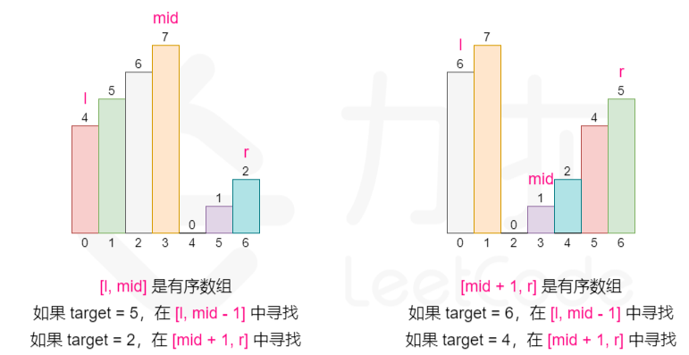
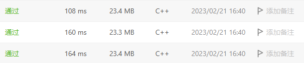
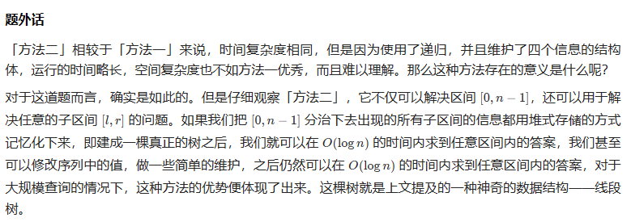

- [LeetCode Summary](#leetcode-summary)
- [Little Tips Mentioned Ahead](#little-tips-mentioned-ahead)
- [贪心](#贪心)
- [二分](#二分)
  - [33.搜索旋转排序数组](#33搜索旋转排序数组)
  - [81.搜索旋转排序数组 II](#81搜索旋转排序数组-ii)
- [DFS \& BFS](#dfs--bfs)
  - [200.岛屿数量](#200岛屿数量)
- [排序](#排序)
  - [215.数组中的第K个最大元素](#215数组中的第k个最大元素)
  - [912.堆排序](#912堆排序)
  - [912.快速排序\&三路快速排序](#912快速排序三路快速排序)
- [链表](#链表)
  - [206.反转链表](#206反转链表)
  - [25.K个一组翻转链表](#25k个一组翻转链表)
  - [21.合并两个有序链表](#21合并两个有序链表)
  - [141.环形链表](#141环形链表)
- [栈](#栈)
  - [20. 有效的括号](#20-有效的括号)
- [队列](#队列)
- [树](#树)
  - [102.二叉树的层序遍历](#102二叉树的层序遍历)
- [图](#图)
- [滑动窗口 \& 双指针](#滑动窗口--双指针)
  - [3.无重复字符的最长子串](#3无重复字符的最长子串)
  - [15.三数之和](#15三数之和)
  - [88.合并两个有序数组](#88合并两个有序数组)
- [动态规划](#动态规划)
  - [53.最大子数组和](#53最大子数组和)
  - [121. 买卖股票的最佳时机](#121-买卖股票的最佳时机)
  - [122. 买卖股票的最佳时机 II](#122-买卖股票的最佳时机-ii)
  - [5.最长回文子串](#5最长回文子串)
- [设计类问题](#设计类问题)
  - [146.LRU 缓存](#146lru-缓存)
- [数学类问题](#数学类问题)
- [模拟 \& 找规律](#模拟--找规律)
- [其他问题](#其他问题)
  - [1. 两数之和（巧用哈希表）](#1-两数之和巧用哈希表)


# LeetCode Summary

本文件是在解决LeetCode算法问题过程中的总结与反思汇总，<mark>点击题目的超链接即可跳转到对应LeetCode官网题面</mark>。

# Little Tips Mentioned Ahead

- 如果要使用线性复杂度在一维数组中解决问题，优先考虑<mark>滑动窗口</mark>和<mark>双指针</mark>，以及<mark>动态规划</mark>。
- Top K的问题求解时，优先考虑堆(优先队列)来解决，因为它<mark>会自动维护前K个元素的有序性</mark>。但这里有一些例外，比如<mark>215.数组中的第K个最大元素</mark>，就使用了<mark>快速选择算法(QuickSelect)</mark>来快速地定位第K大的元素，这是因为只需要求"第k大"而非"前k大。
- 有关链表的问题中，<mark>添加伪节点Dummy是一个很好的习惯</mark>，它会使得原本头节点的处理逻辑和后续节点保持一致，从而大大简化代码的边界情况讨论。

# 贪心

# 二分

朴素的二分搜索是一种非常基础和巧妙的算法，它使用序列中存在的<mark>二段性</mark>来将原有区间一分为二，<mark>从而实现O(n)->O(logn)的搜索加速</mark>。基于朴素二分法也诞生了非常多的变式题，这些题往往非常精巧和复杂：<b>首先你要找出序列中存在的二段性，其次要妥善处理各种边界条件</b>。前者只能就事论事地结合题目来思考，后者需要约定好写二分法代码的区间，我一般使用<mark>左闭右开区间</mark>。

## [33.搜索旋转排序数组](https://leetcode.cn/problems/search-in-rotated-sorted-array/)



这道题是一道经典的使用二分法解决的问题，题目是<mark>要求在一个"旋转排序"之后的数组</mark>里找到指定的元素并返回下标。这道题所谓的二段性体现在：<b>在这样一个旋转排序的数组中的任何一个位置切一刀，总会旋转排序数组切分成两个部分，一个部分有序，一个部分无序。</b>可以结合上图来理解这种二段性。

<mark>既然有二段性，这道题就可以使用二分法来求解</mark>，方法就是逐步地判断目标元素target是否在有序区间那一半，如果在<mark>则在有序区间中二分下去</mark>，如果<mark>不在则在无序区间中进一步二分下去</mark>。这样就可以实现O(logn)级别的算法复杂度：

```cpp
class Solution {
public:
    // 约定，区间记法全部采用左闭右开区间，故开始时是[Left, Right)
    int search(vector<int>& nums, int target)
    {
        int n = nums.size();
        int Left = 0, Right = n;
        while(Left < Right)
        {
            int Mid = (Left + Right) >> 1;
            // 如果中点元素正好是target，那么直接返回下标
            if(nums[Mid] == target)
                return Mid;
            
            // 如果nums[Left] < nums[Mid]，说明有序序列是[Left, Mid)
            if(nums[Left] < nums[Mid])
            {
                // 判断target值是否在有序区间里，来将区间进行二分
                if(nums[Left] <= target and target < nums[Mid])
                    Right = Mid;
                else
                    Left = Mid;
            }          
            else // nums[Left] > nums[Mid]，说明有序区间是[Mid, Right)
            {
            // 注意这里：nums[Right]是不存在于区间之中的，故使用nums[Right - 1]来比较
            // 同样的，因为nums[Right - 1]包含在区间中，所以是<=号
                if(nums[Mid] <= target and target <= nums[Right - 1])
                    Left = Mid;
                else
                    Right = Mid;
            }
        }
        return nums[Left] == target ? Left : -1;
    }
};
```

上述这段代码最困难的地方就在于如何找到二段性，以及找到二段性之后如何对细节进行管理，如何管理<,=,>符号，如何进行区间的变换，这需要我们始终坚持对区间的约定，这里就是<mark>左闭右开区间的写法</mark>。

## [81.搜索旋转排序数组 II](https://leetcode.cn/problems/search-in-rotated-sorted-array-ii/)

这道题是在上述<mark>搜索旋转数组</mark>的问题上引入了重复元素，这下使得整个问题变得复杂了很多，首先之前的二段性就荡然无存了，所以二分算法只能加速本题的求解，而在<mark>最坏状态下问题还是会退化到O(n)的状态</mark>。

代码如下：
```cpp
class Solution {
    // 本题还是约定使用左闭右开的区间写法[)
public:
    bool search(vector<int> &nums, int target) {
        int n = nums.size();
        int Left = 0, Right = n;
        while(Left < Right)
        {
            // 如果当前区间长度为1， 那么直接判断结果
    // 否则如果还要取中点，有可能会导致Left > Right的情况，这在左闭右开的约定中
    // 是非法情况，详见测试用例[1,3], 0
            if(Right - Left == 1)
                return nums[Left] == target;
            
            // 取区间中点
            int Mid = (Left + Right) >> 1;
            if(nums[Mid] == target)
                return true;
            
            // 如果区间中点与左右边界值相等，这时无法判断哪一半区间有序
            // 但我们知道nums[Left]和nums[Right - 1]一定不是
            if(nums[Left] == nums[Mid] and nums[Mid] == nums[Right - 1])
            {
                ++Left;
                --Right;
            }

            // [nums[Left], nums[Mid])是有序区间
            // 这里的逻辑和33.寻找旋转排序数组一致
            else if(nums[Left] <= nums[Mid])
            {
                if(nums[Left] <= target and target < nums[Mid])
                    Right = Mid;
                else
                    Left = Mid;
            }
            // [nums[Mid], nums[right])是有序区间
            else     
            {
                if(nums[Mid] <= target and target <= nums[Right - 1])
                    Left = Mid;
                else
                    Right = Mid;
            }   
        }
        return nums[Left] == target;
    }
};
```
其实本题的难点就在于，当我们找到的nums[Mid]正好位于旋转数组重复元素的"平台期"时，我们不知道两个区间到底哪个是有序的，这种情况下只能将指针进行简单的调整。而正是因为这种情况的出现，算法的最坏时间复杂度可能会退化到O(n)。其他的情况就是需要<mark>注意左闭右开区间的约定，管理好比较过程和指针，防止非法区间Left > Right的出现</mark>。

# DFS & BFS

DFS和BFS是最常见的两种搜索方法，前者以<mark>搜索的深度(depth)优先</mark>，会一鼓作气地搜索到合法位置边界，然后<mark>逐渐回退搜索距离去搜索其他的位置</mark>。BFS则是沿着距离出发点从近到远，一步步地“逐层”完成遍历，这里的“层”表示的是<mark>距离源点距离等同的点组成的集合</mark>，BFS就像<b>往水中投入一颗石子，涟漪向外逐渐扩展的过程</b>。这两种算法都是可以完整地对搜索空间完成遍历的。

因为算法的特性，<mark>DFS往往采用递归法(栈)实现，而BFS则使用队列来迭代实现</mark>。同时，DFS往往也会<mark>结合回溯、剪枝等技巧对搜索空间完成更加高效的搜索</mark>。

## [200.岛屿数量](https://leetcode.cn/problems/number-of-islands/)

这道题给出一个二维数组，其中1表示陆地，0表示海洋，问<mark>有多少块陆地</mark>(上下左右方向上连在一起的都属于一个陆地)。

这是一个<mark>非常典型的统计连通分量个数</mark>的问题，一个DFS/BFS搜索只能“打通”一个连通块。要找到所有的连通块还是要对矩阵进行遍历，找到所有没展开过搜索的源点进行分别的DFS，<mark>执行DFS的次数就是陆地的数量</mark>。完整的代码如下，每次DFS时都要对四个方向进行搜索：

```cpp
class Solution {
    /*array indicating whether the element has been used*/
    bool Used[300][300] = {false};

    /*check if the current point inside of boundary*/
    bool isInBoundary(vector<vector<char>>& grid, int i, int j)
    {
        return i >= 0 && i < grid.size() && j >= 0 && j < grid[0].size();
    }

    /*(i,j) is the start point of traverse*/
    void DFS(vector<vector<char>>& grid, int i, int j)
    {
        /*if not has been arrived and current element is land*/
        if(isInBoundary(grid, i, j) && !Used[i][j] && grid[i][j] == '1')
        {
            /*set the (i,j) as true*/
            Used[i][j] = true;

            /*DFS towards RIGHT, DOWN, LEFT, UP*/
            DFS(grid, i, j + 1);
            DFS(grid, i + 1, j);
            DFS(grid, i, j - 1);
            DFS(grid, i - 1, j);
        }
    }

    /*return value is the number of islands*/
    int DFSTraverse(vector<vector<char>>& grid, int RowNum, int ColNum)
    {
        int Result = 0;

        for(int i = 0 ; i < RowNum ; ++i)
            for(int j = 0 ; j < ColNum ; ++j)
                /*if the current element has not been arrived, start from it*/
                if(!Used[i][j] && grid[i][j] == '1')
                {
                    DFS(grid, i, j);
                    ++Result;
                }
        return Result;
    }

public:
    int numIslands(vector<vector<char>>& grid) {
        /*get the size of vector*/
        int RowNum = grid.size();
        int ColNum = grid[0].size();

        return DFSTraverse(grid, RowNum, ColNum);
    }
};
```

# 排序

<b>值得注意的是排序类问题并不是简单的排序算法的实现，而是基于基础排序算法而诞生的一系列问题，其中以快速排序算法的划分法诞生的变式问题最多。</b>

##  <a name='215.Khttps:leetcode.cnproblemskth-largest-element-in-an-array'></a>[215.数组中的第K个最大元素](https://leetcode.cn/problems/kth-largest-element-in-an-array/)

这是典型的一道Top K求解问题，一般来说这类问题使用<mark>堆(优先队列)</mark>来解决即可。但是这道题要求实现O(n)的算法，所以堆排序在时间复杂度上不符合要求。

事实上，这道题使用的是<mark>基于快速排序的快速选择算法</mark>，使用快速排序中的划分法，一点点逼近数组中第K大的数字。在这个过程中还要引入<mark>随机选择划分元</mark>的方法来进一步降低极端情况出现的可能性，从而使得算法的<mark>整体期望复杂度降至O(n)</mark>，这种算法叫做<mark>快速选择(quick select)算法</mark>。

如果遇到要求<mark>第K个最大或者最小元素</mark>，而<b>不期望给出前K个最大最小元素</b>时，使用快速选择算法是一个比较好的选择。

含注释的代码如下：
```cpp
class Solution {
    /*这里假设区间是左闭右闭的[Start, End]*/
    int partition(vector<int>& nums, int Start, int End)
    {
        /*随机选择划分元，可以使得算法复杂度降至O(n)*/
        int RandomIndex = (rand() % (End - Start + 1)) + Start;

        /*Attention ：选好划分元之后，和最左元素交换，方便后续操作*/
        swap(nums[Start], nums[RandomIndex]);
        int Tmp = nums[Start];
        while(Start < End)  // 划分过程，不再详述
        {
            while(Start < End and nums[End] > Tmp) --End;
            nums[Start] = nums[End];
            while(Start < End and nums[Start] <= Tmp) ++Start;
            nums[End] = nums[Start];
        }   
        nums[Start] = Tmp;
        return Start;
    }

    /*快速划分算法：quick select algorithm*/
    int quickSelect(vector<int>& nums, int k, int Start, int End)
    {
        int Pivot = partition(nums, Start, End);
        /* 如果随机选择的划分元正好是第k小的元素，直接返回 */
        if(Pivot == k - 1)                                  
            return nums[Pivot];
        else if(Pivot < k - 1)
            /* 否则向一侧区间进行递归 */
            return quickSelect(nums, k, Pivot + 1, End);    
        else
            return quickSelect(nums, k, Start, Pivot - 1);  

    }
public:
    int findKthLargest(vector<int>& nums, int k) 
    {
        /* 初始化随机数种子 */
        srand((unsigned)time(NULL));                        
        int n = nums.size();
        /* 第k大数字也是第n+1-k小的数字 */
        return quickSelect(nums, n + 1 - k, 0, n - 1);      
    }
};
```

##  <a name='912.https:leetcode.cnproblemskth-largest-element-in-an-array'></a>[912.堆排序](https://leetcode.cn/problems/kth-largest-element-in-an-array/)

堆排序是解决Top K排序的重要方法，但是堆排序<mark>在面试时也往往需要直接手撕</mark>。

值得注意的是，<b>堆一棵完全二叉树</b>，所以在静态存储的树结构中，<mark>一个节点编号和它的左右孩子编号之间存在定量关系</mark>，这是整个堆排序算法运行的重要原理。一般来说有两种换算方法：

- 如果数组下标从1开始，那么<mark>左孩子 = 2 * index</mark>，<mark>右孩子 = 2 * index + 1</mark>
- 如果数组下标从0开始，那么<mark>左孩子 = 2 * index + 1</mark>，<mark>右孩子 = 2 * index + 2</mark>

一般来说数组下标都是从0开始的，所以<mark>一般选择第二种换算法</mark>。

堆排序涉及的核心步骤就是<mark>堆的调整(adjustHeap)</mark>，要重点掌握。
```cpp
/* 向下调整堆的函数, [Low, High]划定了调整范围*/
void adjustHeap(vector<int>& nums, int Low, int High)
{
    // 取出Low节点和其左孩子，注意左孩子的下标是如何计算的
    int i = Low, j = i * 2 + 1;     
    while(j <= High)
    {
        // 调整j为左右孩子中的较大值，准备和i进行交换
        if(j + 1 <= High and nums[j + 1] > nums[j])
            j = j + 1;

        // 如果左右孩子的较大值大于父亲节点，那么交换之并继续向下调整              
        if(nums[i] < nums[j])
        {
            swap(nums[i], nums[j]);
            i = j;
            j = i * 2 + 1;
        }
        // 否则调整到此结束
        else
            break;
    }
}
```

在实现了向下调整堆的函数之后，接下来就是重建堆的函数，即从<mark>数组n/2的位置(n是是数组的总长度)开始倒序进行调整直到第一个节点</mark>，代码如下所示：
```cpp
void buildHeap(vector<int>& nums)
{
    int n = nums.size();
    // 从中间节点进行倒序调整直到第一个节点
    for(int i = n / 2 ; i >= 0 ; --i)
        adjustHeap(nums, i, n - 1);
}
```

在实现了上述两个函数之后，堆排序就很简单了：
<b>
- 首先重建堆，这时位于nums[0]这个位置的一定是最大元素，将其与最后一个元素进行交换，那么此时它就到了它应该在的位置上
- 对[0, n-2]这个范围进行向下调整，从而再一次得到了一个堆
- ...
- 重复这个过程直至所有元素都已经归位
</b>

```cpp
//堆排序
void heapSort(vector<int>& nums)
{
    // 重建堆
    buildHeap(nums);
    int n = nums.size();
    for(int i = n - 1 ; i >= 0 ; --i)
    {
        // 将当前堆的最大元素交换到它的应有位置上，并向下调整堆
        swap(nums[0], nums[i]);
        adjustHeap(nums, 0, i - 1);
    }
}

```
## [912.快速排序&三路快速排序](https://leetcode.cn/problems/sort-an-array/)

这道题还是经典的排序算法实现，这里实现的是<mark>快速排序算法</mark>，快速排序算法主要分为两个部分：<mark>划分和排序</mark>。划分时可以选择使用随机算法选取划分元，这样<mark>在统计意义</mark>上可以将算法的一般复杂度降至O(nlogn)。

注意这里着重强调了在统计意义上，这是因为一般来说使用排序算法的场景是处理现实生活中的数据，这些数据往往是随机的，没有特定规律的。这也就意味着，如果<mark>人为地编造特殊数据</mark>，<b>即使采用挑选随机划分元的方法，快速排序算法的时间复杂度也会退化到O(n^2)</b>，我们很快就会看到这个例子。

这里直接给出快速排序的代码，很经典，必须掌握：
```cpp
class Solution {
    // 在nums[Left, Right]这个范围内进行划分
    int parition(vector<int>& nums, int Start, int End) 
    {
        // 使用随机算法优化划分元的选取
        int RandomIndex = (rand() % (End - Start + 1)) + Start;
        swap(nums[RandomIndex], nums[Start]);
        int Tmp = nums[Start];
        while(Start < End)
        {   
            // 大于等于Tmp元素的值放后面
            while(Start < End and nums[End] >= Tmp) --End;
            nums[Start] = nums[End];
            while(Start < End and nums[Start] < Tmp) ++Start;
            nums[End] = nums[Start];
        }
        nums[Start] = Tmp;
        return Start;
    }

    // 对nums[Start, End]进行快速排序
    void quickSort(vector<int>& nums, int Start, int End)
    {
        // 千万要注意这个前提条件，当区间长度小于等于1时直接返回
        // 否则上面选取划分元时可能出现越界
        if(Start < End)
        {
            int Pivot = parition(nums, Start, End);
            quickSort(nums, Start, Pivot - 1);
            quickSort(nums, Pivot + 1, End);
        }
    }
    
public:
    vector<int> sortArray(vector<int>& nums) {
        // 生成随机数的种子
        srand((unsigned int)time(NULL));
        int n = nums.size();
        quickSort(nums, 0, n - 1);
        return nums;
    }
};
```

这是一套<mark>非常正确和经典的快速排序算法的写法</mark>，更确切地说，是<mark>2-路快速排序</mark>的写法，但是上面的这份代码提交之后会超时。这是因为LeetCode更新了测试用例，给出了一个长度为5 x 10^4个2的数组。这就是我们上面说的：<mark>人造逆天数据</mark>，专门用来将快速排序算法卡住的。

为了解决这个问题，必须引入一种更加先进的算法：<mark>3-路快速排序</mark>，随之而来的还有一个经典问题：[荷兰国旗问题](https://en.wikipedia.org/wiki/Dutch_national_flag_problem)。这道题在LeetCode题库中也是有的，后面也许还有机会见到，其实<mark>这就是3-路快速排序算法的雏形</mark>。

3-路快速排序算法将整个序列分成三部分，设划分元是Tmp，那么<mark>区间将会被划分为以下三部分</mark>：

- 小于Tmp
- 等于Tmp
- 大于Tmp

算法的细节非常精巧和值得回味，下面直接结合代码来说：
```cpp
class Solution {
    // 对nums[Left, Right]进行三路快排划分(3-way partition)
    pair<int, int> partition(vector<int>& nums, int Left, int Right)
    {
        // 随机选择一个划分元
        // 注意这里的划分元选择是有问题的，当区间长度太大时，rand()函数可能不够
        int RandomIndex = (rand() % (Right - Left + 1)) + Left;
        swap(nums[RandomIndex], nums[Left]);
        int Tmp = nums[Left];
        
        // 声明两枚指针Lower，Higher和迭代变量i，并做如下约定(左闭右开区间)
        // [Left, Low)存放小于Tmp的值
        // [Low, High)存放等于Tmp的值
        // [High, Right + 1)存放大于Tmp的值
        int Lower = Left, Higher = Right + 1, i = Left + 1;
        while(i < Higher)
        {
            if(nums[i] < Tmp)
                /*
                    如果当前元素小于划分元，那么首先将其与Lower位置的元素进行互换
                    nums[Lower]一定指向与划分元等大的元素，这是因为我们的约定
                */
                swap(nums[Lower++], nums[i++]);
            else if(nums[i] > Tmp)
            /*
                如果当前元素大于划分元，那么首先将Higher指针前移，因为是右开区间
                然后将当前元素和Higher指向的元素进行互换
                但是注意：i不要加一
                这是因为从Higher原先位置换过来的元素我们是未知的
                还需要再处理一遍
            */
                swap(nums[--Higher], nums[i]);
            else 
                // 遇到了等大的元素，i直接后移
                i++;
        }
        return {Lower, Higher};
    }

    void quickSort(vector<int>& nums, int Left, int Right)
    {
        // 区间长度必须大于1，否则没必要继续深入
        if(Left < Right)
        {
            // 执行上述算法，直接获得两个划分边界Lower和Higher
            // 分治下去即可
            auto ReturnPair = partition(nums, Left, Right);
            quickSort(nums, Left, ReturnPair.first - 1);
            quickSort(nums, ReturnPair.second, Right);
        }
    }
public:
    vector<int> sortArray(vector<int>& nums) {
        srand((unsigned int)time(NULL));
        int n = nums.size();
        quickSort(nums, 0, n - 1);
        return nums;
    }
};

```

# 链表
##  <a name='206.https:leetcode.cnproblemsreverse-linked-list'></a>[206.反转链表](https://leetcode.cn/problems/reverse-linked-list/)

经典题，有<mark>递归和迭代</mark>两种做法，都必须掌握。

迭代解法比较符合人的逻辑思维习惯，<mark>从前向后依次将节点反转</mark>。
这里需要额外注意的一点是，原先头节点的next指针必须置为*nullptr*。为此，我们<mark>将Left指针的初始值置为nullptr</mark>，这样可以直接完成操作。

```cpp
class Solution {
public:
    ListNode* reverseList(ListNode* head) 
    {
        if(not head)
            return head;
    /*将Left初始值置为nullptr*/
    /*可以直接保证翻转完之后最后一个节点的next指针是nullptr*/
        ListNode* Left = nullptr;
        ListNode* Right = head;
        while(Right)
        {
            ListNode *Tmp = Right->next;
            Right->next = Left;
            Left = Right;
            Right = Tmp;
        }
        return Left;
    }
};
```

递归法就比较**逆天**了，递归法的本质是<mark>递推+回归</mark>。所以这个过程首先假设后面的链表<mark>全部翻转完毕了</mark>，在此基础上再去考虑要对返回的指针进行怎样的操作。

```cpp
class Solution {
public:
/*
    注意：递归函数的返回值是翻转后的链表的头节点
    这点非常重要
*/
    ListNode* reverseList(ListNode* head) 
    {
        if(not head or not head->next)
            return head;
        ListNode* Tmp = reverseList(head->next);
        head->next->next = head;  // 将新的链表节点接入链表
        head->next = nullptr;     // 最后一个节点的next指针是nullptr
        return Tmp;  // 返回值应该是反转后链表的头节点
    }
};

```

##  <a name='25.Khttps:leetcode.cnproblemsreverse-nodes-in-k-group'></a>[25.K个一组翻转链表](https://leetcode.cn/problems/reverse-nodes-in-k-group/)

这是一道困难题，但是并没有什么新颖的算法，只是有很多<mark>细碎的边界条件</mark>需要处理，核心还是反转链表。这里多了两个部分的逻辑：

- <b>1.当剩余节点个数不足k个时，及时返回链表</b>，这部分的逻辑如下：

```cpp
// ListNode *Head = head, *Tail = head;
int Counter = 0;
// 从Head开始向后数k - 1个节点，找到Tail节点
// 之所以是k-1是因为我们是从链表的第一个节点开始数的
while(Counter < k - 1)              
{
    Tail = Tail->next;
    Counter++;
    // 如果当前剩余节点数量不足K个，直接返回首节点
    if(not Tail)
        return Dummy->next;
}
```
- 2.<b>完成局部的K个链表反转之后，将子链表接回原先的链表</b>，这部分的逻辑如下：
```cpp
auto ReversePair = reverseList(Head, Tail);

// 将反转之后的子链表再次连接到原先的链表上
Previous->next = ReversePair.first;
ReversePair.second->next = Next;
```

在完成上述两部分的逻辑之后，剩下的就是简单的链表反转问题，<mark>全部代码如下</mark>：

```cpp
class Solution {
    /*反转[Head, Tail]这个范围内的链表*/
    pair<ListNode*, ListNode*> reverseList(ListNode *Head, ListNode* Tail)
    {
        ListNode *Previous = Head, *Present = Head->next;
        while(Previous != Tail)
        {
            ListNode *Tmp = Present->next;
            Present->next = Previous;
            Previous = Present;
            Present = Tmp;
        }
        return {Tail, Head};    // 反转之后，头尾节点正好反过来
    }
public:
    ListNode* reverseKGroup(ListNode* head, int k) {
        ListNode *Dummy = new ListNode(0, head);

        // Head和Tail记录的分别是k个节点小组中的头尾节点
        ListNode *Head = head, *Tail = head;
        ListNode *Previous = Dummy, *Next = nullptr;
        while(Head)
        {
            int Counter = 0;
            // 从Head开始向后数K - 1个节点，找到Tail节点
            while(Counter < k - 1)              
            {
                Tail = Tail->next;
                Counter++;
                // 如果当前剩余节点数量不足K个，直接返回首节点
                if(not Tail)
                    return Dummy->next;
            }
            // 记录Tail之后的下一个节点
            Next = Tail->next;
            auto ReversePair = reverseList(Head, Tail);

            // 将反转之后的子链表再次连接到原先的链表上
            Previous->next = ReversePair.first;
            ReversePair.second->next = Next;

            // 调整指针准备下一次反转
            Previous = ReversePair.second;
            Head = Tail = Next;
        }
        return Dummy->next;
    }
};
```
## [21.合并两个有序链表](https://leetcode.cn/problems/merge-two-sorted-lists/)

一道非常基础的题目，让把两个原本有序的链表进行合并。

申请一个头结点可能会让<mark>整体的逻辑变得更加简单</mark>，剩下的就是比较大小并插入即可。注意不要申请新的节点，而是在原有链表的基础上进行指针的变换即可。但是也有的问题，<mark>新申请节点可能会让整个处理逻辑变得简单许多</mark>，这需要看情况而定。

```cpp
class Solution {
public:
    ListNode* mergeTwoLists(ListNode* list1, ListNode* list2) 
    {
        // 申请一个伪节点简化指针处理逻辑，这是一个好习惯
        ListNode *Dummy = new ListNode(1);
        ListNode *Present = Dummy, *P1 = list1, *P2 = list2;

        // 注意跳出循环的判断条件，一个链表走到尽头就可以跳出循环
        while(P1 and P2)
        {
            if(P1->val <= P2->val)
            {
                Present->next = P1;
                P1 = P1->next;
            }
            else
            {
                Present->next = P2;
                P2 = P2->next;
            }
            Present = Present->next;
        }

        // 处理剩下的链表，因为两个链表不一定等长
        if(P1)
            Present->next = P1;
        if(P2)
            Present->next = P2;
        return Dummy->next;
    }
};

```

## [141.环形链表](https://leetcode.cn/problems/linked-list-cycle/)

这道题是一道比较基础的有关环形链表的题目，目的是找出<mark>在当前链表中是否存在环路</mark>。方法就是使用快慢指针，看两个指针会不会最终相遇，会的话说明有环路存在。反之<mark>如果其中一个指针已经为空还没有相遇</mark>，那么说明不存在环路。

注意<mark>在代码中及时判断快指针是否为空</mark>，否则可能出现越界：
```cpp
class Solution {
public:
    bool hasCycle(ListNode *head) 
    {
        if(not head)
            return false;
        // 申请了一个伪节点，让快慢指针从同一个起点开始
        ListNode *Dummy = new ListNode(1);
        Dummy->next = head;
        
        ListNode *Fast = Dummy, *Slow = Dummy;
        while(Fast)
        {   
            // 注意及时判断快指针是否已经到达终点
            if(Fast->next)
                Fast = Fast->next->next;
            else
                Fast = Fast->next;
            Slow = Slow->next;
            if(Fast == Slow)
                break;
        }

        // 如果快指针到达了终点，说明无环
        if(not Fast)
            return false;

        // 反之则是因为快慢指针相遇而退出循环，说明有环
        return true;

    }
};
```


# 栈

栈是一种LIFO的数据结构，在算法题中它经常用来解决<mark>匹配问题</mark>。

## [20. 有效的括号](https://leetcode.cn/problems/valid-parentheses/)

这是使用栈解决的问题中最常见的一类，即<mark>简单匹配问题</mark>。

思路也非常简单，遇见左括号入栈，遇见右括号时观察栈顶元素是否是与之配对的左括号，最终整个序列遍历完成之后。如果序列正好是一个完整的匹配序列，<mark>栈应该恰好排空</mark>，否则就不是一个合法的序列。

```cpp
class Solution {
public:
    bool isValid(string s) 
    {
        stack<char> S;
        int n = s.size();
        for(int i = 0 ; i < n ; ++i)
        {
            // 左括号入栈
            if(s[i] == '(' or s[i] == '[' or s[i] == '{')
                S.push(s[i]);
            
            // 右括号则判断栈顶是否是相匹配的括号，是则出栈
            else if(not S.empty() and (
                        (s[i] == ')' and S.top() == '(') or
                        (s[i] == ']' and S.top() == '[') or
                        (s[i] == '}' and S.top() == '{')))
            
                S.pop();
            // 否则括号不匹配，直接返回
            else return false; 
        }

        // 最后判断栈是否排空，这是为了排除左括号多余的情况
        return S.size() == 0;
    }
};
```

# 队列

# 树

## [102.二叉树的层序遍历](https://leetcode.cn/problems/binary-tree-level-order-traversal/)

这是二叉树问题的基础问题，即二叉树的BFS，还有二叉树的DFS。
尽管标准的BFS写法没有在<mark>对某一层的遍历之前统计本层节点数量</mark>，但我依旧建议这样做，这会明确节点的的层次边界(包括本题)，让我们<mark>知道每一层的边界在哪里</mark>，BFS的代码如下：

```cpp
class Solution {
public:
    vector<vector<int>> levelOrder(TreeNode* root) 
    {
        if(not root)
            return {};
        vector<vector<int>> Ans;
        queue<TreeNode*> Q;
        Q.push(root);
        while(not Q.empty())
        {
            // 统计本层节点数量，这样可以让我们更好区分当前层与下一层的节点
            int n = Q.size();

            // 当前层的遍历结果
            vector<int> Tmp;
            for(int i = 0 ; i < n ; ++i)
            {
                auto Front = Q.front();
                Q.pop();
                Tmp.push_back(Front->val);
                if(Front->left)
                    Q.push(Front->left);
                if(Front->right)
                    Q.push(Front->right);
            }
            Ans.push_back(Tmp);
        }
        return Ans;
    }
};
```


# 图

# 滑动窗口 & 双指针

滑动窗口和(双指针)是一种高效解决线性序列问题的算法思想，它<mark>可以将线性序列中的一些问题时间复杂度降低到O(n)</mark>。

##  <a name='3.https:leetcode.cnproblemslongest-substring-without-repeating-characters'></a>[3.无重复字符的最长子串](https://leetcode.cn/problems/longest-substring-without-repeating-characters/)

这道题是一道<mark>非常经典的滑动窗口问题</mark>，它要求我们在一个字符串中找到最长的不含重复字符的子串(注意子字符串必须是连续的)。

结合本题的数据规模可以知道要求的<mark>应该是O(n)复杂度的算法</mark>。

<b>在字符串问题中涉及到不重复或者计数问题</b>时往往要用到<mark>滑动窗口+哈希表</mark>。这道题不同的是，因为涉及到重复问题，只需要<mark>集合记录元素</mark>即可。


官方题解如下，使用的是unordered_set来记录窗口中出现的字符，左边界每排出一个字符，<mark>右边界就不断向前推进探索当前可以到达的最大位置</mark>并更新答案：
```cpp
class Solution {
public:
    int lengthOfLongestSubstring(string s) {
        // 哈希集合，记录每个字符是否出现过
        unordered_set<char> occ;
        int n = s.size();
        // 右指针，初始值为 -1，相当于我们在字符串的左边界的左侧，还没有开始移动
        int rk = -1, ans = 0;
        // 枚举左指针的位置，初始值隐性地表示为 -1
        for (int i = 0; i < n; ++i) {
            if (i != 0) {
                // 左指针向右移动一格，移除一个字符
                occ.erase(s[i - 1]);
            }
            while (rk + 1 < n && !occ.count(s[rk + 1])) {
                // 不断地移动右指针探测更长的长度
                occ.insert(s[rk + 1]);
                ++rk;
            }
            // 第 i 到 rk 个字符是一个极长的无重复字符子串
            ans = max(ans, rk - i + 1);
        }
        return ans;
    }
};
```
上面是官方题解的做法，这个做法中存在一个问题，那就是在检测到重复字符时它只是一次<mark>将窗口左边界前移一个长度</mark>，事实上还可以<b>有更快的方法</b>。那就是在哈希表中记录下来每一个字符出现的位置，当有重复字符出现时直接跳转到它的下一个字符，这样可能会有一个问题，那就是中间跳过去的这些字符是否需要删掉？

答案是不需要的，直接通过$max$运算就可以保证正确性，代码如下：
```cpp
class Solution {
public:
    int lengthOfLongestSubstring(string s) 
    {
        unordered_map<char, int> HashTable;
        int n = s.length();
        int Left = 0, Right = 0;    // [Left, Right]是滑动窗口范围
        int Ans = 0;
        while(Right < n)         
        {
    // 发现重复字符，直接跳过中间的所有字符位置，不用一个个向窗口外排出 
            if(HashTable.count(s[Right]))   
                /*使用max运算符保证跳转位置大于当前左边界*/
                Left = max(Left, HashTable[s[Right]]);  
            HashTable[s[Right]] = Right + 1;    // 更新字符出现位置
            Ans = max(Ans, Right - Left + 1);   // 更新最大长度
            ++Right;
        }
        return Ans;
    }
};
```

##  <a name='15.https:leetcode.cnproblems3sum'></a>[15.三数之和](https://leetcode.cn/problems/3sum/)

这是最经典的<mark>三指针问题</mark>，其实三指针问题也只是<mark>双指针问题的变式</mark>。本题的要求是在一个序列中找出所有<mark>不重复的相加之和等于0的三元组</mark>。

首先简化一下这个问题，如果本题让求的是二元组，<mark>这就是最经典的双指针问题</mark>。我们只需要<mark>先将整个序列进行排序</mark>，然后分别用两个指针指向头尾，使它们<mark>逐渐向中间靠拢</mark>即可不重不漏地搜索到所有符合要求得二元组，代码逻辑如下：
```cpp
// 下面的代码是最原始的双指针算法
// 假设数组为nums，其大小为n
int First = 0, Second = n - 1;
// 和等于0，说明已经找到了满足要求的二元组
if(nums[First] + nums[Second] == 0)
    Ans.push_back({nums[First], nums[Second]});
// 如果当前二元组的和偏小，说明First指针指向的值太小
else if(nums[First] + nums[Second] < 0)
    ++First;
// 如果当前二元组的和偏大，说明Second指针指向的值太大
else
    --Second;
```

这样就将这个问题的复杂度整体降至了O(nlogn)的级别，即<mark>排序本身的复杂度</mark>，而上面的这段代码复杂度为O(n)。

事实上，<mark>双指针算法可以写成下面这样</mark>，如下所示：
```cpp
int Second = n - 1;
for(int First = 0 ; First < Second ; ++First)
{
    // 跳过重复的二元组
    if(First > 0 and nums[First] == nums[First - 1])
        continue;   
    while(First < Second and nums[First] + nums[Second] > 0)
        --Second;
    
    // 检查循环跳出原因
    // 1.如果是因为指针相遇，那么说明进行到了尽头
    if(First == Second)
        break;
    
    // 2.如果当前找到了一组解，则加入答案
    if(nums[First] + nums[Second] == 0)
        Ans.push_back({nums[First], nums[Second]});
    // 这里还隐藏了一个逻辑，但不用写
    // if(nums[First] + nums[Second] < 0)
        // continue;
}
    
```

这和最原始版本相比，对于右指针Second的移动变得更加紧凑，代码效率可能也会更高，“可能”是指从理论上分析代码的整体复杂度是一致的，但<mark>实际运行时发现上述写法比原始写法要快一些</mark>，可能是代码更加紧凑的原因，也有可能是测试用例的原因。

回到本题，也是同样的思路，只是我们<mark>先固定一个指针(First)，移动剩下的两个指针(Second, Third)</mark>即可，目标值也<mark>从0变成了-nums[First]</mark>。这个道理明白了之后，就知道：

<b>所谓三指针问题，甚至四指针问题，也只是<mark>先固定其中n-2个指针之后的双指针问题</mark>，它们的逻辑和解法本质上都是一样的。</b>

但是本题还有很值得学习的点，那就是<b>如何写出简洁优雅的三指针代码</b>，<mark>首先给出我的原始版本代码，献一下丑:)</mark>。
```cpp
//我的原始版本代码，思路正确，但代码效率还是偏低
class Solution {
public:
    vector<vector<int>> threeSum(vector<int>& nums) 
    {
        sort(nums.begin(), nums.end());
        int n = nums.size();
        vector<vector<int>> Ans;
        // 最外层循环，枚举固定指针的位置
        for(int Fixed = 0 ; Fixed < n - 2 ; ++Fixed)
        {
            // 跳过重复的元素值，防止搜到重复的组
            if(Fixed > 0 and nums[Fixed] == nums[Fixed - 1])
                continue;
            // 初始化双指针的位置
            int Left = Fixed + 1, Right = n - 1;
            // 此时的目标值是nums[Fixed]的负值
            int Target = -nums[Fixed];
            while(Left < Right)
            {
                // 跳过重复的nums[Left]值
                if(Left > Fixed + 1 and nums[Left] == nums[Left - 1])
                {
                    ++Left;
                    continue;
                }
                // 传统的双指针代码，这没什么好说的...
                if(nums[Left] + nums[Right] == Target)
                {
                    Ans.push_back({nums[Fixed], nums[Left], nums[Right]});
                    ++Left;
                    --Right;
                }
                else if(nums[Left] + nums[Right] < Target)
                    ++Left;
                else
                    --Right;
            }
        }
        return Ans;
        
    }
};

```
官解的代码就使用了双指针第二种写法，效率却明显提升了不少，猜测可能和测试用例有关，<mark>但无论如何推荐第二种写法</mark>，代码如下：



```cpp
class Solution {
public:
    vector<vector<int>> threeSum(vector<int>& nums) {
        int n = nums.size();
        sort(nums.begin(), nums.end());
        vector<vector<int>> ans;
        // 枚举 a
        for (int first = 0; first < n; ++first) {
            // 需要和上一次枚举的数不相同
            if (first > 0 && nums[first] == nums[first - 1]) {
                continue;
            }
            // c 对应的指针初始指向数组的最右端
            int third = n - 1;
            int target = -nums[first];
            // 枚举 b
            for (int second = first + 1; second < n; ++second) {
                // 需要和上一次枚举的数不相同
                if (second > first + 1 && nums[second] == nums[second - 1]) {
                    continue;
                }
                // 需要保证 b 的指针在 c 的指针的左侧
                while (second < third && nums[second] + nums[third] > target) {
                    --third;
                }
                // 如果指针重合，随着 b 后续的增加
                // 就不会有满足 a+b+c=0 并且 b<c 的 c 了，可以退出循环
                if (second == third) {
                    break;
                }
                if (nums[second] + nums[third] == target) {
                    ans.push_back({nums[first], nums[second], nums[third]});
                }
            }
        }
        return ans;
    }
};

```

## [88.合并两个有序数组](https://leetcode.cn/problems/merge-sorted-array/)

这道题给定了两个数组nums1和nums2，两者<mark>都按照升序进行排列</mark>。现在要求<mark>将两个数组合并</mark>，结果记录在nums1中。这道题的最优解法是双指针，但是如果按照传统的从前到后的双指针的话，会发现nums1中的元素很容易被覆盖，但是<mark>新开一个数组的话又会导致空间复杂度上升</mark>。

这道题真正的解法是<b>逆向双指针</b>，也就是<mark>从后往前进行元素摆放</mark>。因为合并后的数组总长度是确定的，那么就可以从后往前摆放。

```cpp
class Solution {
public:
    void merge(vector<int>& nums1, int m, vector<int>& nums2, int n) {
        int p1 = m - 1, p2 = n - 1;
        // 合并后的总长度是m + n
        int tail = m + n - 1;

        // cur存放的是当前要摆放的下一个元素
        int cur;
        while (p1 >= 0 || p2 >= 0) 
        {
            // 首先判断是否访问越界
            if (p1 == -1) 
                cur = nums2[p2--];
            else if (p2 == -1) 
                cur = nums1[p1--];
            else if (nums1[p1] > nums2[p2])
                cur = nums1[p1--];
            else
                cur = nums2[p2--];
            
            // 将元素放置到应有的位置上
            nums1[tail--] = cur;
        }
    }
};


```


# 动态规划

动态规划是一种非常重要的算法设计思想，可以分为自底向上和自顶向下两种写法，一般<mark>自底向上的写法用得较多</mark>，而自顶向下的写法也时有用到，这种方法从要解决的问题出发逐渐缩小问题的规模，并在求解过程中不断记录子问题的解，因此也叫做<mark>记忆化搜索</mark>。

自底向上的方法则一般需要以下这几个思考步骤：

<b>

- 明确DP数组含义
- 递推奠基，即将DP前几项的正确值放置到数组中
- 寻找递推方程，保证最优子结构和重叠子问题这两个特性
  - 最优子结构：即更大问题的最优解可以从更小问题的最优解中推出
  - 重叠子问题：一个问题可以被分解成若干个子问题，且这些子问题会重复出现

</b>

## [53.最大子数组和](https://leetcode.cn/problems/maximum-subarray/)

这道题的题目是<mark>求出一个数组中连续的子数组和</mark>，首先看一眼这道题的数据规模是10^5，那么一定是使用O(n)级别的算法来解决。

我的最原始解法使用的是<mark>动态规划</mark>。动态规划法的递推关系非常简单，<mark>设DP[i]是以nums[i]为结尾的最大子数组和</mark>，那么：

<b>DP[i] = max(DP[i - 1] + nums[i], nums[i]);</b>

而要求接的答案Ans其实也就是max(DP[i])，在<mark>求解DP数组的同时求出即可</mark>，非常简单。

```cpp
class Solution {
public:
    int maxSubArray(vector<int>& nums) 
    {
        int Ans = nums[0];
        int n = nums.size();
        int DP[n];
        fill(DP, DP + n, 0);
        DP[0] = nums[0];
        for(int i = 1 ; i < n ; ++i)
        {
             DP[i] = max(nums[i], DP[i - 1] + nums[i]); // 递推方程
             Ans = max(Ans, DP[i]);                     // 更新可能的答案
        }
        return Ans;
    }
};
```

但除此之外，这道题还有一种<mark>分治的解法在官方题解中</mark>给出了，这本质上也是线段树这种算法的重要功能，使用分治法的代码如下，它对于<mark>任意一个区间(l,r)</mark>保留了如下的四个信息：

- lsum:区间[l,r]中以l为左端点的最大子段和
- rsum:区间[l,r]中以r为右端点的最大子段和
- msum:区间[l,r]中的最大子段和
- isun:区间[l,r]的区间和

对每一个区间都维持着上述几个信息，那么本题<mark>要求的值其实就是msum[0, n - 1]</mark>，具体可见[官方题解](https://leetcode.cn/problems/maximum-subarray/solution/zui-da-zi-xu-he-by-leetcode-solution/)中对上述几个信息的更新和维护方法，这里不再重复，这种方法代码还是非常非常巧妙的。

```cpp
class Solution {
public:
    struct Status {
        int lSum, rSum, mSum, iSum;
    };

    Status pushUp(Status l, Status r) {
        // 注意这里对四项特征的更新策略
        int iSum = l.iSum + r.iSum;
        int lSum = max(l.lSum, l.iSum + r.lSum);
        int rSum = max(r.rSum, r.iSum + l.rSum);
        int mSum = max(max(l.mSum, r.mSum), l.rSum + r.lSum);
        return (Status) {lSum, rSum, mSum, iSum};
    };

    Status get(vector<int> &a, int l, int r) {
        // 递归到区间长度为1时，返回唯一的数值
        if (l == r) {
            return (Status) {a[l], a[l], a[l], a[l]};
        }
        // 从区间中点进行分治
        int m = (l + r) >> 1;

        // 左右分别递归下去，得到子区间的状态信息
        Status lSub = get(a, l, m);
        Status rSub = get(a, m + 1, r);

        // 汇总并向上返回
        return pushUp(lSub, rSub);
    }

    int maxSubArray(vector<int>& nums) {
        return get(nums, 0, nums.size() - 1).mSum;
    }
};
```
正如题解中所说的那样，这就是<mark>线段树方法的雏形</mark>：



## [121. 买卖股票的最佳时机](https://leetcode.cn/problems/best-time-to-buy-and-sell-stock/)

这是<mark>买卖股票的最佳时机</mark>系列问题的第一道，它给出了一个数组，让我们决定在<mark>何时买入何时卖出可以获得最大收益</mark>，这个系列的问题有通用解法，即<mark>动态规划</mark>，所以将此问题总结在动态规划这个专题下面。

这个问题很简单，因为<mark>只允许一次买入和一次卖出</mark>，且卖出时间一定要在买入时间之后，所以可以<mark>通过一次遍历来记录最小值</mark>，并<mark>不断更新当前值与最小值之差的最大值</mark>。代码如下：
```cpp
class Solution {
public:
    int maxProfit(vector<int>& prices) 
    {
        int n = prices.size();
        int Min = INT_MAX, Ans = 0;
        for(int i = 0 ; i < n ; ++i)
        {
            // 遍历数组并不断记录最小值
            Min = min(Min, prices[i]);

            // 不断更新当前值与最小值的差值的最大值，这就是答案
            Ans = max(Ans, prices[i] - Min);
        }
        return Ans;
    }
};
```

上述代码就是该问题的最优解，但是对于这个系列的问题而言<mark>不是通用解法</mark>，在总结系列问题的共性时难以概况，动态规划就是这个问题的通解。而且这类问题的特点在于，<mark>它是双重的线性动态规划，且两个量会相互交织<mark>，具体来说：

我们设置一个DP数组：DP[n][2]，当然为了逻辑的清晰，<mark>也可以开辟两个数组DP1、DP2</mark>。<b>DP[i][0]表示的含义是第i天持有现金时的最大现金收益，DP[i][1]表示的是持有股票时可以获得的最大现金收益。</b>这两个DP数组之间是相互影响的，因为之前的决策会影响到后面:

递推方程是：

```cpp
DP[i][0] = max(DP[i - 1][0], DP[i - 1][1] + prices[i]);
DP[i][1] = max(DP[i - 1][1], -prices[i]);
```
以DP[i][1] = max(DP[i - 1][1], -prices[i])为例对递推方程进行解释，DP[i][1]表示的是第i天持有股票的情况下拥有的<b>最大现金收益</b>。第i天持有股票<b>有两种情况</b>，<mark>第一是i-1天或更早以前就已经买入股票而且第i天也没有卖出</mark>，那么此时的收益就应该是DP[i - 1][1]。<mark>第二种情况是第i天当天才买入股票，因为只能买一次股票，显然这就是唯一一次买股票的时间，现金收益为当日股票价格的负值-prices[i]</mark>。DP[i][0]的含义可以类比推出，在此不再赘述。

含注释的代码如下：

```cpp
class Solution {
public:
    int maxProfit(vector<int>& prices) {
        int n = prices.size();
        // DP[i][0]表示第i天持有现金可以获得的最大现金收益
        // DP[i][1]表示第i天持有股票可以获得的最大现金收益
        int DP[n][2];

        int Ans = 0;
        // 注意：注意第0天持有现金时最大现金收益为0，因为没有买卖操作故DP[0][0] = 0
        // 而买入股票的话，现金收益就会是买股票花出去的钱(因为还没有卖出操作)DP[0][1] = -prices[i]
        DP[0][0] = 0;
        DP[0][1] = -prices[0];
        for(int i = 1 ; i < n ; ++i)
        {
            DP[i][0] = max(DP[i - 1][0], DP[i - 1][1] + prices[i]);
            DP[i][1] = max(DP[i - 1][1], -prices[i]);
        }
        return DP[n - 1][0];
    }
};

```
注意到上述代码中，DP[i]的值只和DP[i - 1]有关，所以<mark>可以使用滚动数组技巧来优化空间复杂度</mark>。掌握这类问题的本质建议还是<mark>使用动态规划法来解决</mark>，在面试手撕时建议使用一次遍历来解。

## [122. 买卖股票的最佳时机 II](https://leetcode.cn/problems/best-time-to-buy-and-sell-stock-ii/)

这是买卖股票系列问题之二，这次买卖次数改为了<mark>任意次买入和任意次卖出</mark>。这道题的最优解法是贪心法，通用解法则是动态规划，因为动态规划是这一类问题的通解。所以，总结在此专题下。

首先看贪心解法，因为允许任意次买入和卖出，所以我们只需要<mark>"吃尽"好处</mark>即可获得收益最大值。因为我们拥有了上帝视角，知道股票每天的价格，所以<mark>专拣可以获得正收益的前后两天累加</mark>即可，代码如下：

```cpp
class Solution {
public:
    int maxProfit(vector<int>& prices) 
    {
      int MaxProfit = 0;
      for(int i = 1 ; i < prices.size() ; ++i)
            // 只挑选可以获得收益的段进行累加，会亏损的段不要
          MaxProfit += max(0, prices[i] - prices[i - 1]);
      return MaxProfit;
    }
};
```

再看动态规划解法，和121.买卖股票的最佳时机类似定义DP数组，那么本题的递推方程如下，注意由于允许多次买卖，DP[i][1]的更新策略与121题是不一样的，<mark>第i天持有股票时的最大现金收益必须考虑到之前的收益，而121题因为只允许买入一次所以必为-prices[i]</mark>，请对比121题中的递推方程理解本题中的递推方程，并注意它们之间的细微差异：
```cpp
DP[i][0] = max(DP[i - 1][0], DP[i - 1][1] + prices[i]);
DP[i][1] = max(DP[i - 1][1], DP[i - 1][0] - prices[i]);
```

完整的代码如下:

```cpp
class Solution {
public:
    int maxProfit(vector<int>& prices) {
        int n = prices.size();
        int DP[n][2];
        memset(DP, 0, sizeof(DP));

        // DP[i][0]表示持有现金时的最大现金收益
        // DP[i][1]表示持有股票时的最大现金收益
        DP[0][0] = 0;
        DP[0][1] = -prices[0];
        for(int i = 1 ; i < n ; ++i)
        {
            DP[i][0] = max(DP[i - 1][0], DP[i - 1][1] + prices[i]);
            DP[i][1] = max(DP[i - 1][1], DP[i - 1][0] - prices[i]);
        }
        return DP[n - 1][0];
    }
};
```

## [5.最长回文子串](https://leetcode.cn/problems/longest-palindromic-substring/)

一道非常经典的动态规划问题，本题所有的解法总结如下：
<b>
- 按<mark>长度</mark>对字符串进行动态规划
- 中心扩展算法
- 马拉车(Manacher)算法
</b>

这里主要对前两种方法进行记录和分析。

首先来看动态规划法，本题的动态规划解法对应的<mark>递推方程如下</mark>，设DP[i][j]的含义是s[i..j]这个范围内的<mark>子串是否为回文串</mark>：

```cpp
DP[i][j] = DP[i + 1][j - 1] if s[i] == s[j]
DP[i][j] = 0 if s[i] != s[j]
```

也就是说，当两个字符相等时问题规模会缩小到DP[i + 1][j - 1]，即判断s[i + 1..j - 1]这个范围内的字串<mark>是否为回文串</mark>。但是这里存在的问题就是我们在将要使用DP[i][j]时<mark>不能保证DP[i + 1][j - 1]之前已经被计算出来了</mark>。要保证这点我们必须<mark>按照字符串长度由小到大</mark>进行遍历，这样当我们遍历到更长的子串时，可以确保<mark>比它短的所有子串</mark>的判断结果都已经得到了。

含注释的代码如下，注意我们首先枚举了所有长度为1和2的子串是否为回文子串，这也算是<mark>递推奠基的部分</mark>。此后在对长度为3及以上的子串进行枚举：

```cpp
class Solution {
public:
    string longestPalindrome(string s) {
        int n = s.size();
        // target记录的是当前最长的回文子串的开始结束下标
        // MaxLength记录的是当前记录到的最长长度
        pair<int, int> Target = make_pair(0, 0);
        int MaxLength = 1;

        // DP[i][j]表示的是s[i..j]是否为回文子串
        bool DP[n][n];
        memset(DP, false, sizeof(DP));

        // 递推奠基：对长度为1或2的子串进行枚举和判断
        for(int i = 0 ; i < n ; ++i)
        {
            DP[i][i] = true;
            if(i + 1 < n and s[i] == s[i + 1])
            {
                DP[i][i + 1] = true;
                if(2 > MaxLength)
                {
                    MaxLength = 2;
                    Target = make_pair(i, i + 1);
                }
            }
        }

        // 从长度为3的子串开始进行遍历，可以确保更短的子串已经遍历过
        // 在这个过程中一旦发现更长的子串，就更新Target和MaxLength
        for(int Length = 3 ; Length <= n ; ++Length)
            for(int i = 0 ; i + Length - 1 < n ; ++i)
            {
                int j = i + Length - 1;
                DP[i][j] = (DP[i + 1][j - 1] and s[i] == s[j]);
                if(DP[i][j] and Length > MaxLength)
                {
                    MaxLength = Length;
                    Target = make_pair(i, j);
                }  
            }

        return s.substr(Target.first, Target.second - Target.first + 1);
    }
};

```

<mark>按长度进行动态规划</mark>是最长回文子串的经典解法之一，但是空间复杂度不是很好，还有更好的算法可以进一步优化空间复杂度，这种算法也很简单，就是<mark>中心扩展算法</mark>。

因为回文子串的起始点可以是<mark>一个或者两个字符</mark>(分别对应于回文串长度为奇数或偶数的情况)，所以对于每一个字符而言都要从两个(长度分别为1或2)回文中心出发扩展。扩展的思路很简单，就是<mark>从中心出发向两边遍历，直到不符合回文要求为止</mark>，这部分代码的逻辑写在CenterExpansion中。

随后就是统计在<mark>中心扩展时遇到的最长回文子串</mark>即可，使用pair保持下来比较方便，完整的代码如下：

```cpp
class Solution {
    pair<int, int> CenterExpansion(const string& s, int Start, int End)
    {
        int n = s.size();
        while(Start >= 0 and End < n and s[Start] == s[End])
        {
            Start--;
            End++;
        }
        return {Start + 1, End - 1};
    }
public:
    string longestPalindrome(string s) {
        int n = s.size();
        pair<int, int> Present = make_pair(0, 0);
        for(int i = 0 ; i < n ; ++i)
        {
            auto Pair1 = CenterExpansion(s, i, i);
            auto Pair2 = CenterExpansion(s, i, i + 1);
            if(Pair1.second - Pair1.first + 1 > Present.second - Present.first)
                Present = Pair1;
            if(Pair2.second - Pair2.first + 1 > Present.second - Present.first)
                Present = Pair2;
                
        }
        return s.substr(Present.first, Present.second - Present.first + 1);
    }
};

```


# 设计类问题
## <a name='146.LRUhttps:leetcode.cnproblemslru-cache'></a>[146.LRU 缓存](https://leetcode.cn/problems/lru-cache/)

本题是设计类问题的代表，题目中让实现一个含LRU功能的cache，且<mark>插入和删除元素的复杂度都是O(1)</mark>。这道设计题的核心思想在于<mark>链表和哈希表相互索引</mark>。

链表节点中存放着完整的key-value对，哈希表存放着<key, ListNode*>，所以<mark>哈希表可以通过ListNode*快速索引到链表，而链表也可以通过key快速索引到哈希表</mark>，这是整个数据结构设计的精髓所在。


具体实现代码如下：
```cpp
// 定义链表节点数据结构，包含完整的键值对，前后向的指针
struct Node
{
    int Key, Value;
    Node* Prev;
    Node* Next;

    // ctor defined here
    Node() : Key(0), Value(0), Prev(nullptr), Next(nullptr){}
    Node(int K, int V) : Key(K), Value(V), Prev(nullptr), Next(nullptr){} 
};

class LRUCache {
    // cache容量
    int Capacity;   

    // 当前的cache size，即存放的键值对数量
    int CurrentSize;

    // 双向链表的头尾指针，这其实是两个Dummy节点
    Node* Head;
    Node* Tail;

    // 哈希表
    map<int, Node*> HashMap;

public:
    LRUCache(int capacity) : Capacity(capacity), CurrentSize(0)
    {
        // 初始化头尾链表节点
        Head = new Node();
        Tail = new Node();

        // 修改指针
        Head->Next = Tail;
        Tail->Prev = Head;
    }

    // 向链表头部插入一个节点
    void insertNode(Node* NewNode)
    {
        // 修改指针以在头部插入一个节点
        NewNode->Next = Head->Next;
        NewNode->Prev = Head->Next->Prev;
        Head->Next->Prev = NewNode;
        Head->Next = NewNode;
        ++CurrentSize;      // 增加节点计数
    }   

    // 移除指定的链表节点
    void deleteNode(Node* DelNode)
    {
        DelNode->Next->Prev = DelNode->Prev;
        DelNode->Prev->Next = DelNode->Next;
        --CurrentSize;
    }

    // 将节点移至链表的头部
    // 即删除某个节点并插入到链表头部的组合
    void moveToHead(Node* Temp)
    {
        // delete the element and insert it to head of list
        deleteNode(Temp);
        insertNode(Temp);
    }

    // 删除链表尾部的节点，即满足LRU的条件删去最近最久未使用
    Node* removeTail()
    {
        Node* Res = Tail->Prev;
        deleteNode(Tail->Prev);
        return Res;
    }

    int get(int key) 
    {
        // 根据key去索引对应的hash表
        // 如果找到了对应的键值，则直接索引到链表节点得到值
        if(HashMap.find(key) != HashMap.end())
        {
            int Res = HashMap[key]->Value;

            // 将刚刚访问过的节点转移到链表头部
            moveToHead(HashMap[key]);
            return Res;
        }
        // 未找到则返回-1
        return -1;
    }
    
    void put(int key, int value) 
    {
        // 如果当前键值已经存在，那么更新对应的值并将节点移动至头部
        if(HashMap.find(key) != HashMap.end())
        {
            HashMap[key]->Value = value;
            moveToHead(HashMap[key]);
        }

        // 如果键值不存在且Cache未满，则插入对应的键值对和节点
        else if(HashMap.find(key) == HashMap.end() && CurrentSize < Capacity)
        {
            Node* NewNode = new Node(key, value);
            HashMap.insert(make_pair(key, NewNode));
            insertNode(NewNode);
        }

        // 如果键值不存在且Cache已满，则使用LRU策略换出最后的节点
        // 并插入新的节点
        else if(HashMap.find(key) == HashMap.end() && CurrentSize == Capacity)
        {
            // remove the LRU element and insert the new element
            Node* Temp = removeTail();
            HashMap.erase(Temp->Key);
            delete Temp;                            // prevent memory leak
            
            Node* NewNode = new Node(key, value);
            HashMap.insert(make_pair(key, NewNode));
            insertNode(NewNode);
        }
    }
};
```

# 数学类问题

# 模拟 & 找规律

# 其他问题

## [1. 两数之和](https://leetcode.cn/problems/two-sum/)（巧用哈希表）

这道题让找出一个数组中相加之和等于target值的一对元素，并<mark>返回它们的下标</mark>。很简单的一道题，这里<mark>不再讨论它的O(n^2)的暴力解法，因为没有什么价值</mark>。

首先，不能使用排序算法，因为<mark>排序算法会破坏数据原有的下标</mark>。这道题实际的解法是在遍历nums的时候，<mark>遇到nums[i]不记录nums[i]本身，而要将它的互补值当作键，下标当作值</mark>，即<target-nums[i], i>二元组。这样以后在遍历到这个值时就会发现它已经在哈希表中了，直接返回答案即可。

因此，这道题的O(n)复杂度的解法如下：

```cpp
class Solution {
public:
    vector<int> twoSum(vector<int>& nums, int target) 
    {
        unordered_map<int, int> HashTable;
        int n = nums.size();
        for(int i = 0 ; i < n ; ++i)
        {
            // 若发现当前值已经被记录，说明它的互补值已经出现过了，可以返回答案
            if(HashTable.count(nums[i]))
                return{HashTable[nums[i]], i};
            // 否则记录下来当前值的互补值和对应的下标，方便返回
            HashTable[target - nums[i]] = i; 
        }

        // 因为题目中保证一定有解，所以此处代码永远不会到达，仅是为了保证语法正确
        return {};
    }
};
```