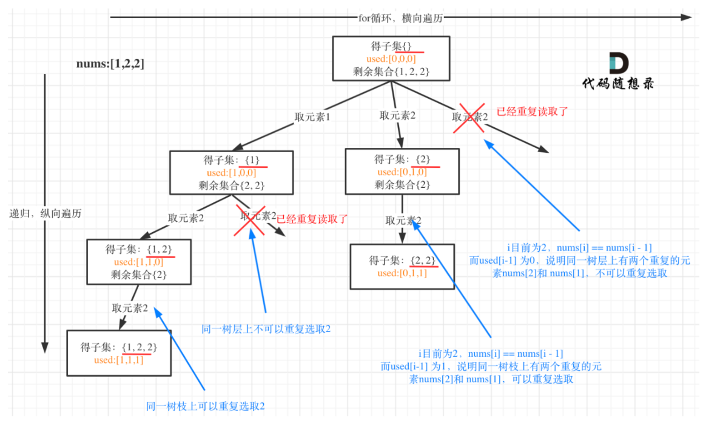
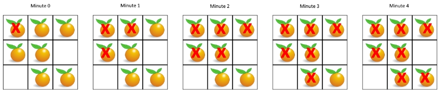

- [LeetCode Summary](#leetcode-summary)
- [Little Tips Mentioned Ahead](#little-tips-mentioned-ahead)
- [贪心](#贪心)
  - [55.跳跃游戏](#55跳跃游戏)
- [二分](#二分)
  - [704.二分查找](#704二分查找)
  - [33.搜索旋转排序数组](#33搜索旋转排序数组)
  - [81.搜索旋转排序数组 II](#81搜索旋转排序数组-ii)
  - [69.x的平方根](#69x的平方根)
  - [34.在排序数组中查找元素的第一个和最后一个位置](#34在排序数组中查找元素的第一个和最后一个位置)
  - [162.寻找峰值](#162寻找峰值)
  - [2616.最小化数对的最大差值(贪心+二分)](#2616最小化数对的最大差值贪心二分)
  - [2439.最小化数组中的最大值(贪心+二分)](#2439最小化数组中的最大值贪心二分)
  - [2560.打家劫舍 IV(贪心+二分)](#2560打家劫舍-iv贪心二分)
- [DFS \& BFS](#dfs--bfs)
  - [200.岛屿数量](#200岛屿数量)
  - [78.子集](#78子集)
  - [90.子集 II](#90子集-ii)
  - [46.全排列](#46全排列)
  - [47.全排列 II](#47全排列-ii)
  - [994.腐烂的橘子(多源点BFS)](#994腐烂的橘子多源点bfs)
  - [1457.二叉树中的伪回文路径(DFS+回溯+位运算技巧)](#1457二叉树中的伪回文路径dfs回溯位运算技巧)
  - [1038.从二叉搜索树到更大和树(DFS, DQ20231204)](#1038从二叉搜索树到更大和树dfs-dq20231204)
- [排序](#排序)
  - [215.数组中的第K个最大元素](#215数组中的第k个最大元素)
  - [912.堆排序](#912堆排序)
  - [912.快速排序\&三路快速排序](#912快速排序三路快速排序)
  - [2933.高访问员工(排序+哈希, WC371)](#2933高访问员工排序哈希-wc371)
  - [2948.交换得到字典序最小的数组(分组排序，WC373)](#2948交换得到字典序最小的数组分组排序wc373)
- [链表](#链表)
  - [206.反转链表](#206反转链表)
  - [25.K个一组翻转链表](#25k个一组翻转链表)
  - [21.合并两个有序链表](#21合并两个有序链表)
  - [141.环形链表](#141环形链表)
  - [142.环形链表 II](#142环形链表-ii)
  - [160.相交链表](#160相交链表)
  - [143.重排链表](#143重排链表)
  - [237.删除链表中的节点](#237删除链表中的节点)
  - [83.删除排序链表中的重复元素](#83删除排序链表中的重复元素)
  - [82.删除排序链表中的重复元素 II](#82删除排序链表中的重复元素-ii)
  - [148.排序链表](#148排序链表)
  - [2.两数相加](#2两数相加)
- [栈](#栈)
  - [20.有效的括号](#20有效的括号)
  - [402.移掉 K 位数字(贪心+单调栈)](#402移掉-k-位数字贪心单调栈)
- [队列\&优先队列](#队列优先队列)
  - [1046.最后一块石头的重量](#1046最后一块石头的重量)
- [树](#树)
  - [102.二叉树的层序遍历](#102二叉树的层序遍历)
  - [94.二叉树的中序遍历](#94二叉树的中序遍历)
  - [103.二叉树的锯齿形层序遍历](#103二叉树的锯齿形层序遍历)
  - [236.二叉树的最近公共祖先](#236二叉树的最近公共祖先)
  - [543.二叉树的直径](#543二叉树的直径)
  - [124.二叉树中的最大路径和](#124二叉树中的最大路径和)
  - [958.二叉树的完全性检验](#958二叉树的完全性检验)
- [图](#图)
- [双指针](#双指针)
  - [15.三数之和](#15三数之和)
  - [88.合并两个有序数组](#88合并两个有序数组)
  - [26.删除有序数组中的重复项](#26删除有序数组中的重复项)
  - [80. 删除有序数组中的重复项 II](#80-删除有序数组中的重复项-ii)
  - [11.盛最多水的容器(双指针+贪心)](#11盛最多水的容器双指针贪心)
- [滑动窗口](#滑动窗口)
  - [3.无重复字符的最长子串](#3无重复字符的最长子串)
  - [76.最小覆盖子串](#76最小覆盖子串)
  - [1423.可获得的最大点数(问题转化+滑动窗口, DQ20231202)](#1423可获得的最大点数问题转化滑动窗口-dq20231202)
- [动态规划](#动态规划)
  - [53.最大子数组和](#53最大子数组和)
  - [152.乘积最大子数组](#152乘积最大子数组)
  - [121.买卖股票的最佳时机](#121买卖股票的最佳时机)
  - [122.买卖股票的最佳时机 II](#122买卖股票的最佳时机-ii)
  - [322.零钱兑换](#322零钱兑换)
  - [518.零钱兑换 II](#518零钱兑换-ii)
  - [198.打家劫舍(简单DP)](#198打家劫舍简单dp)
  - [213.打家劫舍 II(两次DP)](#213打家劫舍-ii两次dp)
  - [337.打家劫舍 III(树形DP)](#337打家劫舍-iii树形dp)
  - [100118.在树上执行操作以后得到的最大分数(WC 370)](#100118在树上执行操作以后得到的最大分数wc-370)
  - [221.最大正方形](#221最大正方形)
  - [1277.统计全为 1 的正方形子矩阵](#1277统计全为-1-的正方形子矩阵)
  - [5.最长回文子串](#5最长回文子串)
  - [300.最长递增子序列](#300最长递增子序列)
  - [1143.最长公共子序列](#1143最长公共子序列)
  - [718.最长重复子数组](#718最长重复子数组)
  - [42.接雨水](#42接雨水)
  - [72.编辑距离](#72编辑距离)
  - [1235.规划兼职工作](#1235规划兼职工作)
  - [139.单词拆分](#139单词拆分)
  - [1049.最后一块石头的重量 II](#1049最后一块石头的重量-ii)
- [设计类问题](#设计类问题)
  - [146.LRU 缓存](#146lru-缓存)
  - [1670.设计前中后队列](#1670设计前中后队列)
- [数学类问题](#数学类问题)
- [模拟 \& 找规律](#模拟--找规律)
  - [54.螺旋矩阵](#54螺旋矩阵)
  - [31.下一个排列](#31下一个排列)
- [差分 \& 前缀和](#差分--前缀和)
  - [304.二维区域和检索-矩阵不可变](#304二维区域和检索-矩阵不可变)
  - [2536.子矩阵元素加 1](#2536子矩阵元素加-1)
  - [560.和为 K 的子数组](#560和为-k-的子数组)
  - [1094.拼车(一维差分)](#1094拼车一维差分)
  - [1109 航班预订统计(一维差分)](#1109-航班预订统计一维差分)
  - [848.字母移位(倒序遍历/一维差分)](#848字母移位倒序遍历一维差分)
  - [2381.字母移位 II(一维差分)](#2381字母移位-ii一维差分)
- [其他问题](#其他问题)
  - [1.两数之和(哈希)](#1两数之和哈希)
  - [56.合并区间(排序)](#56合并区间排序)
  - [1758.生成交替二进制字符串的最少操作数(技巧)](#1758生成交替二进制字符串的最少操作数技巧)
  - [128.最长连续序列(推理+剪枝)](#128最长连续序列推理剪枝)
  - [2934.最大化数组末位元素的最少操作次数(分类讨论，WC371)](#2934最大化数组末位元素的最少操作次数分类讨论wc371)
  - [1657.确定两个字符串是否接近(问题转化，DQ20231130)](#1657确定两个字符串是否接近问题转化dq20231130)


# LeetCode Summary

本文件是在解决LeetCode算法问题过程中的总结与反思汇总，<mark>点击题目的超链接即可跳转到对应LeetCode官网题面</mark>。

# Little Tips Mentioned Ahead

- 如果要使用线性复杂度在一维数组中解决问题，优先考虑<mark>滑动窗口</mark>和<mark>双指针</mark>，以及<mark>动态规划</mark>。
- Top K的问题求解时，优先考虑堆(优先队列)来解决，因为它<mark>会自动维护前K个元素的有序性</mark>。但这里有一些例外，比如<mark>215.数组中的第K个最大元素</mark>，就使用了<mark>快速选择算法(QuickSelect)</mark>来快速地定位第K大的元素，这是因为只需要求"第k大"而非"前k大。
- 有关链表的问题中，<mark>添加伪节点Dummy是一个很好的习惯</mark>，它会使得原本头节点的处理逻辑和后续节点保持一致，从而大大简化代码的边界情况讨论。

# 贪心

## [55.跳跃游戏](https://leetcode.cn/problems/jump-game/description/)

这道题给出了一个数组nums，<mark>nums[i]表示的含义是在i这个位置，最多可以往后走的步数。</mark>现在问是否可以走到数组的尾部？

第一次看到这道题时我尝试使用DFS，

# 二分

朴素的二分搜索是一种非常基础和巧妙的算法，它使用序列中存在的<mark>二段性</mark>来将原有区间一分为二，<mark>从而实现O(n)->O(logn)的搜索加速</mark>。基于朴素二分法也诞生了非常多的变式题，这些题往往非常精巧和复杂：<b>首先你要找出序列中存在的二段性，其次要妥善处理各种边界条件</b>。前者只能就事论事地结合题目来思考，后者需要约定好写二分法代码的区间，<mark>二分区间可以是左闭右开的区间，抑或是左闭右闭区间</mark>，可以根据问题本身的场景确定到底使用哪种写法更加简单，其他两种区间形式(左开右开、左开右闭用的比较少，等遇到问题再详细解释)。

## [704.二分查找](https://leetcode.cn/problems/binary-search/)

这是二分查找和搜索的基础问题，就是<mark>在一个有序的数组中找到对应的元素的下标</mark>，不存在则返回-1，还有一类问题就是<mark>确定特定元素的插入位置</mark>，这两类问题的解决方法是一样的。


这里我直接给出左闭右闭区间下的代码写法：
```cpp
// 约定：使用左闭右闭区间
class Solution {
public:
    int search(vector<int>& nums, int target) 
    {
        int n = nums.size();
        int Left = 0, Right = n - 1;

        // 在左闭右闭区间中搜索一个元素
        // Mid元素已经被验证过，因此不能再包含Mid了
        while(Left <= Right)
        {
            int Mid = (Left + Right) >> 1;
            if(nums[Mid] == target)
                return Mid;
            
            // 注意对区间端点值的更新
            else if(nums[Mid] < target)
                Left = Mid + 1;
            else
                Right = Mid - 1;
        }

        // 如果跳出循环说明查找失败了
        return -1;
    }
};
```

## [33.搜索旋转排序数组](https://leetcode.cn/problems/search-in-rotated-sorted-array/)


这道题是一道经典的使用二分法解决的问题，题目是<mark>要求在一个"旋转排序"之后的数组</mark>里找到指定的元素并返回下标。这道题所谓的二段性体现在：<b>在这样一个旋转排序的数组中的任何一个位置切一刀，总会旋转排序数组切分成两个部分，一个部分有序，一个部分无序。</b>可以结合上图来理解这种二段性。

<mark>既然有二段性，这道题就可以使用二分法来求解</mark>，方法就是逐步地判断目标元素target是否在有序区间那一半，如果在<mark>则在有序区间中二分下去</mark>，如果<mark>不在则在无序区间中进一步二分下去</mark>。这样就可以实现O(logn)级别的算法复杂度：

```cpp
class Solution {
// 约定：使用左闭右闭区间
public:
    int search(vector<int>& nums, int target) 
    {
        int n = nums.size();
        if(n == 1)
            return nums[0] == target ? 0 : -1; 
        int Left = 0, Right = n - 1;
        while(Left <= Right)
        {
            int Mid = (Left + Right) >> 1;

            // 如果找到目标元素直接返回
            if(nums[Mid] == target)
                return Mid;
            
            // 说明[Left, Mid]是有序区间
            // 注意这里一定要取等号
            // 这是因为这里Mid取的是中间元素中靠前的那个
            // 这里的逻辑有些晦涩，可推导用例[3,1], 1的错误
            if(nums[Left] <= nums[Mid])
            {
                // 如果target位于这个有序区间内
                // 则更新Right
                if(nums[Left] <= target and target < nums[Mid])
                    Right = Mid - 1;
                else
                    Left = Mid + 1;
            }          

            // nums[Left] > nums[Mid]，说明有序区间是[Mid, Right]
            else 
            {
                if(nums[Mid] < target and target <= nums[Right])
                    Left = Mid + 1;
                else
                    Right = Mid - 1;
            }
        }
        return -1;
    }
};
```

## [81.搜索旋转排序数组 II](https://leetcode.cn/problems/search-in-rotated-sorted-array-ii/)

这道题是在上述<mark>搜索旋转数组</mark>的问题上引入了重复元素，这下使得整个问题变得复杂了很多，首先之前的二段性就荡然无存了，所以二分算法只能加速本题的求解，而在<mark>最坏状态下问题还是会退化到O(n)的状态</mark>。

含注释的代码如下：
```cpp
// 约定：左闭右闭区间
class Solution {
public:
    bool search(vector<int> &nums, int target) {
        int n = nums.size();
        int Left = 0, Right = n - 1;
        while(Left <= Right)
        {  
            int Mid = (Left + Right) >> 1;
            if(nums[Mid] == target)
                return true;
            
            // 若正好位于"平台"上
            // 这里只能对指针进行微调
            // 所以算法的最坏复杂度还是O(n)
            if(nums[Left] == nums[Mid] and nums[Mid] == nums[Right])
            {
                ++Left;
                --Right;
            }

            // 这里及以下的逻辑和33.搜索旋转排序数组是一致的
            else if(nums[Left] <= nums[Mid])
            {
                if(nums[Left] <= target and target < nums[Mid])
                    Right = Mid - 1;
                else
                    Left = Mid + 1;
            }
            // [nums[Mid], nums[right])是有序区间
            else     
            {
                if(nums[Mid] < target and target <= nums[Right])
                    Left = Mid + 1;
                else
                    Right = Mid - 1;
            }   
        }
        return false;
    }
};
```
其实本题的难点就在于，当我们找到的nums[Mid]正好位于旋转数组重复元素的"平台期"时，我们<mark>不知道两个区间到底哪个是有序的，这种情况下只能将指针进行简单的调整</mark>。而正是因为这种情况的出现，算法的最坏时间复杂度可能会退化到O(n)。

## [69.x的平方根](https://leetcode.cn/problems/sqrtx/)
这道题非常简单，就是求出一个整数x的平方根，<mark>返回它的平方根抹去小数的整数部分</mark>，比方说8平方根是$2 \times \sqrt{2} = 2.8$，我们只需要返回2即可。这道题一般来说，需要掌握<b>二分法和牛顿梯度下降法(牛顿法)</b>。因为牛顿法使用相对较少，且依赖数学公式推导，这里我们只写二分法，代码和注释如下：

```cpp
class Solution {
public:
    int mySqrt(int x) 
    {
        if(x == 0 or x == 1)
            return x;
        
        // 确定二分的左右边界
        int Left = 0, Right = x;
        while(Left <= Right)
        {
            int Mid = (Left + Right) >> 1;

            // 因为Mid * Mid可能会使得int溢出
            // 所以我们这里将一个Mid移到等号的右半边
            // 这样可以防止溢出，是一个小技巧
            if(Mid == x / Mid)
                return Mid;
            else if(Mid < x / Mid)
                Left = Mid + 1;
            else
                Right = Mid - 1;    
        }   
        return Left - 1;
    }
};
```

## [34.在排序数组中查找元素的第一个和最后一个位置](https://leetcode.cn/problems/find-first-and-last-position-of-element-in-sorted-array/description/)

这道题给出了一个排好序的数组，并给出了一个数字，让我们<mark>找出这个数字出现的第一个和最后一个位置，要求使用二分法。</mark>

这道题相对思维难度最小的做法是两趟二分，虽然要求时间复杂度是O(logn)，但其实我们可以执行多次二分。<b>我们首先实现一个函数，找出在数组中第一个大于target的数字</b>(最简单地，我们可以使用upper_bound内置函数来实现这个功能)：

```cpp
// 版本1：使用内置的upper_bound函数
int findFirstLarger(const vector<int>& nums, int target)
{
    auto iter = upper_bound(nums.begin(), nums.end(), target);
    return iter - nums.begin();
}

// 版本2：自己手写二分
// 这里我采用了左闭右闭的二分写法
int findFirstLarger(const vector<int>& nums, int target)
{
    int n = nums.size();

    // 左闭右闭区间的写法
    int Left = 0, Right = n - 1;

    // 跳出区间时应该有Left == Right
    // 此时区间恰好只有一个元素，我们还需要检查这个元素
    while(Left < Right)
    {
        int Mid = (Left + Right) >> 1;
        if(nums[Mid] > target)
            Right = Mid;
        else
            Left = Mid + 1;
    }


    // 检查元素，并返回其下标
    // 如果没有找到满足的元素，返回尾后值
    return nums[Left] > target ? Left : n;
}

```

在实现了上述找大于某个元素的第一个元素的函数之后，这道题只需要调用两次上述函数，执行两次二分即可，参数的设置比较巧妙，代码如下：
```cpp
vector<int> searchRange(vector<int>& nums, int target) 
{
    int n = nums.size();
    if(not n)
        return {-1, -1};
    
    // 大于target - 1的第一个元素
    // 若存在，必为target出现的第一个位置
    int Left = findFirstLarger(nums, target - 1);

    // 大于target的第一个元素出现的位置的上一个位置
    // 必为target出现的最后一个位置
    int Right = findFirstLarger(nums, target) - 1;

    // 由于找不到合适元素时返回尾后值
    // 这里我们可以比较Left和Right的相对大小
    // 从而判断有没有合适的解
    if(Left <= Right)
        return {Left, Right};
    else
        return {-1, -1};
}
```

## [162.寻找峰值](https://leetcode.cn/problems/find-peak-element/)

这道题要求使用二分法来寻找一个数组中的“峰值”，<mark>所谓峰值就是局部极大值</mark>，一个数组中可能有多个峰值，但我们只需要返回一个即可，本题的二段性在于<mark>峰值一定在上升段和下降段的交汇处。</mark>所以我们只需要循着上升段找下去即可。

代码如下，注意我约定的区间是<mark>左闭右闭区间</mark>，因为本题约定<mark>默认区间的两侧都是负无穷大，所以极值一定存在。</mark>故写跳出循环的条件时，只需要$Left < Right$即可跳出。
```cpp

class Solution {
public:
    int findPeakElement(vector<int>& nums) 
    {
        int n = nums.size();
        int Left = 0, Right = n - 1;
        while(Left < Right)
        {
            int Mid = (Left + Right) >> 1;
            if(nums[Mid] <= nums[Mid + 1])
                Left = Mid + 1;
            else
                Right = Mid;
        }
        return Left;
    }
};

```
## [2616.最小化数对的最大差值(贪心+二分)](https://leetcode.cn/problems/minimize-the-maximum-difference-of-pairs/description/)

这道题和2023年9月15日滴滴笔试第一题完全类似，是极小化极大值问题，与之相对的还有极大化极小值问题，它们的解法都是<mark>贪心+二分</mark>，这类问题应该作为一类模板问题记录下来。

这道题给出了一个数组，<mark>让我们找出P个数对，每个数对的两个数之间会有一个差值</mark>。我们要让这些差值的最大值最小化，问我们该怎么选出这P个数对？

第一次看到这个题，大概率是很难想到最优解的。这类问题解法如下：

- <mark>首先将数组排序</mark>，这样可以使每一数对中两个数值的相对差异最小。
- 对[0, nums[n - 1]]这个范围的数字进行二分，<mark>贪心地判断每一个中值是否满足上述条件</mark>。在本题中就是判断相邻两个数组成的数对，它们的差小于中值的数量，是否大于等于P。如果满足，那么这个中值就足够大，完全可以容纳下这么多的数对，反之说明还不够大。
- 继续二分下去，因为题目保证$0 \le p \le \frac{nums.length}{2}$，<mark>所以这样的最大差值一定存在，我们完全可以使用左闭右闭的区间写法</mark>，循环条件为while(Left < Right)
  
```cpp
class Solution {
  
  bool isLegal(vector<int>& nums, int p, int Mid)
  {
    int n = nums.size();
    int Counter = 0;
    for(int i = 1 ; i < n ; ++i)
    // 判断相邻数对差值是否小于Mid
    // 每发现一个这样的相邻数对，计数值就加一
    // 同时直接跳到下一个元素对
      if(nums[i] - nums[i - 1] <= Mid)
      {
        ++Counter;

        // ++i专门用来跳到下一个元素对
        // 注意这就是贪心的地方所在
        // 遇到满足条件的元素对，直接就选下来
        ++i;
      }
    
    // 看是否满足P个数对的要求
    return Counter >= p;
  }
public:
    int minimizeMax(vector<int>& nums, int p) {
        int n = nums.size();
        sort(nums.begin(), nums.end());

        // 对[0， nums[n - 1]]这个范围内的数字进行二分
        // 因为答案一定存在，所以使用Left < Right作为循环条件
        int Left = 0, Right = nums[n - 1];
        while(Left < Right)
        {
          
          // 判断每个中值是否满足条件
          // 按照情况缩小查找范围
          int Mid = (Left + Right) >> 1;
          if(isLegal(nums, p, Mid))
            Right = Mid;
          else
            Left = Mid + 1;
        }

        // 最后返回Left即可
        return Left;
    }
};
```

## [2439.最小化数组中的最大值(贪心+二分)](https://leetcode.cn/problems/minimize-maximum-of-array/description/)

这道题和上面的一个问题是同源的，都是极小化极大值问题，这道题给出了一个数组，和一个操作，这个操作如下：

- 选择一个下标i，$1 \le i \lt n - 1$
- 每次可以使nums[i]-1，代价是nums[i - 1]必须+1

求问经过若干次这样的操作之后，<mark>整个数组中元素的最小化最大值是多少?</mark>。这个问题的本质在于，后面的元素如果过大，<b>可以将“压力”分担给前面的所有元素来均衡，这就是上面这个操作的本质</b>。还有一个特别需要注意的是，nums[0]这个元素非常特殊，因为它<mark>“无法像其他元素那样向前分担压力”</mark>。

理解了这个本质之后，这道题的做法还是二分+贪心，代码如下：
```cpp
class Solution {
    bool isLegal(vector<int> nums, int Mid)
    {
        int n = nums.size();

        // 注意nums[0]这个元素的特殊性
        if(nums[0] > Mid)
            return false;

        // Counter用来记录一个元素之前有多少余量
        // 余量指的是前面的元素可以帮助它分担多少压力
        // 初始情况下，余量是Mid - nums[0]
        // 不要忘记了nums[0]可以提供的余量
        long long Counter = Mid - nums[0];

        // 模拟，看当前序列是否可以满足Mid作为最大值
        for(int i = 1 ; i < n ; ++i)
        {
            if(nums[i] > Mid)
            {
                // 及时对Counter值进行更新
                Counter -= (nums[i] - Mid);
                if(Counter < 0)
                    return false;
            }
            else
                Counter += (Mid - nums[i]);
        }
        return true;
    }
public:
    int minimizeArrayValue(vector<int>& nums) {
        int n = nums.size();
        int Max = 0;
        for(auto Each : nums)
            Max = max(Max, Each);
        
        if(Max == nums[0])
            return Max;
        
        // 二分，最大元素值不可能超过当前序列元素最大值
        // 因此对[0, Max]这个范围的值进行二分即可
        int Left = 0, Right = Max;
        while(Left < Right)
        {
            int Mid = (Left + Right) >> 1;
            if(isLegal(nums, Mid))
                Right = Mid;
            else
                Left = Mid + 1;
        }
        return Left;
    }
};

```
## [2560.打家劫舍 IV(贪心+二分)](https://leetcode.cn/problems/house-robber-iv/description/)

和打家劫舍的其他姊妹问题不同，打家劫舍IV是一个<mark>基于二分的，极小化极大值问题。</mark>而其他的几个问题都是动态规划问题。

这道题给出了一个长度为n的数组，让我们<mark>从这个数组中挑选出各不相邻的k个数字，求这个k个数字中极大值的极小者。</mark>这也是一道典型的极小化极大值问题，首先我们要写出一个最基本的二分的框架，然后<mark>在这个基础上写出判断中值是否合法的函数。</mark>

这道题和2616.最小化数对的最大差值有些类似，我们<mark>也需要在满足条件时将元素直接选下来并直接跳过下一个相邻元素</mark>(因为相邻元素不能同时选取)。代码如下，注意<b>max_element函数的使用</b>，它的返回值<b>是一个迭代器</b>，以后不必自己遍历去求序列最大值。

```cpp
class Solution {
    bool isLegal(vector<int>& nums, int k, int Mid)
    {
        int n = nums.size();
        int Counter = 0;
        
        // 遍历序列中的元素
        for(int i = 0 ; i < n ; ++i)
        {
            // 如果发现元素满足要求
            // 直接贪心地选下它，不要犹豫
            if(nums[i] <= Mid)
            {
                ++Counter;

                // 跳过下一个相邻元素，它不能选
                ++i;
            }
        }

        // 看计数值有没有超过k
        return Counter >= k;
    }
public:
    int minCapability(vector<int>& nums, int k) {
        int n = nums.size();

        // Left和Right分别设定为0和序列中的最大值
        int Left = 0, 
        Right = *max_element(nums.begin(), nums.end());
        while(Left < Right)
        {
            // 判断每个中值元素是否合法
            // 并不断二分缩小范围
            int Mid = (Left + Right) >> 1;
            if(isLegal(nums, k, Mid))
                Right = Mid;
            else
                Left = Mid + 1;
        }
        return Left;
    }
};

```

# DFS & BFS

DFS和BFS是最常见的两种搜索方法，前者以<mark>搜索的深度(depth)优先</mark>，会一鼓作气地搜索到合法位置边界，然后<mark>逐渐回退搜索距离去搜索其他的位置</mark>。BFS则是沿着距离出发点从近到远，一步步地“逐层”完成遍历，这里的“层”表示的是<mark>距离源点距离等同的点组成的集合</mark>，BFS就像<b>往水中投入一颗石子，涟漪向外逐渐扩展的过程</b>。这两种算法都是可以完整地对搜索空间完成遍历的。

因为算法的特性，<mark>DFS往往采用递归法(栈)实现，而BFS则使用队列来迭代实现</mark>。同时，DFS往往也会<mark>结合回溯、剪枝等技巧对搜索空间完成更加高效的搜索</mark>。

## [200.岛屿数量](https://leetcode.cn/problems/number-of-islands/)

这道题给出一个二维数组，其中1表示陆地，0表示海洋，问<mark>有多少块陆地</mark>(上下左右方向上连在一起的都属于一个陆地)。

这是一个<mark>非常典型的统计连通分量个数</mark>的问题，一个DFS/BFS搜索只能“打通”一个连通块。要找到所有的连通块还是要对矩阵进行遍历，找到所有没展开过搜索的源点进行分别的DFS，<mark>执行DFS的次数就是陆地的数量</mark>。完整的代码如下，每次DFS时都要对四个方向进行搜索：

```cpp
class Solution {
    /*array indicating whether the element has been used*/
    bool Used[300][300] = {false};

    /*check if the current point inside of boundary*/
    bool isInBoundary(vector<vector<char>>& grid, int i, int j)
    {
        return i >= 0 && i < grid.size() && j >= 0 && j < grid[0].size();
    }

    /*(i,j) is the start point of traverse*/
    void DFS(vector<vector<char>>& grid, int i, int j)
    {
        /*if not has been arrived and current element is land*/
        if(isInBoundary(grid, i, j) && !Used[i][j] && grid[i][j] == '1')
        {
            /*set the (i,j) as true*/
            Used[i][j] = true;

            /*DFS towards RIGHT, DOWN, LEFT, UP*/
            DFS(grid, i, j + 1);
            DFS(grid, i + 1, j);
            DFS(grid, i, j - 1);
            DFS(grid, i - 1, j);
        }
    }

    /*return value is the number of islands*/
    int DFSTraverse(vector<vector<char>>& grid, int RowNum, int ColNum)
    {
        int Result = 0;

        for(int i = 0 ; i < RowNum ; ++i)
            for(int j = 0 ; j < ColNum ; ++j)
                /*if the current element has not been arrived, start from it*/
                if(!Used[i][j] && grid[i][j] == '1')
                {
                    DFS(grid, i, j);
                    ++Result;
                }
        return Result;
    }

public:
    int numIslands(vector<vector<char>>& grid) {
        /*get the size of vector*/
        int RowNum = grid.size();
        int ColNum = grid[0].size();

        return DFSTraverse(grid, RowNum, ColNum);
    }
};
```


## [78.子集](https://leetcode.cn/problems/subsets/solution/)

这道题给出了一个<b>不含重复元素的数组</b>，任务是让我们求出这个数组的所有子集。这道题可以使用<mark>DFS + 回溯</mark>来完成，但是更加方便的一种方法则是使用<mark><b>基于掩码的方法</b></mark>，或者说迭代法。

因为子集的选取本质就是二进制串的枚举过程，所以<mark>只需要遍历所有掩码的情况，找出每个掩码中为1的位，挑选对应的数字加入集合</mark>即可，这就是迭代法的本质，代码如下：
```cpp
class Solution {
public:
    vector<vector<int>> subsets(vector<int>& nums) {
        vector<vector<int>> Ans;
        int n = nums.size();

        // 生成掩码mask，覆盖从[0, 2^n - 1]的区间
        for(int Mask = 0 ; Mask < (1 << n) ; ++Mask)
        {
            vector<int> Tmp;

            // 检测上述掩码中每一位的情况
            // 如果对应位是1，则将对应的数字加入集合
            for(int i = 0 ; i < n ; ++i)
                if((1 << i) & Mask)
                    Tmp.push_back(nums[i]);

            // 得到一个集合，加入最终结果集合
            Ans.push_back(Tmp);
        }
        return Ans;
    }
};
```

作为学习，也应该掌握DFS+回溯的写法，DFS本质和迭代法是一致的，迭代法通过<mark>枚举所有二进制掩码串来覆盖整个搜索空间</mark>，递归法则考虑当前字符是否应该放入出发，每个字符都有<b>放入和不放入两种可能</b>，这和排列是不一样的，<mark>顺序不同不能作为区分的标准</mark>，代码如下：
```cpp
class Solution {
    vector<vector<int>> Ans;
    vector<int> Tmp;
    void DFS(vector<int>& nums, vector<int>& Tmp, int Pos, int n)
    {
        if(Pos == n)
        {
            Ans.push_back(Tmp);
            return;
        }

        // 放入当前字符的情况，回溯法消除状态影响
        Tmp.push_back(nums[Pos]);
        DFS(nums, Tmp, Pos + 1, n);
        Tmp.pop_back();

        // 不放入当前字符的情况
        DFS(nums, Tmp, Pos + 1, n);
    }


public:
    vector<vector<int>> subsets(vector<int>& nums) {
        int n = nums.size();
        DFS(nums, Tmp, 0, n);
        return Ans;
    }
};
```

## [90.子集 II](https://leetcode.cn/problems/subsets-ii/)

这道题和上一题大体一致，不同的地方在于本题给出的<mark>集合有重复元素</mark>，凡是有重复数字的问题难点就是去重。而对于这一类的问题，一个标准的解法就是<b>排序</b>，排序之后相同的元素会聚集在一起。理解这个问题的一个很好的角度是<b>“树层去重”和“树枝去重”</b>。示意图如下：



其实这个所谓的搜索过程可以被抽象成树的遍历过程，<mark>向深处遍历的过程增加了子集的大小， 重复元素在这种情况下并不用被规避</mark>。本题也可以使用基于掩码的方法(迭代)来实现，基于掩码的方法本质上枚举了整个搜索空间，代码则要从这些搜索空间中<mark>筛去不符合要求的元素</mark>。

```cpp
class Solution {
public:
    vector<vector<int>> subsetsWithDup(vector<int>& nums) {
        int n = nums.size();
        vector<vector<int>> Ans;
        sort(nums.begin(), nums.end());
        for(int Mask = 0 ; Mask < (1 << n) ; ++Mask)
        {
            vector<int> Tmp;
            bool Valid = true;
            for(int i = 0 ; i < n ; ++i)
            {
                if(Mask & (1 << i))
                {
                // 判断条件说明
                // 1.当前元素与前一个元素相同
                // 2.且前一个数据没有被加入子集
                // 那么在搜索空间中，这是一个重复的层序搜索，删去这个解
                // 否则是一个广度搜索，继续深入下去
                    if( i > 0 and 
                        nums[i] == nums[i - 1] and 
                        (Mask & (1 << i - 1)) == 0)
                    {
                        Valid = false;
                        break;
                    }
                    Tmp.push_back(nums[i]);
                }
            }
            if(Valid)
                Ans.push_back(Tmp);
        }
        return Ans;
    }
};
```

同样的，这里也可以使用回溯法来实现问题的求解，我们记录<b>上一个元素是什么，以及它是否加入了集合</b>，来判断当前元素是否应该加入子集即可，代码如下：
```cpp
class Solution {
    vector<vector<int>> Ans;
    vector<int> Tmp;
    void DFS(vector<int>& nums, int Pos, int n, bool LastIn)
    {
        if(Pos == n)
        {
            Ans.push_back(Tmp);
            return;
        }
    
        // 无论如何都应该尝试，不放入当前元素的情况 
        DFS(nums, Pos + 1, n, false);

        // 如果可能出现层级遍历重复的情况，则不尝试放入当前元素
        if( Pos > 0 and 
            LastIn == false and 
            nums[Pos - 1] == nums[Pos])
            return;
        
        // 否则尝试放入当前元素
        // 使用回溯法消除状态改变
        Tmp.push_back(nums[Pos]);
        DFS(nums, Pos + 1, n, true);
        Tmp.pop_back();

    }
public:
    vector<vector<int>> subsetsWithDup(vector<int>& nums) {
        int n = nums.size();

        // 一定要排序，否则重复元素不会聚集在一起
        sort(nums.begin(), nums.end());
        DFS(nums, 0, n, false);
        return Ans;
    }
};
```

## [46.全排列](https://leetcode.cn/problems/permutations/description/)

这道题也是一道经典问题，就是给出一个<b>不含重复数字的数组</b>，让我们找出它的所有全排列。使用回溯法即可，注意因为在排列问题中，元素的<mark>相对顺序不同算作不同的排列</mark>，所以每次都需要遍历整个序列，安排每一个元素到每一个位置上。

因为不含重复元素，所以本题就是一个基础的回溯，因为<mark>要记录每个元素是否被使用过</mark>，所以我们有必要开辟一个Visited数组来记录使用情况。

```cpp
class Solution {
    vector<vector<int>> Ans;
    vector<int> Tmp;
    bool IsVisited[10] = {false};
    void DFS(vector<int>& nums, int n, int Counter)
    {
        if(Counter == n)
        {
            Ans.push_back(Tmp);
            return;
        }

        for(int i = 0 ; i < n ; ++i)
            if(not IsVisited[i])
            {
                IsVisited[i] = true;
                Tmp.push_back(nums[i]);
                DFS(nums, n, Counter + 1);
                Tmp.pop_back();
                IsVisited[i] = false;
            }
    }

public:
    vector<vector<int>> permute(vector<int>& nums) {
        int n = nums.size();
        DFS(nums, n, 0);
        return Ans;
    }
};

```

## [47.全排列 II](https://leetcode.cn/problems/permutations-ii/description/)

这道题作为上一题的进阶版，在数组中<b>加入了重复元素</b>。其实解决思路也和之前子集问题一样，我们需要首先对原数组进行排序，这样会<mark><b>使得相同元素聚集在一起</b></mark>，每当我们准备插入一个元素时，要判断它的前一个元素的情况，<mark>刨除掉“树层遍历”的重复情况，保留“深度遍历”的情况</mark>。

```cpp
class Solution {
    vector<vector<int>> Ans;
    vector<int> Tmp;
    bool Visited[8] = {false};
    void DFS(vector<int>& nums, int n, int Length)
    {   
        if(Length == n)
        {
            Ans.push_back(Tmp);
            return;
        }

        for(int i = 0 ; i < n ; ++i)
        {
            if(not Visited[i])
            {
                // 如果当前元素和上一个元素相同
                // 且上一个元素没有加入过排列
                // 说明当前元素在进行重复的树层遍历
                // 我们只需要保存深度遍历的结果
                if( i > 0 and 
                    nums[i] == nums[i - 1] and 
                    not Visited[i - 1])
                    continue;
                
                // 如果不是树层遍历
                // 则使用回溯法探测可行解
                Tmp.push_back(nums[i]);
                Visited[i] = true;
                DFS(nums, n, Length + 1);
                Visited[i] = false;
                Tmp.pop_back();     
            }
        }
            
    }

public:
    vector<vector<int>> permuteUnique(vector<int>& nums) {
        int n = nums.size();

        // 排序，使得相同元素聚集在一起
        sort(nums.begin(), nums.end());
        DFS(nums, n, 0);
        return Ans;
    }
};
```

## [994.腐烂的橘子(多源点BFS)](https://leetcode.cn/problems/rotting-oranges/description/)



这道题的场景是在一个二维方格中，每个方格都有三种状态，<mark>0表示此处没有摆放任何东西，1表示此处放着一个新鲜的橘子，2表示此处放置着一个腐烂的橘子</mark>。每过一分钟，腐烂的橘子<mark>附近四个方向上的橘子都会变成腐烂的橘子</mark>，问最短需要多长时间才可以让这个方格里的所有橘子变成腐烂的橘子。

这道题是一道BFS算法的变式问题，因为每一个瞬间都会有<b>很多个腐烂的橘子开始干扰附近的新鲜橘子</b>。这个过程完全可以使用BFS来模拟，但是问题在于初始状态下，有多个橘子处于腐烂状态，所以我们需要在初始化阶段将其全部压入队列中。

另外需要记录当前还未被影响的新鲜橘子数量，如果<b>直到最后队列排空时仍有橘子没有腐烂，则传播失败，返回-1。</b>代码如下：
```cpp
class Solution {
    int Ans = 0;

    // Distance数组存放每一个位置上的橘子(如果有)，被影响的最短时间
    vector<vector<int>> Distance = vector<vector<int>> (10, vector<int>(10, 0));

    // 4个合法方向，枚举出来方便后面直接索引
    vector<vector<int>> Direction = {{1, 0}, 
                                     {-1, 0}, 
                                     {0, 1}, 
                                     {0, -1}};

    // 防止传播越界，检查下一个传播的位置是否合法
    bool isLegal(pair<int, int>& Pos, vector<int>& Direction, int m, int n)
    {
        return  Pos.first + Direction[0] < m and 
                Pos.second + Direction[1] < n and 
                Pos.first + Direction[0] >= 0 and 
                Pos.second + Direction[1] >= 0;
    }


public:
    int orangesRotting(vector<vector<int>>& grid) {
        int m = grid.size(), n = grid[0].size();
        int Counter = 0;
        queue<pair<int, int>> Q;
        
        // 初始阶段完成以下三个任务，多源点BFS的初始化阶段稍显复杂
        // 1.将腐烂的橘子的坐标放入队列，准备开始传播
        // 2.将腐烂的橘子的传播时间设置为0，表示初始时即腐烂
        // 3.记录下新鲜橘子的个数
        for(int i = 0 ; i < m ; ++i)
            for(int j = 0 ; j < n ; ++j)
            {
                if(grid[i][j] == 2)
                {
                    Q.push(make_pair(i, j));
                    Distance[i][j] = 0;
                }
                else if(grid[i][j] == 1)
                    ++Counter;
            }
        
        // 开始BFS过程
        while(not Q.empty())
        {
            auto Front = Q.front();
            Q.pop();

            // 向四个方向分别传播
            for(int i = 0 ; i < 4 ; ++i)
            {

                // 只有不越界且新鲜的橘子才可以传播
                int X = Front.first + Direction[i][0]; 
                int Y = Front.second + Direction[i][1];
                if( isLegal(Front, Direction[i], m, n) and 
                    grid[X][Y] == 1)
                {
                    --Counter;
                    Distance[X][Y] = Distance[Front.first][Front.second] + 1;

                     // 不断更新最大的传播时间
                    Ans = max(Ans, Distance[X][Y]);

                    // 将最新被影响到的橘子置为腐烂的
                    // 并压入队列让其传播
                    grid[X][Y] = 2;
                    Q.push(make_pair(X, Y));
                }
            }
        }   
        
        // 返回最长的传播时间
        // 如果不能保证所有橘子均被影响，则返回-1
        return Counter == 0 ? Ans : -1;
    }
};

```

## [1457.二叉树中的伪回文路径(DFS+回溯+位运算技巧)](https://leetcode.cn/problems/pseudo-palindromic-paths-in-a-binary-tree/description/)

这道题给出了一棵二叉树，每个节点的值范围均在[1,9]这个范围内，现在要求<mark>求出所有根节点到叶子结点的路径中，所经过的路径节点上的值有能力凑成一个回文序列的数量。</mark>

有能力凑成一个回文序列，那么就要<mark>求路径中的值凑成的伪序列，出现次数为奇数的元素个数必须小于等于1
</mark>。因为元素是有范围的，所以我们完全可以<b>使用一个数组来记录任何一个路径中，出现次数为奇数的元素个数</b>。同时需要注意，我们其实并不需要真的记录下来出现的次数，而是使用0-1来表示这个元素出现次数为奇数还是偶数即可，这一点可以通过<mark>异或运算</mark>来实现，完整的代码如下：


```cpp
// @copyright：灵茶山艾府
class Solution {
    int dfs(TreeNode *node, array<int, 10> &p) {
        if (node == nullptr)
            return 0;
        // 使用异或运算，修改node->val 出现次数的奇偶性
        p[node->val] ^= 1; 
        int res;

        // node是叶子节点
        if (node->left == node->right) { 

            // 返回值是一个布尔值，表示当前这个路径是否满足要求
            res = accumulate(p.begin(), p.end(), 0) <= 1;
        } else {
            res = dfs(node->left, p) + dfs(node->right, p);
        }

        // 回溯，恢复到递归node之前的状态（不做这一步就把 node->val 算到其它路径中了）
        p[node->val] ^= 1;
        return res;
    }

public:
    int pseudoPalindromicPaths(TreeNode *root) {
        array<int, 10> p{};
        return dfs(root, p);
    }
};

```

## [1038.从二叉搜索树到更大和树(DFS, DQ20231204)](https://leetcode.cn/problems/binary-search-tree-to-greater-sum-tree/description/)

这道题给出了一个<b>二叉搜索树</b>，让我们<mark>将其中每个节点的值修改为大于等于这个节点值的所有节点值之和</mark>，题目中保证每个节点的值不相同。

因为这道题是二叉搜索树，所以保证了一个节点的右子树所有节点的值都大于其自身，左子树的所有节点值都小于其自身，所以<mark>解决这道题的一个直观办法就是先遍历右子树，再遍历左子树，并且始终保持一个变量累计遍历过程中的部分和</mark>，代码如下：

```python
# python3
class Solution:
    def bstToGst(self, root: TreeNode) -> TreeNode:
        # 维持一个部分和来累计遍历过程中的节点值之和
        PartialSum = 0
        def DFS(root: TreeNode):
            if not root:
                return

            # 注意声明使用外部变量 
            nonlocal PartialSum

            # 首先遍历右子树，再遍历左子树
            DFS(root.right)

            # 先累计变量，再改变节点值
            PartialSum += root.val
            root.val = PartialSum
            DFS(root.left)

        DFS(root)
        return root
```

# 排序

<b>值得注意的是排序类问题并不是简单的排序算法的实现，而是基于基础排序算法而诞生的一系列问题，其中以快速排序算法的划分法诞生的变式问题最多。</b>

## [215.数组中的第K个最大元素](https://leetcode.cn/problems/kth-largest-element-in-an-array/)

这是典型的一道Top K求解问题，一般来说这类问题使用<mark>堆(优先队列)</mark>来解决即可。但是这道题要求实现O(n)的算法，所以堆排序在时间复杂度上不符合要求。

事实上，这道题使用的是<mark>基于快速排序的快速选择算法</mark>，使用快速排序中的划分法，一点点逼近数组中第K大的数字。在这个过程中还要引入<mark>随机选择划分元</mark>的方法来进一步降低极端情况出现的可能性，从而使得算法的<mark>整体期望复杂度降至O(n)</mark>，这种算法叫做<mark>快速选择(quick select)算法</mark>。

如果遇到要求<mark>第K个最大或者最小元素</mark>，而<b>不期望给出前K个最大最小元素</b>时，使用快速选择算法是一个比较好的选择。

含注释的代码如下：
```cpp
class Solution {
    /*这里假设区间是左闭右闭的[Start, End]*/
    int partition(vector<int>& nums, int Start, int End)
    {
        /*随机选择划分元，可以使得算法复杂度降至O(n)*/
        int RandomIndex = (rand() % (End - Start + 1)) + Start;

        /*Attention ：选好划分元之后，和最左元素交换，方便后续操作*/
        swap(nums[Start], nums[RandomIndex]);
        int Tmp = nums[Start];
        while(Start < End)  // 划分过程，不再详述
        {
            while(Start < End and nums[End] > Tmp) --End;
            nums[Start] = nums[End];
            while(Start < End and nums[Start] <= Tmp) ++Start;
            nums[End] = nums[Start];
        }   
        nums[Start] = Tmp;
        return Start;
    }

    /*快速划分算法：quick select algorithm*/
    int quickSelect(vector<int>& nums, int k, int Start, int End)
    {
        int Pivot = partition(nums, Start, End);
        /* 如果随机选择的划分元正好是第k小的元素，直接返回 */
        if(Pivot == k - 1)                                  
            return nums[Pivot];
        else if(Pivot < k - 1)
            /* 否则向一侧区间进行递归 */
            return quickSelect(nums, k, Pivot + 1, End);    
        else
            return quickSelect(nums, k, Start, Pivot - 1);  

    }
public:
    int findKthLargest(vector<int>& nums, int k) 
    {
        /* 初始化随机数种子 */
        srand((unsigned)time(NULL));                        
        int n = nums.size();
        /* 第k大数字也是第n+1-k小的数字 */
        return quickSelect(nums, n + 1 - k, 0, n - 1);      
    }
};
```

## [912.堆排序](https://leetcode.cn/problems/kth-largest-element-in-an-array/)

堆排序是解决Top K排序的重要方法，但是堆排序<mark>在面试时也往往需要直接手撕</mark>。

值得注意的是，<b>堆一棵完全二叉树</b>，所以在静态存储的树结构中，<mark>一个节点编号和它的左右孩子编号之间存在定量关系</mark>，这是整个堆排序算法运行的重要原理。一般来说有两种换算方法：

- 如果数组下标从1开始，那么<mark>左孩子 = 2 * index</mark>，<mark>右孩子 = 2 * index + 1</mark>
- 如果数组下标从0开始，那么<mark>左孩子 = 2 * index + 1</mark>，<mark>右孩子 = 2 * index + 2</mark>

一般来说数组下标都是从0开始的，所以<mark>一般选择第二种换算法</mark>。

堆排序涉及的核心步骤就是<mark>堆的调整(adjustHeap)</mark>，要重点掌握。
```cpp
/* 向下调整堆的函数, [Low, High]划定了调整范围*/
void adjustHeap(vector<int>& nums, int Low, int High)
{
    // 取出Low节点和其左孩子，注意左孩子的下标是如何计算的
    int i = Low, j = i * 2 + 1;     
    while(j <= High)
    {
        // 调整j为左右孩子中的较大值，准备和i进行交换
        if(j + 1 <= High and nums[j + 1] > nums[j])
            j = j + 1;

        // 如果左右孩子的较大值大于父亲节点，那么交换之并继续向下调整              
        if(nums[i] < nums[j])
        {
            swap(nums[i], nums[j]);
            i = j;
            j = i * 2 + 1;
        }
        // 否则调整到此结束
        else
            break;
    }
}
```

在实现了向下调整堆的函数之后，接下来就是重建堆的函数，即从<mark>数组n/2的位置(n是是数组的总长度)开始倒序进行调整直到第一个节点</mark>，代码如下所示：
```cpp
void buildHeap(vector<int>& nums)
{
    int n = nums.size();
    // 从中间节点进行倒序调整直到第一个节点
    for(int i = n / 2 ; i >= 0 ; --i)
        adjustHeap(nums, i, n - 1);
}
```

在实现了上述两个函数之后，堆排序就很简单了：
<b>
- 首先重建堆，这时位于nums[0]这个位置的一定是最大元素，将其与最后一个元素进行交换，那么此时它就到了它应该在的位置上
- 对[0, n-2]这个范围进行向下调整，从而再一次得到了一个堆
- ...
- 重复这个过程直至所有元素都已经归位
</b>

```cpp
//堆排序
void heapSort(vector<int>& nums)
{
    // 重建堆
    buildHeap(nums);
    int n = nums.size();
    for(int i = n - 1 ; i >= 0 ; --i)
    {
        // 将当前堆的最大元素交换到它的应有位置上，并向下调整堆
        swap(nums[0], nums[i]);
        adjustHeap(nums, 0, i - 1);
    }
}

```
## [912.快速排序&三路快速排序](https://leetcode.cn/problems/sort-an-array/)

这道题还是经典的排序算法实现，这里实现的是<mark>快速排序算法</mark>，快速排序算法主要分为两个部分：<mark>划分和排序</mark>。划分时可以选择使用随机算法选取划分元，这样<mark>在统计意义</mark>上可以将算法的一般复杂度降至O(nlogn)。

注意这里着重强调了在统计意义上，这是因为一般来说使用排序算法的场景是处理现实生活中的数据，这些数据往往是随机的，没有特定规律的。这也就意味着，如果<mark>人为地编造特殊数据</mark>，<b>即使采用挑选随机划分元的方法，快速排序算法的时间复杂度也会退化到O(n^2)</b>，我们很快就会看到这个例子。

这里直接给出快速排序的代码，很经典，必须掌握：
```cpp
class Solution {
    // 在nums[Left, Right]这个范围内进行划分
    int parition(vector<int>& nums, int Start, int End) 
    {
        // 使用随机算法优化划分元的选取
        int RandomIndex = (rand() % (End - Start + 1)) + Start;
        swap(nums[RandomIndex], nums[Start]);
        int Tmp = nums[Start];
        while(Start < End)
        {   
            // 大于等于Tmp元素的值放后面
            while(Start < End and nums[End] >= Tmp) --End;
            nums[Start] = nums[End];
            while(Start < End and nums[Start] < Tmp) ++Start;
            nums[End] = nums[Start];
        }
        nums[Start] = Tmp;
        return Start;
    }

    // 对nums[Start, End]进行快速排序
    void quickSort(vector<int>& nums, int Start, int End)
    {
        // 千万要注意这个前提条件，当区间长度小于等于1时直接返回
        // 否则上面选取划分元时可能出现越界
        if(Start < End)
        {
            int Pivot = parition(nums, Start, End);
            quickSort(nums, Start, Pivot - 1);
            quickSort(nums, Pivot + 1, End);
        }
    }
    
public:
    vector<int> sortArray(vector<int>& nums) {
        // 生成随机数的种子
        srand((unsigned int)time(NULL));
        int n = nums.size();
        quickSort(nums, 0, n - 1);
        return nums;
    }
};
```

这是一套<mark>非常正确和经典的快速排序算法的写法</mark>，更确切地说，是<mark>2-路快速排序</mark>的写法，但是上面的这份代码提交之后会超时。这是因为LeetCode更新了测试用例，给出了一个长度为5 x 10^4个2的数组。这就是我们上面说的：<mark>人造逆天数据</mark>，专门用来将快速排序算法卡住的。

为了解决这个问题，必须引入一种更加先进的算法：<mark>3-路快速排序</mark>，随之而来的还有一个经典问题：[荷兰国旗问题](https://en.wikipedia.org/wiki/Dutch_national_flag_problem)。这道题在LeetCode题库中也是有的，后面也许还有机会见到，其实<mark>这就是3-路快速排序算法的雏形</mark>。

3-路快速排序算法将整个序列分成三部分，设划分元是Tmp，那么<mark>区间将会被划分为以下三部分</mark>：

- 小于Tmp
- 等于Tmp
- 大于Tmp

算法的细节非常精巧和值得回味，下面直接结合代码来说：
```cpp
class Solution {
    // 对nums[Left, Right]进行三路快排划分(3-way partition)
    pair<int, int> partition(vector<int>& nums, int Left, int Right)
    {
        // 随机选择一个划分元
        // 注意这里的划分元选择是有问题的，当区间长度太大时，rand()函数可能不够
        int RandomIndex = (rand() % (Right - Left + 1)) + Left;
        swap(nums[RandomIndex], nums[Left]);
        int Tmp = nums[Left];
        
        // 声明两枚指针Lower，Higher和迭代变量i，并做如下约定(左闭右开区间)
        // [Left, Low)存放小于Tmp的值
        // [Low, High)存放等于Tmp的值
        // [High, Right + 1)存放大于Tmp的值
        int Lower = Left, Higher = Right + 1, i = Left + 1;
        while(i < Higher)
        {
            if(nums[i] < Tmp)
                /*
                    如果当前元素小于划分元，那么首先将其与Lower位置的元素进行互换
                    nums[Lower]一定指向与划分元等大的元素，这是因为我们的约定
                */
                swap(nums[Lower++], nums[i++]);
            else if(nums[i] > Tmp)
            /*
                如果当前元素大于划分元，那么首先将Higher指针前移，因为是右开区间
                然后将当前元素和Higher指向的元素进行互换
                但是注意：i不要加一
                这是因为从Higher原先位置换过来的元素我们是未知的
                还需要再处理一遍
            */
                swap(nums[--Higher], nums[i]);
            else 
                // 遇到了等大的元素，i直接后移
                i++;
        }
        return {Lower, Higher};
    }

    void quickSort(vector<int>& nums, int Left, int Right)
    {
        // 区间长度必须大于1，否则没必要继续深入
        if(Left < Right)
        {
            // 执行上述算法，直接获得两个划分边界Lower和Higher
            // 分治下去即可
            auto ReturnPair = partition(nums, Left, Right);
            quickSort(nums, Left, ReturnPair.first - 1);
            quickSort(nums, ReturnPair.second, Right);
        }
    }
public:
    vector<int> sortArray(vector<int>& nums) {
        srand((unsigned int)time(NULL));
        int n = nums.size();
        quickSort(nums, 0, n - 1);
        return nums;
    }
};

```

## [2933.高访问员工(排序+哈希, WC371)](https://leetcode.cn/problems/high-access-employees/description/)

周赛第371场第二题，题目给出了每一个员工对系统的访问时间，以xxxx(小时分钟)的形式给出，如0943，2359等等，要求<mark>找出在一个小时的时间之内访问系统3次的所有员工。</mark>

这道题其实比较简单，只需要首先将每一个用户的访问时间放置到一个单独的记录中，然后对其时间戳进行排序。这里<mark>首先需要对时间戳进行一个巧妙地处理，将其转化为数字，就可以很方便地进行排序了。</mark>剩下的任务就是对判断每一个用户是否为高访问用户即可，这里主要学习对时间戳的处理方法。


```cpp
class Solution {
public:
    vector<string> findHighAccessEmployees(vector<vector<string>>& access_times) {
        unordered_map<string, vector<int>> AccessRecord;

        // 将每个员工的访问记录记录在一个单独的数组内
        // 注意对时间戳转化为数字的处理方法：
        // 小时 * 60 + 分钟
        for(auto& Each : access_times)
            AccessRecord[Each[0]].push_back(
                stoi(Each[1].substr(0,2)) * 60 + stoi(Each[1].substr(2))
            );
        

        vector<string> Ans;
        for(auto iter = AccessRecord.begin() ; iter != AccessRecord.end() ; ++iter)
        {
            sort(iter->second.begin(), iter->second.end());
            int n = iter->second.size();
            for(int i = 2 ; i < n ; ++i)

                // 每三个元素判断一次是否符合要求，若符合则并入答案
                if(iter->second[i] - iter->second[i - 2] < 60)
                {
                    Ans.push_back(iter->first);
                    break;
                }
                   
        }
        return Ans;
    }
};

```

## [2948.交换得到字典序最小的数组(分组排序，WC373)](https://leetcode.cn/problems/make-lexicographically-smallest-array-by-swapping-elements/)

这道题给出了一个数组，数组中的<mark>任意两个元素只要满足$abs(nums[i] - nums[j]) \le limit$，无论距离多远都可以发生交换</mark>，现在要求出字典序最小的数组。

这道题还是非常巧妙的，也有一些需要学习的处理技巧。首先$abs(nums[i] - nums[j]) \le limit$这个条件<mark>本质上将整个数组划分成为了数个连通的子数组</mark>(每个子数组内的每两个相邻元素都满足上述条件)。所以我们首先需要排序，


```cpp
// @Copyright:灵茶山艾府
class Solution {
public:
    vector<int> lexicographicallySmallestArray(vector<int> &nums, int limit) {
        int n = nums.size();
        vector<int> ids(n);

        // 将数组ids进行排序
        // ids中存放的是数组下标，对ids排序之后不会破坏原先数组中元素的位置
        // 却得到了排完序的数组中每一个元素对应于原先数组中的索引位置
        iota(ids.begin(), ids.end(), 0);
        sort(ids.begin(), ids.end(), [&](int i, int j) { return nums[i] < nums[j]; });

        vector<int> ans(n);
        for (int i = 0; i < n;) {

            // st记录的是当前分组的开始位置
            int st = i;

            // 直到两个相邻元素之间差别大于limit，否则都是一个组内
            // 首先找出一个组的下标开始和结束位置
            for (i++; i < n && nums[ids[i]] - nums[ids[i - 1]] <= limit; i++);
            vector<int> subIds(ids.begin() + st, ids.begin() + i);

            // 对一个分组内的原数组下标从小到大排序
            sort(subIds.begin(), subIds.end());
            for (int j = 0; j < subIds.size(); j++) {
                ans[subIds[j]] = nums[ids[st + j]];
            }
        }
        return ans;
    }
};


```


# 链表
##  <a name='206.https:leetcode.cnproblemsreverse-linked-list'></a>[206.反转链表](https://leetcode.cn/problems/reverse-linked-list/)

经典题，有<mark>递归和迭代</mark>两种做法，都必须掌握。

迭代解法比较符合人的逻辑思维习惯，<mark>从前向后依次将节点反转</mark>。
这里需要额外注意的一点是，原先头节点的next指针必须置为*nullptr*。为此，我们<mark>将Left指针的初始值置为nullptr</mark>，这样可以直接完成操作。

```cpp
class Solution {
public:
    ListNode* reverseList(ListNode* head) 
    {
        if(not head)
            return head;
    /*将Left初始值置为nullptr*/
    /*可以直接保证翻转完之后最后一个节点的next指针是nullptr*/
        ListNode* Left = nullptr;
        ListNode* Right = head;
        while(Right)
        {
            ListNode *Tmp = Right->next;
            Right->next = Left;
            Left = Right;
            Right = Tmp;
        }
        return Left;
    }
};
```

递归法就比较**逆天**了，递归法的本质是<mark>递推+回归</mark>。所以这个过程首先假设后面的链表<mark>全部翻转完毕了</mark>，在此基础上再去考虑要对返回的指针进行怎样的操作。

```cpp
class Solution {
public:
/*
    注意：递归函数的返回值是翻转后的链表的头节点
    这点非常重要
*/
    ListNode* reverseList(ListNode* head) 
    {
        if(not head or not head->next)
            return head;
        ListNode* Tmp = reverseList(head->next);
        head->next->next = head;  // 将新的链表节点接入链表，是不是很晦涩
        head->next = nullptr;     // 最后一个节点的next指针是nullptr
        return Tmp;  // 返回值应该是反转后链表的头节点
    }
};

```

##  <a name='25.Khttps:leetcode.cnproblemsreverse-nodes-in-k-group'></a>[25.K个一组翻转链表](https://leetcode.cn/problems/reverse-nodes-in-k-group/)

这是一道困难题，但是并没有什么新颖的算法，只是有很多<mark>细碎的边界条件</mark>需要处理，核心还是反转链表。这里多了两个部分的逻辑：

- <b>1.当剩余节点个数不足k个时，及时返回链表</b>，这部分的逻辑如下：

```cpp
// ListNode *Head = head, *Tail = head;
int Counter = 0;
// 从Head开始向后数k - 1个节点，找到Tail节点
// 之所以是k-1是因为我们是从链表的第一个节点开始数的
while(Counter < k - 1)              
{
    Tail = Tail->next;
    Counter++;
    // 如果当前剩余节点数量不足K个，直接返回首节点
    if(not Tail)
        return Dummy->next;
}
```
- 2.<b>完成局部的K个链表反转之后，将子链表接回原先的链表</b>，这部分的逻辑如下：
```cpp
auto ReversePair = reverseList(Head, Tail);

// 将反转之后的子链表再次连接到原先的链表上
Previous->next = ReversePair.first;
ReversePair.second->next = Next;
```

在完成上述两部分的逻辑之后，剩下的就是简单的链表反转问题，<mark>全部代码如下</mark>：

```cpp
class Solution {
    /*反转[Head, Tail]这个范围内的链表*/
    pair<ListNode*, ListNode*> reverseList(ListNode *Head, ListNode* Tail)
    {
        ListNode *Previous = Head, *Present = Head->next;
        while(Previous != Tail)
        {
            ListNode *Tmp = Present->next;
            Present->next = Previous;
            Previous = Present;
            Present = Tmp;
        }
        return {Tail, Head};    // 反转之后，头尾节点正好反过来
    }
public:
    ListNode* reverseKGroup(ListNode* head, int k) {
        ListNode *Dummy = new ListNode(0, head);

        // Head和Tail记录的分别是k个节点小组中的头尾节点
        ListNode *Head = head, *Tail = head;
        ListNode *Previous = Dummy, *Next = nullptr;
        while(Head)
        {
            int Counter = 0;
            // 从Head开始向后数K - 1个节点，找到Tail节点
            while(Counter < k - 1)              
            {
                Tail = Tail->next;
                Counter++;
                // 如果当前剩余节点数量不足K个，直接返回首节点
                if(not Tail)
                    return Dummy->next;
            }
            // 记录Tail之后的下一个节点
            Next = Tail->next;
            auto ReversePair = reverseList(Head, Tail);

            // 将反转之后的子链表再次连接到原先的链表上
            Previous->next = ReversePair.first;
            ReversePair.second->next = Next;

            // 调整指针准备下一次反转
            Previous = ReversePair.second;
            Head = Tail = Next;
        }
        return Dummy->next;
    }
};
```
## [21.合并两个有序链表](https://leetcode.cn/problems/merge-two-sorted-lists/)

一道非常基础的题目，让把两个原本有序的链表进行合并。

申请一个头结点可能会让<mark>整体的逻辑变得更加简单</mark>，剩下的就是比较大小并插入即可。注意不要申请新的节点，而是在原有链表的基础上进行指针的变换即可。但是也有的问题，<mark>新申请节点可能会让整个处理逻辑变得简单许多</mark>，这需要看情况而定。

```cpp
class Solution {
public:
    ListNode* mergeTwoLists(ListNode* list1, ListNode* list2) 
    {
        // 申请一个伪节点简化指针处理逻辑，这是一个好习惯
        ListNode *Dummy = new ListNode(1);
        ListNode *Present = Dummy, *P1 = list1, *P2 = list2;

        // 注意跳出循环的判断条件，一个链表走到尽头就可以跳出循环
        while(P1 and P2)
        {
            if(P1->val <= P2->val)
            {
                Present->next = P1;
                P1 = P1->next;
            }
            else
            {
                Present->next = P2;
                P2 = P2->next;
            }
            Present = Present->next;
        }

        // 处理剩下的链表，因为两个链表不一定等长
        if(P1)
            Present->next = P1;
        if(P2)
            Present->next = P2;
        return Dummy->next;
    }
};

```

## [141.环形链表](https://leetcode.cn/problems/linked-list-cycle/)

这道题是一道比较基础的有关环形链表的题目，目的是找出<mark>在当前链表中是否存在环路</mark>。方法就是使用快慢指针，看两个指针会不会最终相遇，会的话说明有环路存在。反之<mark>如果其中一个指针已经为空还没有相遇</mark>，那么说明不存在环路。

注意<mark>在代码中及时判断快指针是否为空</mark>，否则可能出现越界：
```cpp
class Solution {
public:
    bool hasCycle(ListNode *head) 
    {
        if(not head)
            return false;
        // 申请了一个伪节点，让快慢指针从同一个起点开始
        ListNode *Dummy = new ListNode(1);
        Dummy->next = head;
        
        ListNode *Fast = Dummy, *Slow = Dummy;
        while(Fast)
        {   
            // 注意及时判断快指针是否已经到达终点
            if(Fast->next)
                Fast = Fast->next->next;
            else
                Fast = Fast->next;
            Slow = Slow->next;
            if(Fast == Slow)
                break;
        }

        // 如果快指针到达了终点，说明无环
        if(not Fast)
            return false;

        // 反之则是因为快慢指针相遇而退出循环，说明有环
        return true;

    }
};
```

## [142.环形链表 II](https://leetcode.cn/problems/linked-list-cycle-ii/)

这是141.环形链表的进阶问题，它要求<mark>首先判断链表是否有环，如果有环的话还要找到开始成环的位置</mark>。

判断是否有环的算法思路这里不再赘述了，和141题是一致的，使用的就是<mark>Floyd判圈算法</mark>，即快慢指针相遇的方法。当发现链表中存在环的时候，同时<mark>从头节点和相交节点启动指针，直到它们相遇为止</mark>，这个<b>相遇点就是链表的成环位置</b>。详细的代码如下：

```cpp
class Solution {
public:
    ListNode *detectCycle(ListNode *head) {
        // 如果链表为空，直接返回
        if(not head)
            return NULL;

        // 否则开始使用快慢指针算法判断链表是否有环
        ListNode *Fast = head, *Slow = head;
        while(Fast)
        {
            if(Fast->next)
                Fast = Fast->next->next;
            else
                Fast = Fast->next;
            Slow = Slow->next;

            // 如果快慢指针相遇且不为空，那么说明有环存在
            // 不为空的条件容易忽略，比如测试用例：head = [1], pos = -1
            if(Fast and Fast == Slow)
            {
                // 从头部开始启动一个新的指针
                // 和相交点指针同时向后移动
                ListNode *Start = head;
                while(Slow != Start)
                {
                    Slow = Slow->next;
                    Start = Start->next;
                }
                // 相交点即为链表的成环位置
                // 证明可见官方题解
                return Start;
            }
        }
        // 如果Fast变为空指针，则说明无环，返回NULL
        return NULL;
    }
};
```

## [160.相交链表](https://leetcode.cn/problems/intersection-of-two-linked-lists/)

本题和上面的<mark>141.环形链表</mark>有异曲同工之妙，凡是涉及到有环链表的问题，其解决思路往往就是使用双指针法，最终判断它们是否会相遇。本题也是如此，它启用了两枚指针<mark>交错(也就是说<mark>两个指针都要分别走完两个链表各一次</mark>)着对两个链表进行遍历</mark>，同时保证它们的运动速度一样。


这样一来，可以想见如果两个链表有交叉点，那么这两枚指针<mark>一定会相遇在一个非空节点上</mark>。因为它们走过的路程一样，速度也一样。反之，如果没有相交的节点，那么此时<mark>两个节点就会在某一时刻同时变成空节点</mark>。

一种更加简单的方法是使用Hash表将所有遍历过的节点指针都记录下来，但是<mark>这样的解法会牺牲空间复杂度</mark>，因此不是最优的解法。

这道题更加值得注意的是如何<b>优雅地</b>写出上面相交链表的逻辑，官解做出了很好的示范：
```cpp
class Solution {
public:
    ListNode *getIntersectionNode(ListNode *headA, ListNode *headB) 
    {
        if (headA == nullptr or headB == nullptr)
            return nullptr;
        ListNode *pA = headA, *pB = headB;

        // 注意退出循环的条件是两个指针相遇
        // 如果两个链表有相交，那么会在一个非空节点(交点)处相遇
        // 反之如果不相交，那么一定会在同为空指针时退出循环
        while (pA != pB) {
            // 注意要在指针本身为空时才选择切换
            // 否则可能造成死循环
            pA = pA == nullptr ? headB : pA->next;
            pB = pB == nullptr ? headA : pB->next;
        }
        // 返回相交时的指针即可
        return pA;
    }
};
```

## [143.重排链表](https://leetcode.cn/problems/reorder-list/)

这道题可能是我所接触过的链表问题中最精巧的一道，因为一道题考察了三种常见算法：<mark>快慢指针、链表反转、链表合并</mark>并且写法颇为精巧。首先题目要求对一个链表做如下变化：


这种变换可以使用暴力法来模拟，也可以通过上述的三个小算法来完成：
<b>
- 首先找到链表中点(偶数个节点时找到靠前的那个节点)
- 反转后一半链表
- 将前一半链表和反转后的后一半链表进行合并(merge)
</b>

所以首先实现上述的三个函数：

<mark>1.快慢指针找中点</mark>
```cpp

ListNode* middleNode(ListNode* head) 
{
    ListNode* slow = head;
    ListNode* fast = head;

    // 注意这里跳出循环的条件，是根据快指针是否还能往前走决定的
    while (fast->next != nullptr && fast->next->next != nullptr) 
    {
        slow = slow->next;
        fast = fast->next->next;
    }
    return slow;
}
```

<mark>2.链表的反转</mark>
```cpp
ListNode* reverseList(ListNode* head)
{
    if(not head)
        return nullptr;

    // 为了保证处理节点逻辑的一致性，这里申请了一个头节点
    ListNode *Dummy = new ListNode(0 ,head);
    ListNode *Left = Dummy, *Right = Dummy->next;
    while(Right)
    {
        ListNode *Next = Right->next;
        Right->next = Left;
        Left = Right;
        Right = Next;
    }

    // 保证将反转之后的最后一个节点的指针置为nullptr
    Dummy->next->next = nullptr;
    return Left;
}   

```

<mark>3.合并链表</mark>

因为这里的链表是从中间分开的，<mark>所以两段链表的长度差不超过1</mark>(且一定是前半段链表长度大于等于后半段链表长度)。因此这里合并链表的代码版本可以更加简化一点，<b>一次循环中合并两个节点</b>：
```cpp
 // 较长的链表放置在L1
ListNode* mergeList(ListNode* L1, ListNode* L2)
{
    while(L1 and L2)
    {
        ListNode *L1Next = L1->next;
        L1->next = L2;
        L1 = L1Next;

        ListNode *L2Next = L2->next;
        L2->next = L1;
        L2 = L2Next;
    }
    return L1;
}
```
在完成了上述代码的编写之后，只需要<mark>在主函数中调用它们即可</mark>：

```cpp
void reorderList(ListNode* head) 
{
    ListNode *Mid = getMid(head);

    // 注意在这里将前半段链表的最后一个节点置空
    // 因为我们要将它当作一个完全独立的链表与后半段链表合并
    ListNode *Latter = Mid->next;
    Mid->next = nullptr;

    // 反转链表并与后半段链表合并
    ListNode *Reverse = reverseList(Latter);
    ListNode *Ans = mergeList(head, Reverse);
    return;
}
```

## [237.删除链表中的节点](https://leetcode.cn/problems/delete-node-in-a-linked-list/)

这道题<mark>直接给出链表中一个要删除的节点，但是却没有给出链表的头节点</mark>，但是因为在单链表中我们必须要知道前一个节点才可以完成链表节点的删除，所以本题的解法是非常规的。还注意到题目中还保证了<b>要删除的节点一定不是链表中的最后一个节点</b>，其实这是一个非常明显的暗示。

实际上这道题的解法就是直接将要删除的下一个节点的值复制到当前节点，并删除下一个节点即可，<mark>只需要两行代码！</mark>。

```cpp
class Solution {
public:
    void deleteNode(ListNode* node) {
        // 将下一个节点的值复制到当前节点
        // 因为题目中保证不是最后一个节点
        // 所以这个节点一定存在
        node->val = node->next->val;

        // 删除下一个节点
        // 因为我们持有node节点，所以可以删除它的下一个节点
        node->next = node->next->next;
    }
};
```

## [83.删除排序链表中的重复元素](https://leetcode.cn/problems/remove-duplicates-from-sorted-list/)

这道题要求去重链表中的节点，也就是说<mark>遇到重复的节点要保留第一个</mark>。
遇到这样的删除链表的问题时，一个很重要的技巧就是添加伪节点Dummy Node，因为这样<mark>可以保证删除操作的一致性</mark>，那么什么时候添加伪节点呢？

<b>当头节点有被删除的可能时，最好添加一个头节点</b>。

在本题中，就算头节点有重复的元素值，我们只要保留它就可以了，不需要删除，所以本题不需要添加头节点。另外，要判断节点中的值是否相等时，一定要首先确保指针不为空，否则会出问题：

<b>if(node != nullptr and node.val == Val)</b>

```cpp
class Solution {
public:
    ListNode* deleteDuplicates(ListNode* head) 
    {
        ListNode *Cur = head;
        while(Cur)
        {
            // 如果下一个节点的值和当前节点一样
            // 那么删除下一个节点
            // 注意访问下一个节点的值之前必须先确保指针不为空
            while(Cur->next and Cur->next->val == Cur->val)
                Cur->next = Cur->next->next;
            
            // 删无可删则跳转到下一个节点
            Cur = Cur->next;
        }
        return head;
       
    }
};
```

## [82.删除排序链表中的重复元素 II](https://leetcode.cn/problems/remove-duplicates-from-sorted-list-ii/)

本题是上一题83.删除链表的重复元素的进阶问题，要<mark>完全删除链表中重复的元素</mark>。在这种情况下，<font color=red>head节点也可能被删除，所以必须要添加头节点来简化处理逻辑</font>。详细的思路如下，每一次向前观察两个节点。


```cpp
class Solution {
public:
    ListNode* deleteDuplicates(ListNode* head) {
        // 申请一个Dummy节点以简化处理逻辑
        ListNode *Dummy = new ListNode(-1, head);
        ListNode *Cur = Dummy;

        // 保证至少还有两个节点
        // 因为只剩下一个节点时就没有重复的可能了
        while(Cur->next and Cur->next->next)
        {
            // 首先记录下来节点的值
            int Val = Cur->next->val;

            // 如果有连续两个节点的值相同
            // 那么开启一个循环，循环删除所有相同值的节点
            if(Val == Cur->next->next->val)
                while(Cur->next and Cur->next->val == Val)
                    Cur->next = Cur->next->next;
            else
            // 否则调整指针到下一个节点
                Cur = Cur->next;
        }
        return Dummy->next;
    }
};

```
## [148.排序链表](https://leetcode.cn/problems/add-two-numbers/)

这道题是在链表上完成数字的排序，也就是说我们需要<mark>改造数组的排序算法，使其能够用于链表的排序</mark>。


## [2.两数相加](https://leetcode.cn/problems/add-two-numbers/)
这道题也是一道<mark>非常经典的链表问题</mark>，它会给出两个逆序链表分别表示两个整数(从低位到高位)，然后使用链表来模拟整数加法。在解决这个问题时，<b>不要害怕空间上的额外开销，每次都额外申请一个新的节点来存储数据</b>，可以大大约简代码的难度和体量：
```cpp
class Solution {
public:
    ListNode* addTwoNumbers(ListNode* l1, ListNode* l2) {
        ListNode* Dummy = new ListNode(0, nullptr);
        ListNode* Present = Dummy;
        int Carry = 0;
        while(l1 or l2)
        {
            // 注意这种技巧，如果一个链表已经到达了终点，那么它所在的加数为0
            int a = l1 ? l1->val : 0;		
            int b = l2 ? l2->val : 0;
            int Tmp = a + b + Carry;

            // 申请一个新的链表节点存储临时计算结果
            // 这可以大大约简代码量
            Present->next = new ListNode(Tmp % 10, nullptr);
            Present = Present->next;
            Carry = Tmp / 10;

            // 向后步进指针时需要注意检查原有指针是否为空
            if(l1)							
                l1 = l1->next;
            if(l2)
                l2 = l2->next;
        }

        // 不要忘记处理进位
        if(Carry)							
            Present->next = new ListNode(1, nullptr);
        return Dummy->next;
    }
};
```


# 栈

栈是一种LIFO的数据结构，在算法题中它经常用来解决<mark>匹配问题</mark>。同时，栈的算法还有多种其他的变式，例如<mark>单调栈常用来解决NGE、NLE（下一个更大元素、下一个更小元素）相关的问题。</mark>

## [20.有效的括号](https://leetcode.cn/problems/valid-parentheses/)

这是使用栈解决的问题中最常见的一类，即<mark>简单匹配问题</mark>。

思路也非常简单，遇见左括号入栈，遇见右括号时观察栈顶元素是否是与之配对的左括号，最终整个序列遍历完成之后。如果序列正好是一个完整的匹配序列，<mark>栈应该恰好排空</mark>，否则就不是一个合法的序列。

```cpp
class Solution {
public:
    bool isValid(string s) 
    {
        stack<char> S;
        int n = s.size();
        for(int i = 0 ; i < n ; ++i)
        {
            // 左括号入栈
            if(s[i] == '(' or s[i] == '[' or s[i] == '{')
                S.push(s[i]);
            
            // 右括号则判断栈顶是否是相匹配的括号，是则出栈
            else if(not S.empty() and (
                    (s[i] == ')' and S.top() == '(') or
                    (s[i] == ']' and S.top() == '[') or
                    (s[i] == '}' and S.top() == '{')))
            
                S.pop();
            // 否则括号不匹配，直接返回
            else return false; 
        }

        // 最后判断栈是否排空，这是为了排除左括号多余的情况
        return S.size() == 0;
    }
};
```

## [402.移掉 K 位数字(贪心+单调栈)](https://leetcode.cn/problems/remove-k-digits/description/)

这道题的目的是让我们在<mark>一个字符串构成的数字中移去K个数字，使得最后剩余的数字尽可能小。</mark>这道题乍一看其实感觉比较难，但其实只需要通过<mark>贪心算法结合单调栈来完成数字的删除就可以了</mark>。贪心规则如下：

<mark>对于两个相邻的数位，A和B，假设A在前B在后，且A>B，这个时候应该删去A，这样会让更小的数B占领高位，从而获得一个更小的数字</mark>。而对于绝对值更大的数字，我们倾向于将其放在数字的低位，让其对整个数字贡献的大小更小。

所以本质上我们要去<mark>尽可能维持一个单调不减序列</mark>，因此我们会倾向于使用单调栈完成这个任务，但是删除次数不能超过K次，所以我们<b>贪心地删去前K个满足要求的逆序对。</b>代码如下：

```cpp

class Solution {
public:
    string removeKdigits(string num, int k) {
        deque<char> Q;
        string Ans = "";
        int Size = num.size(), Counter = 0;
        for(int i = 0 ; i < Size ; ++i)
        {
            // 发现一个逆序序列，违反了单调不减性
            // 弹出较大的数，同时递增计数器
            // 计数器的值不要超过K
            while(  not Q.empty() and 
                    num[i] < Q.back() and
                    Counter < k)
            {
                Q.pop_back();
                ++Counter;
            }
            Q.push_back(num[i]);
        }


        // 如果还没删够K个元素
        // 因为我们维护的是单调不减序列
        // 所以删去末尾的K-Counter个元素
        while(Counter < k)
        {
            Q.pop_back();
            ++Counter;
        }
        
        // 删去前导零
        int QSize = Q.size();
        for(int i = 0 ; i < QSize ; ++i)
        {
            if(Ans.size() == 0 and Q.front() == '0')
                continue;
            else
                Ans += Q.front();
            Q.pop_front();
        }

        // 当结果为空串时，返回"0"
        // 否则返回Ans本身
        return Ans.size() == 0 ? "0" : Ans;
    }
};

```

# 队列&优先队列

## [1046.最后一块石头的重量](https://leetcode.cn/problems/last-stone-weight/description/)

这道题给出了一个集合，里面的数据表示很多石头的重量，现在<mark>要求每次取出集合中最重的两个石头进行对撞，剩下的石头重量为两者之差</mark>，留下来的石头还会再次放入集合中，求最后剩下来的石头的重量。

这道题非常简单，只需要简单进行模拟即可，因为涉及到<mark>Top K的问题所以很适合调用优先队列来解决</mark>。完整的代码如下：

```cpp
class Solution {
public:
    int lastStoneWeight(vector<int>& stones) 
    {
        // 注意我们要一个大根堆来快速找出最重的两个石头
        priority_queue<int, vector<int>, less<int>> Q;
        for(auto each : stones)
          Q.push(each);

        // 简单模拟即可，每次让两个石头对碰
        while(Q.size() != 1)
        {
          int First = Q.top();
          Q.pop();
          int Second = Q.top();
          Q.pop();
          Q.push(abs(First - Second));
        }

        // 最后返回剩下的石头
        return Q.top();
    }
};

```

# 树

## [102.二叉树的层序遍历](https://leetcode.cn/problems/binary-tree-level-order-traversal/)

这是二叉树问题的基础问题，即二叉树的BFS，还有二叉树的DFS。
尽管标准的BFS写法没有在<mark>对某一层的遍历之前统计本层节点数量</mark>，但我依旧建议这样做，这会明确节点的的层次边界(包括本题)，让我们<mark>知道每一层的边界在哪里</mark>，BFS的代码如下：

```cpp
class Solution {
public:
    vector<vector<int>> levelOrder(TreeNode* root) 
    {
        if(not root)
            return {};
        vector<vector<int>> Ans;
        queue<TreeNode*> Q;
        Q.push(root);
        while(not Q.empty())
        {
            // 统计本层节点数量，这样可以让我们更好区分当前层与下一层的节点
            int n = Q.size();

            // 当前层的遍历结果
            vector<int> Tmp;
            for(int i = 0 ; i < n ; ++i)
            {
                auto Front = Q.front();
                Q.pop();
                Tmp.push_back(Front->val);
                if(Front->left)
                    Q.push(Front->left);
                if(Front->right)
                    Q.push(Front->right);
            }
            Ans.push_back(Tmp);
        }
        return Ans;
    }
};
```

## [94.二叉树的中序遍历](https://leetcode.cn/problems/binary-tree-inorder-traversal/)

非常基础的一道题目，这里不再对递归法进行解释了，主要记录迭代法。因为处理的是二叉树这种非常具有递归性的数据结构，所以<mark>必须要依靠栈来将中间节点</mark>记录下来。
```cpp
class Solution {
public:
    vector<int> inorderTraversal(TreeNode* root) 
    {
        if(not root)
            return {};
        
        stack<TreeNode*> S;
        vector<int> Ans;

        // 注意循环的条件是栈不为空且root不为空指针
        while(not S.empty() or root)
        {
            // 在穷尽左孩子之前，将所有中间节点保留在栈中
            while(root)
            {
                S.push(root);
                root = root->left;
            }

            // 取出栈顶节点
            TreeNode *root = S.top();
            S.pop();
            Ans.push_back(root->val);

            // 向右节点开始遍历，同样也遵循左、中、右的遍历顺序
            root = root->right;
        }
        return Ans;
    }
};
```

## [103.二叉树的锯齿形层序遍历](https://leetcode.cn/problems/add-strings/)

103题是102题的进阶问题，主要是在<mark>层序遍历的基础上加上锯齿形</mark>。思路也很简单，就是在队列中加上一个标记符来表示当前进行遍历的方向，当<mark>Flag == false是从左到右进行遍历，反之从右到左进行遍历</mark>。另外一个值得注意的点是推入子节点的顺序，当<mark>从右向左进行遍历的时候要先推入右节点</mark>，否则顺序会错误。

```cpp
class Solution {
public:
    vector<vector<int>> zigzagLevelOrder(TreeNode* root) {
        if(not root)
            return {};
        
        vector<vector<int>> Ans;
        deque<TreeNode*> Q;
        /*Flag == False表示从左到右，反之从右到左*/
        bool Flag = false;
        Q.push_back(root);
        while(not Q.empty())
        {
            // 存放每一层结果的数组
            vector<int> Tmp;
            int Length = Q.size();
            for(int i = 0 ; i < Length ; ++i)
            {   
            // Flag == false从左到右进行遍历，注意先进左子节点
                if(not Flag)
                {
                    auto Front = Q.front();
                    Q.pop_front();
                    Tmp.push_back(Front->val);
                    if(Front->left)
                        Q.push_back(Front->left);
                    if(Front->right)
                        Q.push_back(Front->right);
                }
            // Flag = true从右到左进行遍历，注意先进右子节点才能维持顺序
                else
                {
                    auto Back = Q.back();
                    Q.pop_back();
                    Tmp.push_back(Back->val);
                    if(Back->right)
                        Q.push_front(Back->right);
                    if(Back->left)
                        Q.push_front(Back->left);
                }
            }
            // 当前层次遍历完之后，标志位取反
            Flag = not Flag;
            Ans.push_back(Tmp);
        }
        return Ans;
    }
};
```
## [236.二叉树的最近公共祖先](https://leetcode.cn/problems/lowest-common-ancestor-of-a-binary-tree/)

这道题让<mark>求解二叉树中两个节点的最近公共祖先</mark>，可以有两种做法：

1.记录二叉树中每一个节点的父节点，然后对于目标的两个节点<mark>逐渐向上寻找它们对应的父节点</mark>，直至找到第一个共同祖先，这种想法还是比较简单朴素的，也是我求解这道题时的第一个做法，这里我直接引用官解的代码来简述这种思路：
```cpp
class Solution {
public:
    /*因为题目中保证每一个节点的值都不同，所以将值作为键即可*/
    unordered_map<int, TreeNode*> fa;
    unordered_map<int, bool> vis;
    /*这里的DFS用来统计每一个点的父节点*/
    void dfs(TreeNode* root){
        if (root->left != nullptr) {
            fa[root->left->val] = root;
            dfs(root->left);
        }
        if (root->right != nullptr) {
            fa[root->right->val] = root;
            dfs(root->right);
        }
    }
    /*
        使用vis数组记录某个节点是否被访问，当一个节点被访问第二次时
        这说明这就是两个节点的最近公共祖先
    */
    TreeNode* lowestCommonAncestor(TreeNode* root, TreeNode* p, TreeNode* q) {
        fa[root->val] = nullptr;
        dfs(root);
        while (p != nullptr) {
            vis[p->val] = true;
            p = fa[p->val];
        }
        while (q != nullptr) {
            if (vis[q->val]) return q;
            q = fa[q->val];
        }
        return nullptr;
    }
};
```

2.使用<mark>DFS法</mark>求解

相对来说，这种方法要<mark>更加的精巧和高效，但是思维难度也更高</mark>。这里定义了一个DFS函数，它返回一个bool值，含义是：<b>root为根的子树是否包含p节点或q节点</b>。那么，对于一颗以root为根节点的树而言，<mark>它是指针p和q的最近公共祖先当且仅当如下条件之一成立</mark>：


- p,q一左一右位于root的左右子树中
- p就是root本身，而q在root的左右子树之一中
- q就是root本身，而p在root的左右子树之一中

综上所述，代码逻辑和注释如下，这里直接引用的是官解代码：

```cpp
class Solution {
public:
    TreeNode* ans{nullptr};
    /*
        dfs函数的意义是：
        以root为根节点的子树中是否含有p或q节点之一，
        是则返回true，否则返回false
    */
    bool dfs(TreeNode* root, TreeNode* p, TreeNode* q) 
    {
        /*剪枝：当ans不为nullptr时直接返回，减少了相当多的递归次数*/
        if (root == nullptr or ans != nullptr) return false;
        bool lson = dfs(root->left, p, q);
        bool rson = dfs(root->right, p, q);
        // 判断root是否为p和q的最近公共祖先，是则将root保存到ans中
        if ((lson && rson) || ((root->val == p->val || root->val == q->val) && (lson || rson))) {
            ans = root;
        } 

        // 返回值含义：root是否包含p或q其中之一
        return lson || rson || (root->val == p->val || root->val == q->val);
    }
    TreeNode* lowestCommonAncestor(TreeNode* root, TreeNode* p, TreeNode* q) 
    {
        dfs(root, p, q);
        return ans;
    }
};
```

## [543.二叉树的直径](https://leetcode.cn/problems/diameter-of-binary-tree/)

本题的要求是让我们找出二叉树的直径，对所谓二叉树的直径的定义是：<mark>任意两个结点路径长度中的最大值</mark>。本题是一类特殊问题的代表：<b>树形DP</b>。

我们知道动态规划的使用条件有两个：<mark>重叠子问题和最优子结构</mark>。在二叉树这样一种高度对称的结构中重叠子问题是天然满足的，任何一个<b>节点的什么属性总可以向下转化为其子节点的更加细粒度的问题</b>。当一个问题<mark>在树结构中并且涉及到求最值时</mark>，要能够合理联想到树形DP。

如果我们设DP[node]表示以node为根节点的子树可以获得的直径，那么一定有：

<mark>DP[node] = max(DP[node->left], DP[node->right]) + 1;</mark>

这和下面DFS代码中返回给上一层递归的值是一样的。

最后，因为树结构的特性，树形DP也<mark>往往依靠递归算法(如DFS)来完成</mark>，这<mark>其实对应着动态规划的自顶向下(记忆化搜索)写法</mark>。因为平时写动态规划算法时经常使用自底向上的递推写法，这可能一开始有些不太习惯。

本题的代码如下：

```cpp
// copyright:@零茶山艾府
class Solution {
public:
    int diameterOfBinaryTree(TreeNode *root) 
    {
        int ans = 0;
        function<int(TreeNode*)> dfs = [&](TreeNode *node) -> int 
        {
            // 当节点为空指针时，返回-1作为直径
            if (node == nullptr)
                return -1; 
            
            // 左子树的分别返回左右子树的最长链
            int l_len = dfs(node->left); 
            int r_len = dfs(node->right); 

            // 更新答案
            ans = max(ans, l_len + r_len + 2);

            // 返回本层子树的最长链到上一层递归
            return max(l_len, r_len) + 1; 
        };
        dfs(root);
        return ans;
    }
};
```

上述代码可以类比到一个动态规划的过程，<mark>叶节点是整个动态规划的递推奠基，而每一层将答案返回给上一层则类似于动态规划过程里的递推关系</mark>。由于最长直径不一定要经过根节点，所以我们在递归过程中实时更新和记录最长路径的值即可。


## [124.二叉树中的最大路径和](https://leetcode.cn/problems/binary-tree-maximum-path-sum/)

这道题也是一道<mark>树状DP问题</mark>，题目的要求是给定一棵二叉树，树中的每个节点都有一个值，求出由树中节点组成的路径上的最大和。模板和上一题几乎是完全一致的，<mark>注意因为有负值的存在，在返回上一层递归时需要和0做一个大小比较，如果路径和为负数，直接剪掉这条路径</mark>。

上一道题的选择如果是在左右孩子中选出一条更长路径的话，这一道题的选择就在于是否要左右孩子。设DP[node]表示<mark>以node为根的子树所能得到的最大路径和</mark>，那么一定有如下递推关系：

<mark>DP[node] = max(max(DP[node->left], DP[node->right]) + node->val, 0)</mark>

当取0时，表示我们没有取当前节点所在的路径。

```cpp
// copyright:@零茶山艾府
class Solution {
public:
    int maxPathSum(TreeNode *root) 
    {
        int ans = INT_MIN;
        function<int(TreeNode*)> dfs = [&](TreeNode *node) -> int 
        {
            // 节点为空时路径和为0
            if (node == nullptr)
                return 0; 
            
            // 分别获取左右子树的最大子链和
            int l_val = dfs(node->left); 
            int r_val = dfs(node->right); 

            // 更新答案，探索最大的路径和
            ans = max(ans, l_val + r_val + node->val);

            // 向上一层返回路径和，注意因为节点值存在负值
            // 这里的运算结果必须和0取一个较大值
            // 取0表示不选择对应的路径，返回至上一层递归
            return max(max(l_val, r_val) + node->val, 0);
        };

        // 对整棵树执行一次dfs
        dfs(root);
        return ans;
    }
};
```

## [958.二叉树的完全性检验](https://leetcode.cn/problems/check-completeness-of-a-binary-tree/)

这道题就是让我们判断一棵树是否是完全二叉树，属于比较基础的问题。解决这个问题的方法<b>可以是BFS，也可以是标号法</b>。我第一次做这道题的时候使用的是BFS，但是标号法应该是更优的解法。但是<mark>当二叉树层次过深时，就不再适合使用标号法了，因为现有数据类型存储不下标号。</mark>

二叉树中，如果一个节点的标号是$x$，那么它的左孩子标号为$2 \times x$， 右孩子标号为$2 \times x + 1$，所以我们只需要一直记录着孩子的最大标号，并最终对比<mark>最大标号和节点数量是否相等即可判断是否为完全二叉树</mark>。

# 图

# 双指针

滑动窗口和(双指针)是一种高效解决线性序列问题的算法思想，它<mark>可以将线性序列中的一些问题时间复杂度降低到O(n)</mark>。

##  <a name='15.https:leetcode.cnproblems3sum'></a>[15.三数之和](https://leetcode.cn/problems/3sum/)

这是最经典的<mark>三指针问题</mark>，其实三指针问题也只是<mark>双指针问题的变式</mark>。本题的要求是在一个序列中找出所有<mark>不重复的相加之和等于0的三元组</mark>。

首先简化一下这个问题，如果本题让求的是二元组，<mark>这就是最经典的双指针问题</mark>。我们只需要<mark>先将整个序列进行排序</mark>，然后分别用两个指针指向头尾，使它们<mark>逐渐向中间靠拢</mark>即可不重不漏地搜索到所有符合要求得二元组，代码逻辑如下：
```cpp
// 下面的代码是最原始的双指针算法
// 假设数组为nums，其大小为n
int First = 0, Second = n - 1;
// 和等于0，说明已经找到了满足要求的二元组
if(nums[First] + nums[Second] == 0)
    Ans.push_back({nums[First], nums[Second]});
// 如果当前二元组的和偏小，说明First指针指向的值太小
else if(nums[First] + nums[Second] < 0)
    ++First;
// 如果当前二元组的和偏大，说明Second指针指向的值太大
else
    --Second;
```

这样就将这个问题的复杂度整体降至了O(nlogn)的级别，即<mark>排序本身的复杂度</mark>，而上面的这段代码复杂度为O(n)。

事实上，<mark>双指针算法还可以写成下面这样</mark>，如下所示：
```cpp
int Second = n - 1;
for(int First = 0 ; First < Second ; ++First)
{
    // 跳过重复的二元组
    if(First > 0 and nums[First] == nums[First - 1])
        continue;   
    while(First < Second and nums[First] + nums[Second] > 0)
        --Second;
    
    // 检查循环跳出原因
    // 1.如果是因为指针相遇，那么说明进行到了尽头
    if(First == Second)
        break;
    
    // 2.如果当前找到了一组解，则加入答案
    if(nums[First] + nums[Second] == 0)
        Ans.push_back({nums[First], nums[Second]});
    // 这里还隐藏了一个逻辑，但不用写
    // if(nums[First] + nums[Second] < 0)
        // continue;
}
    
```

这和最原始版本相比，对于右指针Second的移动变得更加紧凑，代码效率可能也会更高，“可能”是指从理论上分析代码的整体复杂度是一致的，但<mark>实际运行时发现上述写法比原始写法要快一些</mark>，可能是代码更加紧凑的原因，也有可能是测试用例的原因。

回到本题，也是同样的思路，只是我们<mark>先固定一个指针(First)，移动剩下的两个指针(Second, Third)</mark>即可，目标值也<mark>从0变成了-nums[First]</mark>。这个道理明白了之后，就知道：

<b>所谓三指针问题，甚至四指针问题，也只是<mark>先固定其中n-2个指针之后的双指针问题</mark>，它们的逻辑和解法本质上都是一样的。</b>

但是本题还有很值得学习的点，那就是<b>如何写出简洁优雅的三指针代码</b>，<mark>首先给出我的原始版本代码，献一下丑:)</mark>。
```cpp
//我的原始版本代码，思路正确，但代码效率还是偏低
class Solution {
public:
    vector<vector<int>> threeSum(vector<int>& nums) 
    {
        sort(nums.begin(), nums.end());
        int n = nums.size();
        vector<vector<int>> Ans;
        // 最外层循环，枚举固定指针的位置
        for(int Fixed = 0 ; Fixed < n - 2 ; ++Fixed)
        {
            // 跳过重复的元素值，防止搜到重复的组
            if(Fixed > 0 and nums[Fixed] == nums[Fixed - 1])
                continue;
            // 初始化双指针的位置
            int Left = Fixed + 1, Right = n - 1;
            // 此时的目标值是nums[Fixed]的负值
            int Target = -nums[Fixed];
            while(Left < Right)
            {
                // 跳过重复的nums[Left]值
                if(Left > Fixed + 1 and nums[Left] == nums[Left - 1])
                {
                    ++Left;
                    continue;
                }
                // 传统的双指针代码，这没什么好说的...
                if(nums[Left] + nums[Right] == Target)
                {
                    Ans.push_back({ nums[Fixed], 
                                    nums[Left], 
                                    nums[Right]});
                    ++Left;
                    --Right;
                }
                else if(nums[Left] + nums[Right] < Target)
                    ++Left;
                else
                    --Right;
            }
        }
        return Ans;
        
    }
};

```
官解的代码就使用了双指针第二种写法，效率却明显提升了不少，猜测可能和测试用例有关，<mark>但无论如何推荐第二种写法</mark>，代码如下：


```cpp
class Solution {
public:
    vector<vector<int>> threeSum(vector<int>& nums) {
        int n = nums.size();
        sort(nums.begin(), nums.end());
        vector<vector<int>> ans;
        // 枚举 a
        for (int first = 0; first < n; ++first) {
            // 需要和上一次枚举的数不相同
            if (first > 0 && nums[first] == nums[first - 1]) {
                continue;
            }
            // c 对应的指针初始指向数组的最右端
            int third = n - 1;
            int target = -nums[first];
            // 枚举 b
            for (int second = first + 1; second < n; ++second) {
                // 需要和上一次枚举的数不相同
                if (second > first + 1 && nums[second] == nums[second - 1]) {
                    continue;
                }
                // 需要保证 b 的指针在 c 的指针的左侧
                while (second < third && nums[second] + nums[third] > target) {
                    --third;
                }
                // 如果指针重合，随着 b 后续的增加
                // 就不会有满足 a+b+c=0 并且 b<c 的 c 了，可以退出循环
                if (second == third) {
                    break;
                }
                if (nums[second] + nums[third] == target) {
                    ans.push_back({nums[first], nums[second], nums[third]});
                }
            }
        }
        return ans;
    }
};

```

## [88.合并两个有序数组](https://leetcode.cn/problems/merge-sorted-array/)

这道题给定了两个数组nums1和nums2，两者<mark>都按照升序进行排列</mark>。现在要求<mark>将两个数组合并</mark>，结果记录在nums1中。这道题的最优解法是双指针，但是如果按照传统的从前到后的双指针的话，会发现nums1中的元素很容易被覆盖，但是<mark>新开一个数组的话又会导致空间复杂度上升</mark>。

这道题真正的解法是<b>逆向双指针</b>，也就是<mark>从后往前进行元素摆放</mark>。因为合并后的数组<b>总长度是确定的</b>，那么就可以从后往前摆放。

```cpp
class Solution {
public:
    void merge(vector<int>& nums1, int m, vector<int>& nums2, int n) {
        int p1 = m - 1, p2 = n - 1;
        // 合并后的总长度是m + n
        int tail = m + n - 1;

        // cur存放的是当前要摆放的下一个元素
        int cur;
        while (p1 >= 0 || p2 >= 0) 
        {
            // 首先判断是否访问越界
            if (p1 == -1) 
                cur = nums2[p2--];
            else if (p2 == -1) 
                cur = nums1[p1--];
            else if (nums1[p1] > nums2[p2])
                cur = nums1[p1--];
            else
                cur = nums2[p2--];
            
            // 将元素放置到应有的位置上
            nums1[tail--] = cur;
        }
    }
};
```
## [26.删除有序数组中的重复项](https://leetcode.cn/problems/remove-duplicates-from-sorted-array/description/?envType=study-plan-v2&envId=top-interview-150)

这道题给了我们一个有序的数组，然后要求我们<mark>删除这个有序数组中的重复元素，要求就地算法(即在原数组的基础上进行修改)</mark>，最终返回删除重复元素之后的数组长度。这道题的标准解法是<b>双指针</b>，左指针指向最后一个放入的元素位置(下一个元素，<mark>自然而然就应该是新放入元素的位置</mark>)。

右边的指针则持续向前探索与左指针指向的元素不同的元素，代码如下：

```cpp
class Solution {
public:
    int removeDuplicates(vector<int>& nums) 
    {
        // 如果数组为空，直接返回0
        int n = nums.size();
        if(not n)
            return 0;
        
        // Left指向第一个元素，它前面没有其他元素
        // 所以不会重复
        int Left = 0, Right = 1;
        while(Right < n)
        {
            // 将下一个不同元素放置到Left的下一个位置
            if(nums[Left] != nums[Right])
                nums[++Left] = nums[Right++];

            // 否则只让右指针向前探索不同元素
            else
                Right++;
        }
        return Left + 1;
    }
};

```

## [80. 删除有序数组中的重复项 II](https://leetcode.cn/problems/remove-duplicates-from-sorted-array-ii/description/?envType=study-plan-v2&envId=top-interview-150)

本题和上题一样，给出了一个排序的数组，最终要求<mark>出现次数超过两次的元素只保留两次</mark>。整体解决思路和上面是一样的，我们只使用两枚指针，左指针指向要放入元素的位置，右指针去探索不同的元素。和上面不同的是，<mark>这里的左指针指向的位置是要放入元素的下一个位置，所以最后返回的长度也是Left，而不是Left + 1</mark>。

本题的代码如下：

```cpp
class Solution {
public:
    int removeDuplicates(vector<int>& nums) {
        int n = nums.size();
        if (n <= 2) {
            return n;
        }
        int Left = 2, Right = 2;
        while (Right < n) {
            if (nums[Left - 2] != nums[Right]) 
                nums[Left++] = nums[Right++];
            else
                Right++;
        }
        return Left;
    }
};
```

## [11.盛最多水的容器(双指针+贪心)](https://leetcode.cn/problems/container-with-most-water/description/)

这道题乍一看和接雨水很类似，但其实差别比较大。<mark>接雨水中我们要关心每一块木板上可以盛放的水量</mark>，而这道题的挡板是没有宽度的，我们<mark>只需要选出两块木板，使得它们内部所能积蓄的水尽可能多。</mark>示意图如下：


仔细想想这道题的规律，所能积蓄的水量等于：<mark>$min(LeftHeight, RightHeight) \times (Right - Left)$</mark>。随着两块木板距离的减小，它们所能存下的水量期望其实是越来越小的，这时候我们就得寄希望于可以找到更高的木板来抵消这个缺失，所以<mark>双指针算法应该从两端开始，逐步向中间靠拢，每次移动较短的木板一端，这是一种贪心的思想。</mark>代码如下：

```cpp
class Solution {
public:
    int maxArea(vector<int>& height) 
    {
        int n = height.size();
        int i = 0, j = n - 1;           
        int Ans = 0;
        while(i < j)
        {   

            // 求出本次两块木板的存水量
            // 尝试更新答案
            int Min = min(height[i], height[j]);
            Ans = max(Ans, Min * (j - i));

            // 调整较短一端的木板，向内靠拢，尝试探测更优解
            if(height[i] <= height[j])
                ++i;
            else
                --j;
        }
        return Ans;
    }
};
```


# 滑动窗口

##  <a name='3.https:leetcode.cnproblemslongest-substring-without-repeating-characters'></a>[3.无重复字符的最长子串](https://leetcode.cn/problems/longest-substring-without-repeating-characters/)

这道题是一道<mark>非常经典的滑动窗口问题</mark>，它要求我们在一个字符串中找到最长的不含重复字符的子串(注意子字符串必须是连续的)。

结合本题的数据规模可以知道要求的<mark>应该是O(n)复杂度的算法</mark>。

<b>在字符串问题中涉及到不重复或者计数问题</b>时往往要用到<mark>滑动窗口+哈希表</mark>。这道题不同的是，因为涉及到重复问题，只需要<mark>集合记录元素</mark>即可。我使用的是unordered_set来记录窗口中出现的字符，左边界每排出一个字符，<mark>右边界就不断向前推进探索当前可以到达的最大位置</mark>并更新答案：

```cpp
class Solution {
public:
    int lengthOfLongestSubstring(string s) {
        int n = s.size();
        if(not n)
            return 0;
        
        int Left = 0, Right = 0;
        int Ans = -0x3f;
        unordered_set<int> S;
        while(Right < n)
        {
            // 如果字符没有出现过，则加入集合
            // 同时更新最长长度
            if(not S.count(s[Right]))
            {
                S.insert(s[Right]);
                if(Right - Left + 1 > Ans)
                    Ans = Right - Left + 1;
                ++Right;
                continue;
            }
            
            // 否则调整窗口左边界
            // 排出重复元素
            else while(Left < Right and S.count(s[Right]))
                S.erase(s[Left++]);
        }
        return Ans;
    }
};
```
但这个做法中存在一个问题，那就是在检测到重复字符时它只是一次<mark>将窗口左边界前移一个长度</mark>，事实上还可以<b>有更快的方法</b>。那就是在哈希表中记录下来每一个字符出现的位置，当有重复字符出现时直接跳转到它的下一个字符，这样可能会有一个问题，那就是中间跳过去的这些字符是否需要在哈希表中删掉？

答案是不需要的，直接<mark>通过$max$运算就可以保证左边界Left的正确性</mark>，代码如下：
```cpp
class Solution {
public:
    int lengthOfLongestSubstring(string s) 
    {
        unordered_map<char, int> HashTable;
        int n = s.length();
        int Left = 0, Right = 0;    // [Left, Right]是滑动窗口范围
        int Ans = 0;
        while(Right < n)         
        {
            // 发现重复字符，直接跳过中间的所有字符位置，不用一个个向窗口外排出 
            if(HashTable.count(s[Right]))   
                // 使用max运算符保证跳转位置大于当前左边界
                Left = max(Left, HashTable[s[Right]]);  
            HashTable[s[Right]] = Right + 1;    // 更新字符出现位置
            Ans = max(Ans, Right - Left + 1);   // 更新最大长度
            ++Right;
        }
        return Ans;
    }
};
```

## [76.最小覆盖子串](https://leetcode.cn/problems/minimum-window-substring/)

最小覆盖子串是滑动窗口的一个经典问题：<mark>它给出了两个字符串，s和t，找出s中最短的子串，使得它能够涵盖字符串t中的所有字符</mark>。这道题也是使用滑动窗口 + 哈希表来解决的，<mark>首先不断扩展窗口来记录子串，当涵盖子串之后右移左边界进行探测来减少窗口长度</mark>。

在代码中我<b>引入了Counter变量来记录当前满足要求的字符项数</b>。

```cpp
class Solution {
public:
    string minWindow(string s, string t) {
        unordered_map<char, int> HashtableT, HashtableS;
        for(auto Each : t)
            ++HashtableT[Each];
        
        int n = s.size(), m = HashtableT.size();
        int Left = 0, Right = 0;
        int AnsL = -1, AnsR = -1, MinLength = 0x3f3f3f3f;

        // Counter变量记录的是满足要求的字符项数
        // 字符种类和个数都必须一致才算作满足要求
        int Counter = 0;
        while(Right < n)
        {
            ++HashtableS[s[Right]];

            // 如果新加入的字符在t中，且加入之后个数满足要求
            // 那么递增Counter
            if(HashtableT.count(s[Right]) and 
            HashtableT[s[Right]] == HashtableS[s[Right]])
                ++Counter;
            
            // 当前已经探测到了一个解，尝试缩小窗口范围
            while(Left <= Right and Counter == m)
            {
                if(Right - Left + 1 < MinLength)
                {
                    // 将当前解记录下来
                    AnsL = Left;
                    AnsR = Right;
                    MinLength = Right - Left + 1;
                }

                // 这里尝试右移窗口左边界
                // 同时保证仍能涵盖t中的左右字符
                --HashtableS[s[Left]];
                if( HashtableT.count(s[Left]) and 
                    HashtableS[s[Left]] < HashtableT[s[Left]])
                    --Counter;
                ++Left;
            }

            // 右移窗口右边界，探测更多的解
            ++Right;
        }
        
        // 先看有没有解，没有则返回空串
        return AnsL == -1 ? "" : s.substr(AnsL, AnsR - AnsL + 1); 
    }
};
```

2023年7月中旬重刷此题，发现上述的代码并不是最优解，我们<b>可以只开辟一个Hash表</b>，它的含义是当前还需要的字符串t中对应的字符数量，<mark>数量为正表示还需要更多的字符，数量为零表示当前字符数量正好和t中对应字符数量一致，数量为负表示字符数量多了一些，但是也算是覆盖住了t中的字符</mark>。

其他的思路和上面是一致的，也就是说<b>首先移动窗口右边界，等到窗口中包含t中的所有字符之后再移动窗口左边界，尝试排出多余字符来探测最优解</b>。代码如下：
```cpp
class Solution {
public:
    string minWindow(string s, string t) {
        int n = s.size(), m = t.size();
        unordered_map<char, int> HashTable; 

        // 首先记录下t中每种字符需要多少个
        for(auto Each : t)
            ++HashTable[Each];
        
        int Diff = HashTable.size();

        int Left = 0, Right = 0;
        int Ans = 100000;

        // 与原始代码不同这里我用了pair来存储窗口左右边界
        pair<int, int> Pos = make_pair(-1, -1);


        while(Right < n)
        {
            if(HashTable.count(s[Right]))
            {
                // 逐渐扩展右边界，尝试包容更多的字符
                // 每当有新种类的字符被完全覆盖，Diff就会减一
                --HashTable[s[Right]];
                if(HashTable[s[Right]] == 0)
                    --Diff;

                // 当Diff减到0的时候
                // 尝试排出窗口左边的字符，减小字符串长度
                while(Diff == 0)
                {
                    if(HashTable.count(s[Left]))
                    {
                        ++HashTable[s[Left]];
                        if(HashTable[s[Left]] > 0)
                            ++Diff;
                    }
                   if(Right - Left + 1 < Ans)
                    {
                        Ans = Right - Left + 1;
                        Pos.first = Left;
                        Pos.second = Right;
                    }
                    ++Left;
                }
            }
            ++Right;
        }
        return Pos.first == -1 ? "" : s.substr(Pos.first, Pos.second - Pos.first + 1);

    }
};
```

## [1423.可获得的最大点数(问题转化+滑动窗口, DQ20231202)](https://leetcode.cn/problems/maximum-points-you-can-obtain-from-cards/description/)

这道题给我们一个数组，我们每次只能从数组的<mark>队头或者队尾移除一个数字</mark>，问移除K次数字可以获得的最大值是多少？

这个问题我第一次做的时候尝试使用动态规划来解，但是这其实不是一个动态规划问题，<mark>因为局部最优和全局最优之间并没有一个确定的递推关系，为了获取更大的元素，我们完全可以先取一个小元素，然后再获取一个更大的元素来达成全局最优</mark>，所以最优子结构这个条件是不满足的。

这道题的转化非常巧妙，既然我们只能从队首或者队尾取得元素，那么也就意味着<mark>这个数组中的中间元素是连续的</mark>，这意味着我们可以使用滑动窗口框住中间连续的子序列。<mark>只要找到长度为n-k的滑动窗口的最小值，那么用数组元素之和减去这个最小值，意味着我们就可以得到从队首队尾取元素可以得到的最大和了</mark>。

代码如下：


```python
class Solution:
    def maxScore(self, cardPoints: List[int], k: int) -> int:
        n = len(cardPoints)
        m = n - k
        Sum = sum(cardPoints)
        Min = PartialSum = sum(cardPoints[:m])
        for i in range(m, n):
            PartialSum += cardPoints[i] - cardPoints[i - m]
            Min = min(PartialSum, Min)
        return Sum - Min
        

```


# 动态规划

动态规划是一种非常重要的算法设计思想，可以分为自底向上和自顶向下两种写法，一般<mark>自底向上的写法用得较多</mark>，而自顶向下的写法也时有用到，这种方法从要解决的问题出发逐渐缩小问题的规模，并在求解过程中不断记录子问题的解，因此也叫做<mark>记忆化搜索</mark>(或备忘录方法)。

自底向上的方法则一般需要以下这几个思考步骤：

<b>

- 明确DP数组含义
- 递推奠基，即将DP前几项的正确值放置到数组中
- 寻找递推方程，保证最优子结构和重叠子问题这两个特性
  - 最优子结构：即更大问题的最优解可以从更小问题的最优解中推出
  - 重叠子问题：一个问题可以被分解成若干个子问题，且这些子问题会重复出现

</b>

## [53.最大子数组和](https://leetcode.cn/problems/maximum-subarray/)

这道题的题目是<mark>求出一个数组中最大的子数组和</mark>，首先看一眼这道题的数据规模是10^5，那么一定是使用O(n)或O(nlogn)级别的算法来解决。注意子数组和子序列的不同，<b>子数组必须是连续的，子序列不一定要是连续的</b>。

我的最原始解法使用的是<mark>动态规划</mark>。动态规划法的递推关系非常简单，<mark>设DP[i]是以nums[i]为结尾的最大子数组和</mark>，那么首先对于DP[i]而言，<mark>nums[i]是一定要被选中的</mark>：

<b>DP[i] = max(DP[i - 1] + nums[i], nums[i]);</b>

而要求接的答案Ans其实也就是max(DP[i])，在<mark>求解DP数组的同时求出即可</mark>，非常简单。

```cpp
class Solution {
public:
    int maxSubArray(vector<int>& nums) 
    {
        int Ans = nums[0];
        int n = nums.size();
        int DP[n];
        fill(DP, DP + n, 0);
        DP[0] = nums[0];
        for(int i = 1 ; i < n ; ++i)
        {
             DP[i] = max(nums[i], DP[i - 1] + nums[i]); // 递推方程
             Ans = max(Ans, DP[i]);                     // 更新可能的答案
        }
        return Ans;
    }
};
```

但除此之外，这道题还有一种<mark>分治的解法在官方题解中</mark>给出了，这本质上也是线段树这种算法的重要功能，使用分治法的代码如下，它对于<mark>任意一个区间(l,r)</mark>保留了如下的四个信息：

- lsum:区间[l,r]中以l为左端点的最大子段和
- rsum:区间[l,r]中以r为右端点的最大子段和
- msum:区间[l,r]中的最大子段和
- isun:区间[l,r]的区间和

对每一个区间都维持着上述几个信息，那么本题<mark>要求的值其实就是msum[0, n - 1]</mark>，具体可见[官方题解](https://leetcode.cn/problems/maximum-subarray/solution/zui-da-zi-xu-he-by-leetcode-solution/)中对上述几个信息的更新和维护方法，这里不再重复，这种方法代码还是非常非常巧妙的。

```cpp
class Solution {
public:
    struct Status {
        int lSum, rSum, mSum, iSum;
    };

    Status pushUp(Status l, Status r) {
        // 注意这里对四项特征的更新策略
        int iSum = l.iSum + r.iSum;
        int lSum = max(l.lSum, l.iSum + r.lSum);
        int rSum = max(r.rSum, r.iSum + l.rSum);
        int mSum = max(max(l.mSum, r.mSum), l.rSum + r.lSum);
        return (Status) {lSum, rSum, mSum, iSum};
    };

    Status get(vector<int> &a, int l, int r) {
        // 递归到区间长度为1时，返回唯一的数值
        if (l == r) {
            return (Status) {a[l], a[l], a[l], a[l]};
        }
        // 从区间中点进行分治
        int m = (l + r) >> 1;

        // 左右分别递归下去，得到子区间的状态信息
        Status lSub = get(a, l, m);
        Status rSub = get(a, m + 1, r);

        // 汇总并向上返回
        return pushUp(lSub, rSub);
    }

    int maxSubArray(vector<int>& nums) {
        return get(nums, 0, nums.size() - 1).mSum;
    }
};
```
正如题解中所说的那样，这就是<mark>线段树方法的雏形</mark>：


## [152.乘积最大子数组](https://leetcode.cn/problems/maximum-product-subarray/description/)

本题是上述题目<b>53.最大子数组和</b>的姊妹篇，让我们求出一个数组中子数组的最大乘积，和子数组和不一样的是，<mark>两个负数可能乘出一个非常大的正数。</mark>这也是本题和上面的问题中不同的地方。

这道题的解法也是动态规划，甚至DP数组的含义也和上面的差不多，<mark>DP[i]表示以i结尾的子数组的乘积的最大值。</mark>但是我们时刻要保留2个值，一是乘积最大值，二是乘积最小值(负值)，这就是因为我们要考虑负负得正的情况。

在进行递推时，要注意最大值可能由最小值得来，反之最小值也有可能因为最大值的来，所以在代码中我们会看到一种<mark>特殊的缠绕性，这和买卖股票的最佳时机问题颇有相似之处。</mark>代码如下：

```cpp
class Solution {
public:
    int maxProduct(vector<int>& nums) {
        int n = nums.size();

        // DP是动态规划的数组
        // DP[i][0]表示以nums[i]结尾的子数组乘积最小值
        // DP[i][1]表示以nums[i]结尾的子数组乘积最大值
        vector<vector<int>> DP(n + 1, vector<int>(2, 0));
        int Ans = nums[0];
        DP[0][0] = nums[0], DP[0][1] = nums[0];
        for(int i = 1 ; i < n ; ++i)
        {
            DP[i][0] = min( nums[i], 
                            min(DP[i - 1][0] * nums[i], 
                                DP[i - 1][1] * nums[i]));
            DP[i][1] = max( nums[i], 
                            max(DP[i - 1][0] * nums[i], 
                                DP[i - 1][1] * nums[i]));
            Ans = max(DP[i][1], Ans);
        } 
        return Ans;
    }
};

```


## [121.买卖股票的最佳时机](https://leetcode.cn/problems/best-time-to-buy-and-sell-stock/)

这是<mark>买卖股票的最佳时机</mark>系列问题的第一道，它给出了一个数组，让我们决定在<mark>何时买入何时卖出可以获得最大收益</mark>，这个系列的问题有通用解法，即<mark>动态规划</mark>，所以将此问题总结在动态规划这个专题下面。

这个问题很简单，因为<mark>只允许一次买入和一次卖出</mark>，且卖出时间一定要在买入时间之后，所以可以<mark>通过一次遍历来记录最小值</mark>，并<mark>不断更新当前值与最小值之差的最大值</mark>。代码如下：
```cpp
class Solution {
public:
    int maxProfit(vector<int>& prices) 
    {
        int n = prices.size();
        int Min = INT_MAX, Ans = 0;
        for(int i = 0 ; i < n ; ++i)
        {
            // 遍历数组并不断记录最小值
            Min = min(Min, prices[i]);

            // 不断更新当前值与最小值的差值的最大值，这就是答案
            Ans = max(Ans, prices[i] - Min);
        }
        return Ans;
    }
};
```

上述代码就是该问题的最优解，但是对于这个系列的问题而言<mark>不是通用解法</mark>，在总结系列问题的共性时难以概况，动态规划就是这个问题的通解。而且这类问题的特点在于，<mark>它是双重的线性动态规划，且两个量会相互交织<mark>，具体来说：

我们设置一个DP数组：DP[n][2]，当然为了逻辑的清晰，<mark>也可以开辟两个数组DP1、DP2</mark>。<b>DP[i][0]表示的含义是第i天持有现金时的最大现金收益，DP[i][1]表示的是持有股票时可以获得的最大现金收益。</b>这两个DP数组之间是相互影响的，因为之前的决策会影响到后面:

递推方程是：

```cpp
DP[i][0] = max(DP[i - 1][0], DP[i - 1][1] + prices[i]);
DP[i][1] = max(DP[i - 1][1], -prices[i]);
```
以DP[i][1] = max(DP[i - 1][1], -prices[i])为例对递推方程进行解释，DP[i][1]表示的是第i天持有股票的情况下拥有的<b>最大现金收益</b>。第i天持有股票<b>有两种情况</b>，<mark>第一是i-1天或更早以前就已经买入股票而且第i天也没有卖出</mark>，那么此时的收益就应该是DP[i - 1][1]。<mark>第二种情况是第i天当天才买入股票，因为只能买一次股票，显然这就是唯一一次买股票的时间，现金收益为当日股票价格的负值-prices[i]</mark>。DP[i][0]的含义可以类比推出，在此不再赘述。

含注释的代码如下：

```cpp
class Solution {
public:
    int maxProfit(vector<int>& prices) {
        int n = prices.size();
        // DP[i][0]表示第i天持有现金可以获得的最大现金收益
        // DP[i][1]表示第i天持有股票可以获得的最大现金收益
        int DP[n][2];

        int Ans = 0;
        // 注意：注意第0天持有现金时最大现金收益为0，因为没有买卖操作故DP[0][0] = 0
        // 而买入股票的话，现金收益就会是买股票花出去的钱(因为还没有卖出操作)DP[0][1] = -prices[i]
        DP[0][0] = 0;
        DP[0][1] = -prices[0];
        for(int i = 1 ; i < n ; ++i)
        {
            DP[i][0] = max(DP[i - 1][0], DP[i - 1][1] + prices[i]);
            DP[i][1] = max(DP[i - 1][1], -prices[i]);
        }
        return DP[n - 1][0];
    }
};

```
注意到上述代码中，DP[i]的值只和DP[i - 1]有关，所以<mark>可以使用滚动数组技巧来优化空间复杂度</mark>。掌握这类问题的本质建议还是<mark>使用动态规划法来解决</mark>，在面试手撕时建议使用一次遍历来解。

## [122.买卖股票的最佳时机 II](https://leetcode.cn/problems/best-time-to-buy-and-sell-stock-ii/)

这是买卖股票系列问题之二，这次买卖次数改为了<mark>任意次买入和任意次卖出</mark>。这道题的<mark>最优解法是贪心法，通用解法则是动态规划</mark>，因为动态规划是这一类问题的通解。所以，总结在此专题下。

首先看贪心解法，因为允许任意次买入和卖出，所以我们只需要<mark>"吃尽"好处</mark>即可获得收益最大值。因为我们拥有了上帝视角，知道股票每天的价格，所以<mark>专拣可以获得正收益的前后两天累加</mark>即可，代码如下：

```cpp
class Solution {
public:
    int maxProfit(vector<int>& prices) 
    {
      int MaxProfit = 0;
      for(int i = 1 ; i < prices.size() ; ++i)
            // 只挑选可以获得收益的段进行累加，会亏损的段不要
          MaxProfit += max(0, prices[i] - prices[i - 1]);
      return MaxProfit;
    }
};
```

再看动态规划解法，和121.买卖股票的最佳时机类似定义DP数组，那么本题的递推方程如下，注意由于允许多次买卖，DP[i][1]的更新策略与121题是不一样的，<mark>第i天持有股票时的最大现金收益必须考虑到之前的收益，而121题因为只允许买入一次所以必为-prices[i]</mark>，请对比121题中的递推方程理解本题中的递推方程，并注意它们之间的细微差异：
```cpp
DP[i][0] = max(DP[i - 1][0], DP[i - 1][1] + prices[i]);
DP[i][1] = max(DP[i - 1][1], DP[i - 1][0] - prices[i]);
```

完整的代码如下:

```cpp
class Solution {
public:
    int maxProfit(vector<int>& prices) {
        int n = prices.size();
        int DP[n][2];
        memset(DP, 0, sizeof(DP));

        // DP[i][0]表示持有现金时的最大现金收益
        // DP[i][1]表示持有股票时的最大现金收益
        DP[0][0] = 0;
        DP[0][1] = -prices[0];
        for(int i = 1 ; i < n ; ++i)
        {
            DP[i][0] = max(DP[i - 1][0], DP[i - 1][1] + prices[i]);
            DP[i][1] = max(DP[i - 1][1], DP[i - 1][0] - prices[i]);
        }
        return DP[n - 1][0];
    }
};
```

## [322.零钱兑换](https://leetcode.cn/problems/coin-change/description/)

一道非常朴素的动态规划问题，<mark>给定一个硬币面额的集合coins，和一个要凑成的金钱总数amount，问最少用多少个硬币才可以凑出来这些钱</mark>。我们还是设置一个DP数组，DP[i]的含义是：<font color=red>要凑出i这么多金额，最少用多少枚硬币?</font>，本问题其实是<b>完全背包问题的最优化版本</b>，代码如下：

```cpp
class Solution {
public:
    int coinChange(vector<int>& coins, int amount) {

        // 开辟出来的DP数组，长度只需要为amount + 1即可
        vector<int> DP(amount + 1, 0x3f3f3f3f);
        DP[0] = 0;
        
        // 开始递推
        for(int i = 0 ; i <= amount ; ++i)
        {   
            // 对于每一个要凑出的金额总值
            // 遍历所有面值小于它的硬币，递推方程如下：
            // DP[i] = min(DP[i], DP[i - Each] + 1)
            for(auto Each : coins)
                if(Each <= i)
                    DP[i] = min(DP[i], DP[i - Each] + 1);
        }
        // 如果最后DP的值还是初始值，说明无解，返回-1
        return DP[amount] == 0x3f3f3f3f ? -1 : DP[amount];
    }
};
```

## [518.零钱兑换 II](https://leetcode.cn/problems/coin-change-ii/)

这道题和上面一题给出的信息是类似的，但不同地方在于要求的是<mark>组成给定金额的硬币组合数</mark>。这道题本质上是一道<mark>完全背包的求组合数问题</mark>，它和爬楼梯问题很类似，但却有本质区别。<b>爬楼梯求的是排列数，但这里求的是组合数。</b>

当求组合数的时候，应该将<mark>硬币数(步数)放在外循环，这样就可以避免1+2和2+1这样的重复解</mark>，因为放在外循环的含义是：<b>在内循环，我们只能使用这种面值的硬币</b>，本题就属于这种情况，相当于我们强行筛去了2+1的情况。

而爬楼梯的问题中，1+2和2+1是不同的走法，因此走法应该放在内循环里，这几乎是一个<mark>可以积累下来的定式</mark>，代码如下：

```cpp
class Solution {
public:
    int change(int amount, vector<int>& coins) {
        vector<int> DP(amount + 1, 0);

        // 凑出总金额为0的方法只有1种
        DP[0] = 1;

        // 注意外循环是硬币种类，这样相当于强行对硬币定序
        // 消除了不同排列的可能
        for(auto Each : coins)  
            for(int i = 0 ; i <= amount ; ++i)
                if(Each <= i)
                    DP[i] += DP[i - Each];
        return DP[amount];
    }   
};
```

## [198.打家劫舍(简单DP)](https://leetcode.cn/problems/house-robber/description/)

经典动态规划系列问题第一题，这道题假设的场景是<mark>一个连续的数组，相邻元素不可以被同时选中，求所能选取的数字组合中和(sum)的最大值</mark>。这道题相对来说比较简单，也是一个典型的动态规划问题，设DP[i]表示的是<mark>以num[i]为结尾的元素所能获取的最大和</mark>，那么很简单递推方程如下：

$DP[i] = max(DP[i - 1], DP[i - 2] + nums[i])$


```cpp
class Solution {
public:
    int rob(vector<int>& nums) {
        int n = nums.size();

        // n < 2的场景首先单独讨论
        if(n == 1)
            return nums[0];
        if(n == 2)
            return max(nums[0], nums[1]);
        
        // n > 2的场景使用上述的递推方程求解
        vector<int> DP(n, 0);
        DP[0] = nums[0];
        DP[1] = max(nums[0], nums[1]);
        for(int i = 2 ; i < n ; ++i)
            DP[i] = max(DP[i - 1], DP[i - 2] + nums[i]);
        return DP[n - 1];
    }
};
```

注意，因为上述DP数组中每一个元素的计算<mark>只依赖于上一个和上两个元素，因此完全可以使用滚动数组的技巧来优化空间使用率。</mark>


## [213.打家劫舍 II(两次DP)](https://leetcode.cn/problems/house-robber-ii/description/)

这道题在上一道题的基础上<mark>变成了环状拓扑</mark>，也就是说不再是一个线性的数组，而是数组的头尾元素是相邻的。其他条件不变，<b>求可以获得的和式的最大值。</b> 这道题的基本思路就是：<mark>两次DP</mark>。

既然第一个和最后一个位置不能相邻，那么就<mark>分别对[0, n-2]和[1, n-1]这两个区间分别进行动态规划，然后取出两个的更大值</mark>。而在每个单独区间内进行DP，思路和递推方程都和最原始的问题就一样了。

完整代码如下：

```cpp
class Solution {
    // 求出nums[Start, End]这个范围中可以获得的最大收益
    int robRange(vector<int>& nums, int Start, int End)
    {   
        if(End - Start == 0)
            return nums[Start];
        if(End - Start == 1)
            return max(nums[Start], nums[End]);
            
        int Ans = 0;
        int LastTwo = nums[Start];
        int Last = max(nums[Start], nums[Start + 1]); 
        for(int i = Start + 2 ; i <= End ; ++i)
        {
            int Current = max(LastTwo + nums[i], Last);
            Ans = max(Ans, Current);
            LastTwo = Last;
            Last = Current;
        }
        return Ans;
    }
public:
    int rob(vector<int>& nums) {
        int n = nums.size();
        if(n == 1)
            return nums[0];
        if(n == 2)
            return max(nums[0], nums[1]);
        return max( robRange(nums, 0, n - 2), 
                    robRange(nums, 1, n - 1));
    }
};
```

## [337.打家劫舍 III(树形DP)](https://leetcode.cn/problems/house-robber-iii/description/)

这是打家劫舍系列问题的第三道，问题来到了一棵二叉树上，在这棵二叉树上，<mark>有边相邻的两个节点不可以同时偷取。</mark>求问在这棵树上进行偷取可以获得的最大价值？

这是一道典型的树形DP问题，设置两个数组Choose和NotChoose，这是两个DP数组，分别表示<mark>选或者不选某一个节点时，所能获得的最大收益</mark>。注意我们在线性DP中一般使用数组就可以，这是因为数组自带索引。而<mark>在树状结构中我们必须自己定义映射关系，我们一般使用hash表unordered_map来管理DP数组。</mark>

```cpp
class Solution {
    unordered_map<TreeNode*, int> Choose, NotChoose;
public:
    int rob(TreeNode* root) {
        function<void(TreeNode*)> DFS = [&](TreeNode* root){
            if(not root)
                return;
            DFS(root->left);
            DFS(root->right);

            // 如果选择当前节点
            // 那么它的两个孩子节点都不能选
            // 结果是不选两个孩子的收益 + 节点自身收益
            Choose[root] =  NotChoose[root->left] +
                            NotChoose[root->right] + root->val;
            

            // 如果不选当前节点
            // 那么左右两个孩子的收益都可以选
            // 但仅仅是可以选，不是一定要选
            // 所以是左右两个孩子选或不选收益较大者之和
            NotChoose[root] = max(
                Choose[root->left], 
                NotChoose[root->left]) + 

                max(Choose[root->right], 
                NotChoose[root->right]);
        };


        DFS(root); 
        return max(Choose[root], NotChoose[root]);
    }
};

```

## [100118.在树上执行操作以后得到的最大分数(WC 370)](https://leetcode.cn/problems/maximum-score-after-applying-operations-on-a-tree/description/)

第370场周赛第三题，原题参考上述链接，我很快意识到了<mark>这是一道树形DP的问题，但是写代码的时候感觉非常的别扭</mark>，一个节点只有选或者不选两种操作，但是代码写起来比较麻烦。

我一开始设置的DP含义是：<mark>设DFS(x)表示的是以x为根节点的树所能获得的最大分数</mark>，如果选择不拿x节点上的分数，那么就可以保留以x为根节点的子树上所有其他节点的分数，这需要我们<mark>首先求出每一棵子树上所能获得的分数</mark>。如果选择拿下x节点上的分数，那么在每一条子树上就需要重复解决同样的子问题，递归下去。

另外一种思路是将DP含义定义为：<mark>设DFS(x)表示的是在以x为根节点的树上执行操作，在保持树健康的前提下，会损失分数的最小值。</mark>我们首先假设所有的节点分数都获取到，然后从中剔除一个节点的分数。代码如下：
```cpp
// @copyright：inspired by 灵茶山艾府
class Solution {
public:
    long long maximumScoreAfterOperations(vector<vector<int>>& edges, vector<int>& values) {
        int n = values.size();
        vector<int> Graph[n];
        long long Sum = accumulate(values.begin(), values.end(), 0LL);

        // 建图
        for(auto& e : edges)
        {
            Graph[e[0]].push_back(e[1]);
            Graph[e[1]].push_back(e[0]);
        }

    // 树形DP的含义(DFS函数的返回值)：
    // 以x为根的子树，如果保持健康，那么需要损失的最小分数是多少
    function<long long(int, int)> DFS = [&](int Current, int Father)->long long{

            // 如果当前节点不是根结点，而是叶结点
            // 那么直接返回叶子节点的分数
            // 因为函数进行至此，说明在此之前的路径上没有结点被放弃
            if(Current and Graph[Current].size() == 1)
                return values[Current];
            int n = Graph[Current].size();

            // 计算保留当前结点的情况下，孩子结点损失的分数值是多少
            
            long long Loss = 0;
            for(int i = 0 ; i < n ; ++i)
                if(Graph[Current][i] != Father)
                    Loss += DFS(Graph[Current][i], Current);

            // 返回两者的相对较小值
            return min((long long)values[Current], Loss);
        };
        return Sum - DFS(0, -1);
    }
};

```


## [221.最大正方形](https://leetcode.cn/problems/maximal-square/description/)

这道题<b>给出了一个0-1交错在一起的矩阵，让我们求出元素全部都是1的最大矩阵</b>。我看到这道题的第一想法是用DFS/BFS，但是这样的开销非常大，<b>这道题标准的做法是动态规划，并且规律比较难找</b>，如下：

设DP[i][j]表示<mark>以matrix[i][j]为右下角元素构成的全1矩形的最大边长</mark>。那么如果matrix[i][j]是0，则DP[i][j]一定也是0，反之则遵循如下递推方程：

$DP[i][j] = min(DP[i - 1][j], DP[i][j - 1], DP[i - 1][j - 1]) + 1;$

这个方程成立的原因可以见下图：


最后我们给出代码，注意为了实现的简便性，这里申请DP数组多申请一维空间，<mark>DP[i + 1][j + 1]存放的是以matrix[i][j]为右下角元素构成的全1矩形的最大边长</mark>，代码如下：
```cpp
class Solution {
public:
    int maximalSquare(vector<vector<char>>& matrix) {
        int m = matrix.size(), n = matrix[0].size();

        // 多分配一维空间方便边界处理
        vector<vector<int>>DP(m + 1, vector<int>(n + 1, 0));
        int Ans = 0;
        
        for(int i = 0 ; i < m  ; ++i)
            for(int j = 0 ; j < n ; ++j)
                if(matrix[i][j] == '1')
                {
                    // 按照递推方程完成求解即可
                    DP[i + 1][j + 1] =  min(DP[i][j + 1], 
                                        min(DP[i + 1][j], DP[i][j])) 
                                        + 1;
                    Ans = max(Ans, DP[i + 1][j + 1]);
                }
                
        
        return Ans * Ans;
    }
};
```

## [1277.统计全为 1 的正方形子矩阵](https://leetcode.cn/problems/count-square-submatrices-with-all-ones/)

这道题给出的题干和上面的问题完全一样，但是要求的是<mark>所有由全1构成的矩形的个数</mark>。其实递推方程和上面完全一样，我们<b>只需要求出以每个点为矩阵右下角元素的最长边</b>。那么最大边长其实也就是这个点可以容纳的覆盖矩形的个数，所以代码如下：
```cpp
class Solution {
public:
    int countSquares(vector<vector<int>>& matrix) {
        int m = matrix.size(), n = matrix[0].size();
        vector<vector<int>> DP(m + 1, vector<int>(n + 1, 0));
        int Ans = 0;
        for(int i = 0 ; i < m ; ++i)
            for(int j = 0 ; j < n ; ++j)
            {
                if(matrix[i][j] == 1)
                {
                    DP[i + 1][j + 1] =  min(DP[i][j + 1], 
                                        min(DP[i + 1][j], DP[i][j])) 
                                        + 1;
                    
                    // 答案只需将最长边长加起来即可
                    // 每一个最长边长都可以取1~n
                    // 这么多数量的正方形
                    Ans += DP[i + 1][j + 1];
                }
            }
        
        return Ans;
    }
};
```


## [5.最长回文子串](https://leetcode.cn/problems/longest-palindromic-substring/)

一道非常经典的动态规划问题，本题所有的解法总结如下：
<b>
- 按<mark>长度</mark>对字符串进行动态规划
- 中心扩展算法
- 马拉车(Manacher)算法
</b>

这里主要对前两种方法进行记录和分析。

首先来看动态规划法，本题的动态规划解法对应的<mark>递推方程如下</mark>，设DP[i][j]的含义是s[i..j]这个范围内的<mark>子串是否为回文串</mark>：

```cpp
DP[i][j] = DP[i + 1][j - 1] if s[i] == s[j]
DP[i][j] = 0 if s[i] != s[j]
```

也就是说，当两个字符相等时问题规模会缩小到DP[i + 1][j - 1]，即判断s[i + 1..j - 1]这个范围内的字串<mark>是否为回文串</mark>。但是这里存在的问题就是我们在将要使用DP[i][j]时<mark>不能保证DP[i + 1][j - 1]之前已经被计算出来了</mark>。要保证这点我们必须<mark>按照字符串长度由小到大</mark>进行遍历，这样当我们遍历到更长的子串时，可以确保<mark>比它短的所有子串</mark>的判断结果都已经得到了。

含注释的代码如下，注意我们首先枚举了所有长度为1和2的子串是否为回文子串，这也算是<mark>递推奠基的部分</mark>。此后在对长度为3及以上的子串进行枚举：

```cpp
class Solution {
public:
    string longestPalindrome(string s) {
        int n = s.size();
        // target记录的是当前最长的回文子串的开始结束下标
        // MaxLength记录的是当前记录到的最长长度
        pair<int, int> Target = make_pair(0, 0);
        int MaxLength = 1;

        // DP[i][j]表示的是s[i..j]是否为回文子串
        bool DP[n][n];
        memset(DP, false, sizeof(DP));

        // 递推奠基：对长度为1或2的子串进行枚举和判断
        for(int i = 0 ; i < n ; ++i)
        {
            DP[i][i] = true;
            if(i + 1 < n and s[i] == s[i + 1])
            {
                DP[i][i + 1] = true;
                if(2 > MaxLength)
                {
                    MaxLength = 2;
                    Target = make_pair(i, i + 1);
                }
            }
        }

        // 从长度为3的子串开始进行遍历，可以确保更短的子串已经遍历过
        // 在这个过程中一旦发现更长的子串，就更新Target和MaxLength
        for(int Length = 3 ; Length <= n ; ++Length)
            for(int i = 0 ; i + Length - 1 < n ; ++i)
            {
                int j = i + Length - 1;
                DP[i][j] = (DP[i + 1][j - 1] and s[i] == s[j]);
                if(DP[i][j] and Length > MaxLength)
                {
                    MaxLength = Length;
                    Target = make_pair(i, j);
                }  
            }

        return s.substr(Target.first, Target.second - Target.first + 1);
    }
};

```

<mark>按长度进行动态规划</mark>是最长回文子串的经典解法之一，但是空间复杂度不是很好，还有更好的算法可以进一步优化空间复杂度，这种算法也很简单，就是<mark>中心扩展算法</mark>。

因为回文子串的起始点可以是<mark>一个或者两个字符</mark>(分别对应于回文串长度为奇数或偶数的情况)，所以对于每一个字符而言都要从两个(长度分别为1或2)回文中心出发扩展。扩展的思路很简单，就是<mark>从中心出发向两边遍历，直到不符合回文要求为止</mark>，这部分代码的逻辑写在CenterExpansion中。

随后就是统计在<mark>中心扩展时遇到的最长回文子串</mark>即可，使用pair保持下来比较方便，完整的代码如下：

```cpp
class Solution {
    pair<int, int> CenterExpansion(const string& s, int Start, int End)
    {
        int n = s.size();
        while(Start >= 0 and End < n and s[Start] == s[End])
        {
            Start--;
            End++;
        }
        return {Start + 1, End - 1};
    }
public:
    string longestPalindrome(string s) {
        int n = s.size();
        pair<int, int> Present = make_pair(0, 0);
        for(int i = 0 ; i < n ; ++i)
        {
            auto Pair1 = CenterExpansion(s, i, i);
            auto Pair2 = CenterExpansion(s, i, i + 1);
            if(Pair1.second - Pair1.first + 1 > Present.second - Present.first)
                Present = Pair1;
            if(Pair2.second - Pair2.first + 1 > Present.second - Present.first)
                Present = Pair2;
                
        }
        return s.substr(Present.first, Present.second - Present.first + 1);
    }
};

```

## [300.最长递增子序列](https://leetcode.cn/problems/longest-increasing-subsequence/)


这道题是让求解一个数组中<mark>最长的递增子序列</mark>，子序列不一定要是连续的，只需要前面的元素之一比它小就可以组成一个递增子序列。

这道题的解法可以有两种，<b>第一就是动态规划法，第二则是贪心 + 二分法</b>。
输入规模是2500以内，所以<mark>O(n^2)的算法也是可以接受的，这就是动态规划法</mark>。

注意本题的动态规划解法中DP的含义：
设DP[i]表示<mark>以nums[i]为结尾的最长递增子序列</mark>，则递推关系如下：

<b>DP[i] = max(DP[j] + 1, DP[i]), j < i 且 nums[j] < nums[i]</b>

完整的动态规划的解法代码如下：
```cpp
class Solution {
public:
    int lengthOfLIS(vector<int>& nums) {
        int n = nums.size();
        int DP[n];
        int Ans = -1;
        fill(DP, DP + n, 1);
		
        // 通过两层循环解出完整的DP数组，时间复杂度是O(n^2)
        for(int i = 0 ; i < n ; ++i)
            // 注意j < i的限制
            for(int j = 0 ; j < i ; ++j)	
                if(nums[j] < nums[i])
                    DP[i] = max(DP[j] + 1, DP[i]);
        
        // 通过一次遍历找出DP数组中的最大值，此步骤也可以合并到上述循环中 
        for(int i = 0 ; i < n ; ++i)
            Ans = max(Ans, DP[i]);
        return Ans;
    }
};
```


然后是本题的贪心 + 二分解法：

这种做法非常巧妙，就像最<mark>长回文子串问题中的中心扩展法</mark>一样，属于<mark>动态规划法以外的巧妙解法</mark>。

本解法的贪心之处在于<mark>要使得上升子序列的长度最长，必须要使得数组结尾的数字尽可能小</mark>，这样才可能有更大的数字出现在其后。出于上述的贪心思路，这里设置一个数组d[i]专门来<mark>表示<b>长度为i + 1的</b>最长上升子序列的末尾元素的最小值</mark>，这里d[i]一定会是单调递增的序列（证明可见官方题解）。

在算法执行的时候，当遇到一个比数组d最大元素更大的新元素nums[i]，<mark>直接扩展d的长度</mark>并插入新元素。如果遇到的元素小于d的最大元素，则使用<mark>二分查找</mark>找到<b>大于nums[i]的最小值</b>，并使用nums[i]覆盖之，表示<b>更新了长度为i+1的最长子串的结尾元素</b>。

这样相当于找到了递增序列的最小结尾数字，以备后续覆盖，<mark>官方题解代码</mark>如下，因为使用了<mark>一层循环 + 二分查找，总的时间复杂度是O(nlogn)</mark>：

```cpp
class Solution {
public:
    int lengthOfLIS(vector<int>& nums) {
        int n = nums.size();
        if(n == 1)
            return 1;
        
        // 数组Record[i]表示截止到nums[i]的元素
        // 最长上升子序列的末尾元素的最小值
        vector<int> Record(n, 0);
        int Last = 0;
        Record[Last] = nums[0];

        for(int i = 1 ; i < n ; ++i)
        {
            // 如果比最后一个元素大，那么可以扩展最长上升序列的长度
            if(Record[Last] < nums[i])
                Record[++Last] = nums[i];

            // 否则使用二分法
            // 搜索和替换第一个大于它的Record中的元素
            // 这里使用左闭右闭区间，最终结果记录在Pos中
            // 当我们搜索一个插入位置时，可以另外开辟一个变量去更新它的值
            else
            {
                int Left = 0, Right = Last, Pos = 0;
                while(Left <= Right)
                {
                    int Mid = (Left + Right) >> 1;
                    if(Record[Mid] == nums[i])
                    {
                        Pos = Mid;
                        break;
                    }
                    else if(Record[Mid] < nums[i])
                        Left = Mid + 1;
                    else
                    {
                        Right = Mid - 1;
                        Pos = Mid;
                    }
                }
                Record[Pos] = nums[i];
            }
        }

        // 返回最长上升子序列的长度
        return Last + 1;
    }
};
```

使用lower_bound<mark>代替手写二分法会更加简洁</mark>，代码如下：
```cpp
class Solution {
/*copyright:灵茶山艾府*/
public:
    int lengthOfLIS(vector<int> &nums) {
        vector<int> g;
        for (int x : nums) {
            auto it = lower_bound(g.begin(), g.end(), x);
            if (it == g.end()) g.push_back(x); 
            else *it = x;
        }
        return g.size();
    }
};
```

本题在面试时有时还会遇到输出路径的加问，可以参考以下解答：
[输出字典序最小的路径](https://leetcode.cn/problems/longest-increasing-subsequence/solution/xiao-bai-lang-jing-dian-dong-tai-gui-hua-px0v/)

## [1143.最长公共子序列](https://leetcode.cn/problems/longest-common-subsequence/)

最长公共子序列也是动态规划的经典问题之一，问题规模是1000，所以O(n^2)的算法也是可以应付的。DP[i][j]表示的是<mark>字符串text1前i个字符与字符串text2的前j个字符的最长公共子序列</mark>。递推方程如下：

<b>
DP[i][j] = DP[i - 1][j - 1] + 1 if text1[i - 1] = text2[j - 1]

DP[i][j] = max(DP[i][j - 1], DP[i - 1][j]) if text1[i - 1] != text2[j - 1]
</b>

在找出上述的递推关系之后，可以写出如下代码：
```cpp
class Solution {
public:
    int longestCommonSubsequence(string text1, string text2) {
        int n = text1.size(), m = text2.size();
         // DP[i][j]表示字符串text1前i个字符与字符串text2的前j个字符
         // 的最长公共子序列，这样设置DP数组可以保证DP[0][i] = DP[j][0] = 0
         // 从而节省了大量的递归奠基的代码
        vector<vector<int>> DP(n + 1, vector<int>(m + 1, 0));

        for(int i = 1 ; i <= n ; ++i)
            for(int j = 1 ; j <= m ; ++j)
                if(text1[i - 1] == text2[j - 1])
                    DP[i][j] = DP[i - 1][j - 1] + 1;
                else
                    DP[i][j] = max(DP[i - 1][j], DP[i][j - 1]);
        
        
        return DP.back().back();
    }
};
```

在一开始做这道题时，我设置的DP数组含义是：
<mark>DP[i][j]表示以text1[i]和text2[j]为结尾的子串的最长公共子序列</mark>。这样初始化的话，就需要额外对DP[i][0]和DP[0][j]进行递归奠基，不像上面示例的代码，这里说明了合理设置DP数组含义的重要性。

## [718.最长重复子数组](https://leetcode.cn/problems/maximum-length-of-repeated-subarray/description/)

<mark>看上去好像不难，但其实要漂亮的解决并不容易</mark>。这道题给出了两个数组，让我们求出这两个数组中最长的重复子数组。<b>注意子数组必须是连续的，而子序列可以是不连续的。</b>

这道题如果使用暴力法来解，时间复杂度会高达$O(n^3)$，所以要寻找其他的方法。 一种相对来说比较容易理解的解法是动态规划，<mark>设DP[i][j]表示的含义是nums1[i...]和nums2[j...]的最长公共前缀</mark>。求出两个子数组的最长公共前缀也就知道了它们之间最长的公共子数组，那么如何快速求出两个字符串的最长公共前缀呢？递推关系如下：

<mark>注意求前缀时一定要反序来求解：</mark>

DP[i][j] = DP[i + 1][j + 1] + 1 if nums1[i] == nums2[j]

DP[i][j] = 0 if nums1[i] != nums2[j] 

注意<mark>答案就是DP[i][j]中的最大值</mark>。(注意这里也可以正序进行遍历，但是DP数组的含义就要改成后缀数组。)

代码如下：
```cpp
class Solution {
public:
    int findLength(vector<int>& nums1, vector<int>& nums2) {
        int n = nums1.size(), m = nums2.size();

        // DP代表nums1[i...n]和nums2[j...m]的最长公共前缀
        vector<vector<int>> DP(n + 1, vector<int>(m + 1, 0));

        // 使用动态规划逆序求出最长公共前缀
        int Ans = 0;
        for(int i = n - 1 ; i >= 0 ; --i)
            for(int j = m - 1 ; j >= 0 ; --j)
            {
                if(nums1[i] == nums2[j])
                    DP[i][j] = DP[i + 1][j + 1] + 1;
                else
                    DP[i][j] = 0;
                Ans = max(Ans, DP[i][j]);
            }
                
        return Ans;
    }
};

```

## [42.接雨水](https://leetcode.cn/problems/trapping-rain-water/)
一道非常经典的问题，求解的是在一系列高度各异的木板中，可以存储的最大水量。

这里只总结两种解法：<b>动态规划和双指针</b>。

这道题最难的在于发现规律，也就是一个木板上<mark>能够盛放多少水</mark>如何计算。这里直接给出这个公式，可以自己验证一下：

<mark><b>一块木板上所能积蓄的水量 = min(这个木板以左的最高木板(含自身)，这个木板以右的最高木板(含自身)) - 木板本身的高度</b></mark>

知道了这个结论之后，剩下的问题就转化成如何求出每一个木板左右两侧的最高木板了，这里<mark>可以使用动态规划和双指针算法</mark>。

首先来看动态规划解法，设两个数组LeftMaxHeight[i]和RightMaxHeight[i]分别表示height[i]木板左右(含自身)的最大木板高度。只要分别求出这两个数组，那么剩下的来的<mark>就是使用上面的结论一次遍历求出答案</mark>。

```cpp
class Solution {
public:
    int trap(vector<int>& height) 
    {
        int Length = height.size();

        // 声明两个数组分别记录height[i]左右(含自身)的最高木板
        int* LeftMaxHeight = new int [Length];
        int* RightMaxHeight = new int [Length];

        LeftMaxHeight[0] = height[0];
        RightMaxHeight[Length - 1] = height[Length - 1];

        // 使用动态规划的方法解出上述两个数组
        for(int i = 1 ; i < Length ; ++i)
            LeftMaxHeight[i] = max(LeftMaxHeight[i - 1], height[i]);
    
        for(int j = Length - 2 ; j >= 0 ; --j)
            RightMaxHeight[j] = max(RightMaxHeight[j + 1], height[j]);

        // 使用上述的规律解出答案即可
        // 所以本题的难点其实在于找出每块木板积水的规律
        int Ans = 0; 
        for(int i = 1 ; i < Length - 1 ; ++i)
            Ans += (min(LeftMaxHeight[i], RightMaxHeight[i]) - height[i]);

        return Ans;
    }
};
```
以上就是动态规划的解法，它的时间复杂度和空间复杂度都是O(n)，本题还有双指针的解法，可以将空间复杂度降至O(1)。在双指针法中，我们只需要保存两枚指针，分别记录着<mark>遍历到某个位置时左边和右边的最高木板高度</mark>，在前进的过程中会<b>一一计算出每块木板上可以存放的水量</b>。

就可以通过一次遍历解出答案，代码如下：
```cpp
class Solution {
public:
    int trap(vector<int>& height) {
        int Length = height.size();

        int Head = 0, Tail = height.size() - 1;
        int Ans = 0;

        // LeftMax和RightMax分别记录着
        // 头尾指针分别遍历到Head和Tail时的最高木板高度
        int LeftMax = 0, RightMax = 0;

        /*循环终止的条件是两个指针相遇*/
        while(Head != Tail)			
        {
            LeftMax = max(height[Head], LeftMax);
            RightMax = max(height[Tail], RightMax);

            // 如果LeftMax < RightMax
            // 这时候其实就已经可以计算出height[Left]木板上的水量了
            // 因为RightMax在后面的遍历过程中只会增大不会减小
            // 反过来，LeftMax >= RightMax也是同样的道理
            // 这也是双指针法更加高效的原因
            if(LeftMax < RightMax)
            {
                Ans += (LeftMax - height[Head]);
                ++Head;
            }
            else
            {
                Ans += (RightMax - height[Tail]);
                --Tail;
            }
        }
        return Ans;
    }
};
```
## [72.编辑距离](https://leetcode.cn/problems/edit-distance/)
一道非常初看比较困难的问题，要求解的问题是<b>一个字符串S1最少经过多少步可以变为另一个字符串S2</b>，每一步可以采取的修改方式有<mark>添加、删除、替换一个字符</mark>。

这篇题解比较好地诠释了本题的思路，建议仔细阅读：[编辑距离的题解](https://leetcode.cn/problems/edit-distance/solution/zi-di-xiang-shang-he-zi-ding-xiang-xia-by-powcai-3/)。

事实上，我们开辟一个二维数组DP[i][j]代表<mark>word1前i个字符转换成word2的前j个字符需要的最少步数</mark>。相对应的递推方程是(从题解中引用的解释)：

<b>
1.当 word1[i] == word2[j]，dp[i][j] = dp[i-1][j-1]
</b>

<b>
2.当 word1[i] != word2[j]，dp[i][j] = min(dp[i-1][j-1], dp[i-1][j], dp[i][j-1]) + 1
</b>

其中，dp[i-1][j-1] 表示替换操作，dp[i-1][j] 表示删除操作，dp[i][j-1] 表示插入操作(相对应的解释可参考上述的官方题解)。结合下图，理解递推关系的本质：


在进行递推之前，还需要进行初始化，这就是<mark>上图中第一行与第一列的内容</mark>。可见，从一个空串到任意字符，最少的步数就是一次增加一个字符直到两个字符串相等。完成初始化之后就<mark>可以按照上面的递推关系来求解DP数组</mark>，完整的代码如下：

```cpp
class Solution {
public:
    int minDistance(string word1, string word2) 
    {
    // 初始化
    int n = word1.size();
    int m = word2.size();
    vector<vector<int>> dp(n + 1, vector<int>(m + 1, 0));

        // 递推奠基，初始化二维表格的第一行第一列
        for (int i = 0; i < dp.size(); i++) {
            dp[i][0] = i;
        }
        for (int j = 0; j < dp[0].size(); j++) {
            dp[0][j] = j;
        }

        for (int i = 1; i < dp.size(); i++) {
            for (int j = 1; j < dp[i].size(); j++) {
                // 按照递推方程计算整个DP数组
                // 注意是i-1和j-1，因为字符串索引从0开始
                if (word1[i - 1] == word2[j - 1]) 
                    dp[i][j] = dp[i - 1][j - 1];
                else
        dp[i][j] = min(dp[i - 1][j - 1], min(dp[i - 1][j], dp[i][j - 1])) + 1;
            }
        }
        // 返回表格最右下角的元素
        return dp[n][m];
    }
};
```

## [1235.规划兼职工作](https://leetcode.cn/problems/maximum-profit-in-job-scheduling/description/)


<b>2023年9月6日广联达笔试编程题第一题</b>，本题是一道Hard问题。结合了包含动态规划、二分、排序等多种算法于一身，但是这里仍将其归类为动态规划问题，这是因为<mark>解决问题的核心算法仍是动态规划算法</mark>。

解决问题的步骤如下：

1. 首先将所有任务<mark>按照其结束时间进行排序</mark>，这是因为我们在后面针对每一个任务求解时，<mark>会去寻找结束时间比当前任务开始时间还早的第一个任务</mark>。这个过程我们会使用二分法加速查找，所以必须保证结束时间是有序的。
2. 关于动态规划，我们使用<mark>DP[i]表示排序完成后前i份兼职工作可以获得的最大收益</mark>，那么可以得到如下的递推关系：

<b>$DP[i] = max(DP[i - 1], DP[k] + profit[i - 1])$</b>

道理也不算很难理解，如果我们不选择第i个任务，那么DP[i] = DP[i - 1]，反之我们如果选择，则DP[i]应该等于<mark>上一个时间上不冲突的任务收益DP[k]加上当前动作收益。</mark>其中我们要用到二分法快速查找第k个任务。

代码和注释如下：


```cpp
class Solution {
public:
    int jobScheduling(  vector<int> &startTime, 
                        vector<int> &endTime, 
                        vector<int> &profit) {
        int n = startTime.size();
        vector<vector<int>> jobs(n);
        for (int i = 0; i < n; i++) {
            jobs[i] = {startTime[i], endTime[i], profit[i]};
        }

        // 按照结束时间早晚对任务进行排序
        sort(   jobs.begin(), 
                jobs.end(), 
                []( const vector<int> &job1, 
                    const vector<int> &job2) -> bool {
                    return job1[1] < job2[1];
        });

        vector<int> dp(n + 1);
        for (int i = 1; i <= n; i++) {
            // 找出第一个在时间上不冲突的任务
            // 注意这里使用了upper_bound函数的第四个参数
            // 这是一个可调用对象(lambda表达式或者仿函数)
            // 第一个参数就是upper_bound中传入的第三个参数
            // 第二个参数就是要搜索的容器中的元素类型
            // upper_bound会找出第一个使得谓词为真的元素
            int k = upper_bound(jobs.begin(), 
                                jobs.begin() + i - 1, 
                                jobs[i - 1][0], 
                                [&](int st, 
                                    const vector<int> &job) -> bool {
                                    return st < job[1];
                                }) - jobs.begin();

            dp[i] = max(dp[i - 1], dp[k] + jobs[i - 1][2]);
        }

        // 返回最大收益即可
        return dp[n];
    }
};

```

## [139.单词拆分](https://leetcode.cn/problems/word-break/description/)

这道题给出了一个字符串s和一个单词集合wordDict，让判断从集合中<mark>选择合适的子字符串是否可以组成目标字符串。</mark>第一次见这个题感觉不太好做，因为暴力法的时间复杂度特别高，所以这道题肯定不是暴力法做的，是用动态规划做的。

<mark>设DP[i]表示s[0...i-1]是否可以由单词集合中的子串构成。</mark>这里需要注意我们<b>要为空串留下位置</b>，因为空串作为一种特殊情况，它是一定可以满足的，所以我们<mark>在递推阶段要把DP[0]设置为true</mark>。对于每一个子串，我们都要遍历，看它<b>是否可以由更小的子串经过分解来构成，因此是一个两重循环。</b>

此外，为了<mark>加速字符串集合的查询，我们专门引入哈希表来加速，这里使用unordered_set来完成这个任务。</mark>


```cpp
class Solution {
public:
    bool wordBreak(string s, vector<string>& wordDict) {
        // 首先将字符串记录在哈希表中
        // 一方面为了加速查询，一方面为了去重
        unordered_set<string> Set;
        for(auto& Each : wordDict)
            Set.insert(Each);
        
        // 使用动态规划
        int n = s.size();
        vector<bool> DP(n + 1, false);

        // 注意空串一定可以构成，因此恒为true
        DP[0] = true;

        // 对于每一个子串，我们尝试从每一个中间位置切分开来(遍历)
        // 看这个子串是否可以通过子串的集合构成
        // 因为子串集合中的元素可以重复使用，因此可以这样写
        for(int i = 1 ; i <= n ; ++i)
            for(int j = 0 ; j < i ; ++j)
                if( DP[j] and 
                    Set.find(s.substr(j, i - j)) != Set.end())
                {   
                    DP[i] = true;
                    break;
                }
        
        // 返回DP[n]即可表示是否可以构成
        return DP[n];
    }
};

```

## [1049.最后一块石头的重量 II](https://leetcode.cn/problems/last-stone-weight-ii/description/)

这道题是<mark>1046.最后一块石头的重量</mark>的进阶题目，我们需要自己找出方案，使得最后两个集合中的石头重量尽可能接近。其实<mark>这道题和把一个数组分成两部分，使得两部分的和尽可能接近是一样的，都是一个0-1背包问题。</mark>注意在本题中，物品重量和价值都是stones数组本身。

<mark>首先求出所有石头的重量之和，除以2就是我们需要凑出的目标值，也就是背包的容量。</mark>0-1背包问题的代码，有两种版本，一种是原始版本，另一种是空间优化的版本。这两个版本更推荐空间优化的版本，代码如下：

```cpp
class Solution {
public:
    int lastStoneWeightII(vector<int>& stones) {
        int n = stones.size();
        int Sum = 0;
        for(auto each : stones)
            Sum += each;
        
        // 除以2得到要凑出的目标值
        // 也就是背包的容量
        int Target = Sum >> 1;
        int Max = 0;
        vector<int> DP(Target + 1, 0);

        // 0-1背包问题，注意内层循环倒序遍历
        for(int i = 1 ; i <= n ; ++i)
            for(int j = Target ; j >= stones[i - 1] ; --j)
        DP[j] = max(DP[j], DP[j - stones[i - 1]] + stones[i - 1]);
                
        return Sum - (DP[Target] << 1);
    }
};

```


# 设计类问题
## [146.LRU 缓存](https://leetcode.cn/problems/lru-cache/)

本题是设计类问题的代表，题目中让实现一个含LRU功能的cache，且<mark>插入和删除元素的复杂度都是O(1)</mark>。这道设计题的核心思想在于<mark>链表和哈希表相互索引</mark>。

链表节点中存放着完整的key-value对，哈希表存放着<key, ListNode*>，所以<mark>哈希表可以通过ListNode*快速索引到链表，而链表也可以通过key快速索引到哈希表</mark>，这是整个数据结构设计的精髓所在。


具体实现代码如下：
```cpp
// 定义链表节点数据结构，包含完整的键值对，前后向的指针
struct Node
{
    int Key, Value;
    Node* Prev;
    Node* Next;

    // ctor defined here
    Node() : Key(0), Value(0), Prev(nullptr), Next(nullptr){}
    Node(int K, int V) : Key(K), Value(V), Prev(nullptr), Next(nullptr){} 
};

class LRUCache {
    // cache容量
    int Capacity;   

    // 当前的cache size，即存放的键值对数量
    int CurrentSize;

    // 双向链表的头尾指针，这其实是两个Dummy节点
    Node* Head;
    Node* Tail;

    // 哈希表
    map<int, Node*> HashMap;

public:
    LRUCache(int capacity) : Capacity(capacity), CurrentSize(0)
    {
        // 初始化头尾链表节点
        Head = new Node();
        Tail = new Node();

        // 修改指针
        Head->Next = Tail;
        Tail->Prev = Head;
    }

    // 向链表头部插入一个节点
    void insertNode(Node* NewNode)
    {
        // 修改指针以在头部插入一个节点
        NewNode->Next = Head->Next;
        NewNode->Prev = Head->Next->Prev;
        Head->Next->Prev = NewNode;
        Head->Next = NewNode;
        ++CurrentSize;      // 增加节点计数
    }   

    // 移除指定的链表节点
    void deleteNode(Node* DelNode)
    {
        DelNode->Next->Prev = DelNode->Prev;
        DelNode->Prev->Next = DelNode->Next;
        --CurrentSize;
    }

    // 将节点移至链表的头部
    // 即删除某个节点并插入到链表头部的组合
    void moveToHead(Node* Temp)
    {
        // delete the element and insert it to head of list
        deleteNode(Temp);
        insertNode(Temp);
    }

    // 删除链表尾部的节点，即满足LRU的条件删去最近最久未使用
    Node* removeTail()
    {
        Node* Res = Tail->Prev;
        deleteNode(Tail->Prev);
        return Res;
    }

    int get(int key) 
    {
        // 根据key去索引对应的hash表
        // 如果找到了对应的键值，则直接索引到链表节点得到值
        if(HashMap.find(key) != HashMap.end())
        {
            int Res = HashMap[key]->Value;

            // 将刚刚访问过的节点转移到链表头部
            moveToHead(HashMap[key]);
            return Res;
        }
        // 未找到则返回-1
        return -1;
    }
    
    void put(int key, int value) 
    {
        // 如果当前键值已经存在，那么更新对应的值并将节点移动至头部
        if(HashMap.find(key) != HashMap.end())
        {
            HashMap[key]->Value = value;
            moveToHead(HashMap[key]);
        }

        // 如果键值不存在且Cache未满，则插入对应的键值对和节点
        else if(HashMap.find(key) == HashMap.end() && CurrentSize < Capacity)
        {
            Node* NewNode = new Node(key, value);
            HashMap.insert(make_pair(key, NewNode));
            insertNode(NewNode);
        }

        // 如果键值不存在且Cache已满，则使用LRU策略换出最后的节点
        // 并插入新的节点
        else if(HashMap.find(key) == HashMap.end() && CurrentSize == Capacity)
        {
           
            Node* Temp = removeTail();
            HashMap.erase(Temp->Key);

            // 防止内存溢出
            delete Temp;                            
            
            Node* NewNode = new Node(key, value);
            HashMap.insert(make_pair(key, NewNode));
            insertNode(NewNode);
        }
    }
};
```

## [1670.设计前中后队列](https://leetcode.cn/problems/design-front-middle-back-queue/description/)

这道题让我们设计一个数据结构，<mark>这个数据结构不仅可以快速地从队首、队尾添加和删除元素，也可以快速地从队的中点快速地添加和删除元素</mark>，是一道经典的数据结构设计问题。

解决方案是使用两个双端队列凑成一个完整的大队列，这两个双端队列不妨记为left和right，其中<mark>双端队列left持有$\frac{n}{2} + 1$个元素，双端队列right持有$\frac{n}{2} - 1$个元素，这样我们可以在两个双端队列的断裂处快速地找出中间元素。</mark>示意图如下所示，Q1.back()就是中间元素，以下附上官方题解的源码。


```cpp
class FrontMiddleBackQueue {
public:
    FrontMiddleBackQueue() {

    }

    void pushFront(int val) {
        left.push_front(val);

        // 检查是否需要调整队列以使得Q1.back()是中间元素
        if (left.size() == right.size() + 2) {
            right.push_front(left.back());
            left.pop_back();
        }
    }

    void pushMiddle(int val) {
        if (left.size() == right.size() + 1) {
            right.push_front(left.back());
            left.pop_back();
        }
        left.push_back(val);
    }

    void pushBack(int val) {
        right.push_back(val);
        if (left.size() + 1 == right.size()) {
            left.push_back(right.front());
            right.pop_front();
        }
    }

    int popFront() {
        if (left.empty()) {
            return -1;
        }
        int val = left.front();
        left.pop_front();
        if (left.size() + 1 == right.size()) {
            left.push_back(right.front());
            right.pop_front();
        }
        return val;
    }

    int popMiddle() {
        if (left.empty()) {
            return -1;
        }
        int val = left.back();
        left.pop_back();
        if (left.size() + 1 == right.size()) {
            left.push_back(right.front());
            right.pop_front();
        }
        return val;
    }

    int popBack() {
        if (left.empty()) {
            return -1;
        }
        int val = 0;
        if (right.empty()) {
            val = left.back();
            left.pop_back();
        } else {
            val = right.back();
            right.pop_back();
            if (left.size() == right.size() + 2) {
                right.push_front(left.back());
                left.pop_back();
            }
        }
        return val;
    }
private:
    deque<int> left;
    deque<int> right;
};


```

# 数学类问题

# 模拟 & 找规律

## [54.螺旋矩阵](https://leetcode.cn/problems/spiral-matrix/)
这道题给出了一个矩阵，要求我们<mark>顺时针地对矩阵进行遍历</mark>，如下所示：


如果是单纯地对这个遍历过程进行拟合，是一个相对来说比较麻烦的事情，这里应该<b>使用修改边界法</b>来解决螺旋矩阵的问题。所谓修改边界法就是在<mark>每遍历完一行或者一列时，就将对应的边界进行修改</mark>，防止下次进入到已经遍历过的区域，下面直接给出源代码：
```cpp
class Solution {
public:
    vector<int> spiralOrder(vector<vector<int>>& matrix) {
        /*调整边界法来遍历*/
    int Left = 0, Right = matrix[0].size() - 1, Up = 0, Down = matrix.size() - 1;
        vector<int> Ans;
        while(true)
        {
            for(int i = Left ; i <= Right ; ++i)
                Ans.push_back(matrix[Up][i]);
            // 修改边界，下面同理
            // 同时注意判断是否已经超出遍历边界
            if(++Up > Down)    break;               
            for(int i = Up ; i <= Down ; ++i)
                Ans.push_back(matrix[i][Right]);
            if(--Right < Left) break;
            for(int i = Right ; i >= Left ; --i)
                Ans.push_back(matrix[Down][i]);
            if(--Down < Up)    break;
            for(int i = Down ; i >= Up ; --i)
                Ans.push_back(matrix[i][Left]);
            if(++Left > Right) break;
        }
        return Ans;
    }
};
```

## [31.下一个排列](https://leetcode.cn/problems/next-permutation/)

这道题是一道非常经典的找规律问题，也是STL中对next_permutation算法的实现。这个算法<mark>如果临时去找规律会非常麻烦</mark>，所以这里直接给出算法:

- <b>倒序遍历</b>数组，找出第一个<b>相邻的元素对</b>，使得nums[i] < nums[i + 1] (升序相邻数对)
- 如果找到了这样的相邻数对，则再次倒序遍历找出<b>第一个大于nums[i]的元素nums[k]</b>
- 交换nums[i]和nums[k]，并<b>反转nums[i + 1, end]这个序列</b>，返回
- 如果<b>没有找到这样的相邻数对，则直接反转整个序列，返回</b>

下面是实现的标准代码：
```cpp
class Solution {
public:
    void nextPermutation(vector<int>& nums) 
    {
        int n = nums.size();
        if(n == 1)
            return;
        
        // 找出第一个满足升序的相邻数对
        for(int i = n - 2 ; i >= 0 ; --i)
            
            // 如果找到，则再次倒序遍历找到第一个满足nums[i] < nums[j]的元素
            if(nums[i] < nums[i + 1])
            {
                for(int j = n - 1 ; j >= i + 1 ; --j)
                    if(nums[j] > nums[i])
                    {
                        // 交换nums[i]和nums[j]
                        // 并将nums[i + 1, end]这个序列反转
                        swap(nums[i], nums[j]);
                        reverse(nums.begin() + i + 1, nums.end());
                        return;
                    }
            }
        
        // 如果没有找到升序的相邻数对
        // 直接翻转整个数组，返回
        reverse(nums.begin(), nums.end());
        return;
    }
};
```


# 差分 & 前缀和

差分和前缀和是相对于原数组的运算，它们的关系<mark>就像导数和积分对于原函数的作用</mark>。<b>差分数组求前缀和会得到原数组，而前缀和数组求差分会得到原数组。</b>

前缀和一般处理的是区间和快速查询问题，<mark>对于一维数组来说需要O(n)的复杂度，对于二维数组来说需要O(n^2)的复杂度</mark>。就可以快速求出前缀和数组，然后在此基础上就<mark>可以在O(1)时间内对任何一个区间区域进行快速查询</mark>。

而差分则用来应对<b>区间更新和查询问题</b>，也就是对一个区间内的所有数字加上或者减去一个数字，然后查询原数组的问题。这个过程中首先求出差分数组(和前缀和数组相反，差分数组是相邻项求差)，然后<b>对区间值的修改只需要O(1)时间就可以完成</b>，最后<mark>再求一次前缀和就可以将差分数组恢复到原数组</mark>。

## [304.二维区域和检索-矩阵不可变](https://leetcode.cn/problems/range-sum-query-2d-immutable/)

这道题是<mark>二维前缀和的模板题</mark>，前缀和主要用于连续数组的区间和问题。首先通过一个时间复杂度为O(n)的前处理，之后就可以实现<mark>在O(1)时间内查询任意一个连续区间的和</mark>。因为是模板题，建议记忆下来。

与众不同的是，这道题要求的是二维的前缀和，示意图如下:


注意为了更好地处理边界条件，一般<mark>开辟前缀和数组时多开一维</mark>，<b>多开辟的一个维度一般在头部</b>，这一维一般是初始化为0，这样就可以在后面求前缀和的代码中省去初始化的环节，如果不这样做就<mark>需要另开一个循环专门用来将数组的第一维(下标为0)初始化为数组的第一维</mark>。如果是一维前缀和还好，只需要一行代码，二位前缀和就比较灾难了，它需要两个循环来初始化，所以前缀和模板<mark>为了代码逻辑统一一定要多开辟一维</mark>。

同样的，<b>如果是二维差分，还需要再前缀和的基础上再多开辟一维，因为差分运算涉及到在最后一维的下一个元素减去值的操作</b>，所以这样来看差分运算就要多开辟2维。

模板代码如下:

```cpp
class NumMatrix {
    vector<vector<int>> PrefixSum;
public:
    NumMatrix(vector<vector<int>>& matrix) {
        int n = matrix.size();
        int m = matrix[0].size();
        PrefixSum.resize(n + 1, vector<int>(m + 1, 0));
        // 注意循环是从0开始，但是内部数组的下标是从1开始枚举
        // 这样可以保证代码逻辑的统一
        // 二位前缀和的模板
        for(int i = 0 ; i < n ; ++i)
            for(int j = 0 ; j < m ; ++j)
                PrefixSum[i + 1][j + 1] =   PrefixSum[i][j + 1] + 
                                            PrefixSum[i + 1][j] + 
                                            matrix[i][j] -
                                            PrefixSum[i][j];

    }
    
    // 在计算出前缀和之后，可以在O(1)复杂度内快速求出任意二维区间和
    // 注意下面的计算公式，记忆下来
    int sumRegion(int row1, int col1, int row2, int col2) {
        return  PrefixSum[row2 + 1][col2 + 1] - 
                PrefixSum[row2 + 1][col1] - 
                PrefixSum[row1][col2 + 1] + 
                PrefixSum[row1][col1];
    }
};

```
## [2536.子矩阵元素加 1](https://leetcode.cn/problems/increment-submatrices-by-one/)

这道题是<b>二维差分的模板题</b>，建议记忆下来。不要忘了之前的约定，二位差分数组多开两维。差分<b>一般用来解决区间更新单点查询的问题，而且大多是更新完毕之后一次性查询</b>。


<mark>二维差分解决的是在二维矩阵中的区间修改与单点查询问题</mark>，代码如下：

```cpp
class Solution {
public:
    vector<vector<int>> rangeAddQueries(int n, vector<vector<int>>& queries) {
        vector<vector<int>> Diff(n + 2, vector<int>(n + 2, 0));

        // 二维差分模板
        for(auto Q : queries)
        {
            int R1 = Q[0], C1 = Q[1], R2 = Q[2], C2 = Q[3];
            ++Diff[R1 + 1][C1 + 1];
            --Diff[R2 + 2][C1 + 1];
            --Diff[R1 + 1][C2 + 2];
            ++Diff[R2 + 2][C2 + 2];
        }
        
        // 对差分数组做前缀和可以得到二维原数组
        for(int i = 1 ; i <= n ; ++i)
            for(int j = 1 ; j <= n ; ++j)
                Diff[i][j] +=   Diff[i - 1][j] + 
                                Diff[i][j - 1] - 
                                Diff[i - 1][j - 1];
        
        // 抹除掉差分数组的第一行和第一列
        // 剩余的部分就是答案
        Diff.pop_back();
        Diff.erase(Diff.begin());
        for(auto& Row : Diff)
        {
            Row.erase(Row.begin());
            Row.pop_back();
        }
        return Diff;
    }
};
```

## [560.和为 K 的子数组](https://leetcode.cn/problems/subarray-sum-equals-k/description/)

美团复活赛(2023年8月26日 10:00-12:00)场原题，那道题是<mark>求出平均数为k的最长数组</mark>，我们只需要将数组中的每一个元素都减去k，就可以将问题转化为<mark>和为0的最长子数组</mark>。

这道题的<mark>标准解法是滚动前缀和+哈希表优化</mark>，所谓滚动前缀和就是不使用一个数组来记录所有前缀和，因为我们不是真的要做查询。这道题的代码如下：
```cpp
class Solution {
public:
    int subarraySum(vector<int>& nums, int k) 
    {
        int n = nums.size();

        // Hash表专门用来记录前缀和出现了多少次
        unordered_map<int, int> HashTable;

        // 使用滚动前缀和而不是真的前缀和数组
        int PrefixSum = 0;
        int Ans = 0;

        // 注意，没有元素时前缀和为0，必须要加入Hash表
        ++HashTable[0];

        // 开始求解前缀和出现次数
        // 每次查询PrefixSum - k的值并加到答案Ans中去
        // PrefixSum - k实质上对应了任意区间的和式
        // Hash表加速了这个过程
        for(int i = 0 ; i < n ; ++i)
        {
            PrefixSum += nums[i];
            if(HashTable.count(PrefixSum - k) != 0)
                Ans += HashTable[PrefixSum - k];

            // 记录当前前缀和出现次数
            HashTable[PrefixSum] ++;
        }
        return Ans;
    }
};

```

## [1094.拼车(一维差分)](https://leetcode.cn/problems/car-pooling/description/)

这道题给出了一个trip数组，数组中的每个元素也是一个三维数组，<mark>格式为[乘客人数、上车位置、下车位置]</mark>，车的行驶是单向的，不需要考虑往返，<mark>现在给出车的载客量，询问我们是否可以完成给定的所有载客任务。</mark>

这道题也是典型的差分问题，差分可以帮助我们<mark>快速地完成区间内部所有值加上或者减去同一个数字的修改</mark>，这道题的思路就是将trip数组中的每一个三元组当作对区间修改的动作，使用差分数组技术完成对区间值的快速修改。我们<b>假设有一个空白数组记录着每一个站点拥有的乘客数量</b>，在此数组上进行修改即可，代码如下：

```cpp
class Solution {
public:
    bool carPooling(vector<vector<int>>& trips, int capacity) {
        // 使用map来记录每一个位置上的乘客数量
        // map使用红黑树自动维护元素的顺序，我们在后面遍历时需要顺序遍历
        map<int, int> HashTable;
        for(auto& Each: trips)
        {
            // 使用差分数组对区间数值进行快速修改
            // 注意在To这一点乘客就要下车了，故以此为差分的上界即可
            int Number = Each[0], From = Each[1], To = Each[2];
            HashTable[From] += Number;
            HashTable[To] -= Number;
        }

        // 顺序检查所有区间点的乘客数量是否超过上限值
        // 如有，立即返回假
        int Sum = 0;

        // 注意这种遍历map的语法糖，很好用
        for(auto& [_, Value] : HashTable)
        {
            Sum += Value;
            if(Sum > capacity)
                return false;
        }
        return true;
    }
};

```

## [1109 航班预订统计(一维差分)](https://leetcode.cn/problems/corporate-flight-bookings/description/)

和上面的<mark>1094.拼车属于同源的问题</mark>，这道题也给出了一个三元组[From, To, Seats]，<mark>表示在[From, To]这个区间范围(1 $\le From, To \le n$)内的航班订购了Seats个座椅</mark>，现在要求我们给出所有航班上被订购的座椅总量。

这道题也是典型的差分问题，注意<b>如果修改的区间上界是最后一个元素，其实没有必要执行减操作，但是相应的代码判断逻辑要写出来。</b>代码如下:
```cpp
class Solution {
public:
    vector<int> corpFlightBookings(vector<vector<int>>& bookings, int n) {
        vector<int> Diff(n, 0);
        for(auto& Each : bookings)
        {

            // 由于编号从1开始，所以这里From直接-1
            // 注意如果To修改的区间到了最后一个元素，其实没有必要再改上界了
            // 因为后续没有元素了
            int From = Each[0], To = Each[1], Seats = Each[2];
            Diff[From - 1] += Seats;
            if(To < n)
                Diff[To] -= Seats;
        }

        // 不要忘记差分数组求前缀和才是原数组
        for(int i = 1 ; i < n ; ++i)
            Diff[i] += Diff[i - 1];
        return Diff;
    }
};

```

## [848.字母移位(倒序遍历/一维差分)](https://leetcode.cn/problems/shifting-letters/description/)

本题给我们一个shifts数组，其含义是<mark>对于每个shifts[i]=x，都会将前i+1个字母向后移位x次</mark>，现在让我们给出移位完成之后的字符串。

这道题可以使用一维差分算法来解，这里不再解释具体做法，相对来说更加简单的做法是使用<b>逆序遍历</b>的方法。因为shifts的移位效果具有前向累加性，所以<mark>逆序遍历可以保证在一趟内算出每一个位置上的字符应该被移位多少次</mark>，注意时刻取模保证不要溢出，代码如下：


```cpp
class Solution {
public:
    string shiftingLetters(string s, vector<int>& shifts) {
        int n = s.size();
        int ShiftCounter = 0;

        // 逆序遍历，一趟算出当前位置上应该移动的位数
        for(int i = n - 1 ; i >= 0 ; --i)
        {
            // 注意取模运算，保证加和不越界
            ShiftCounter = (ShiftCounter + shifts[i]) % 26;
            int Diff = s[i] - 'a';
            s[i] = 'a' + (ShiftCounter + Diff) % 26;
        }
        return s;
    }
};

```

## [2381.字母移位 II(一维差分)](https://leetcode.cn/problems/shifting-letters-ii/description/)

这道题也是典型的差分问题，本题给了我们一个shifts数组，<mark>数组中的每一个元素是格式如[start, end, direction]的三元组，表示将[start, end]范围内的字符向direction方向变换1次</mark>，direction=0表示将字符变为上一个字符(b->a)，direction=1表示将字符变为下一个字符(a->b)。现在给出一系列操作的集合，问最终变换之后的字符串是什么？

使用标准的差分算法来解即可，注意<mark>因为这个过程中可能移位的次数非常大，应该时刻保证对26取模运算</mark>，代码如下：
```cpp
class Solution {
public:
    string shiftingLetters(string s, vector<vector<int>>& shifts) {
        int n = s.size();
        vector<int> OpRecord(n, 0);
        for(auto& Each : shifts)
        {
            // 注意将不同方向的移位操作改为+1，-1方便处理
            int From = Each[0], To = Each[1], Op = Each[2] == 1 ? 1 : -1;
            OpRecord[From] += Op;
            if(To < n - 1)
                OpRecord[To + 1] -= Op;
        }

        // 注意：将差分数组还原成原始数组，这才是每个位置上的字符应该移位的次数
        for(int i = 1 ; i < n ; ++i)
            OpRecord[i] += OpRecord[i - 1];
        

        // 将变换施加到每一个元素上
        for(int i = 0 ; i < n ; ++i)
        {
            int Diff = s[i] - 'a';
            OpRecord[i] %= 26;
            if(OpRecord[i] < 0)
                OpRecord[i] += 26;
            s[i] = (OpRecord[i] % 26 + Diff) % 26 + 'a';
        }
        return s;
    }
};

```


# 其他问题

## [1.两数之和(哈希)](https://leetcode.cn/problems/two-sum/)

这道题让找出一个数组中相加之和等于target值的一对元素，并<mark>返回它们的下标</mark>。很简单的一道题，这里<mark>不再讨论它的O(n^2)的暴力解法，因为没有什么价值</mark>。

首先，不能使用排序算法，因为<mark>排序算法会破坏数据原有的下标</mark>。这道题实际的解法是在遍历nums的时候，<mark>遇到nums[i]不记录nums[i]本身，而要将它的互补值当作键，下标当作值</mark>，即<target-nums[i], i>二元组。这样以后在遍历到这个值时就会发现它已经在哈希表中了，直接返回答案即可。

因此，这道题的O(n)复杂度的解法如下：

```cpp
class Solution {
public:
    vector<int> twoSum(vector<int>& nums, int target) 
    {
        unordered_map<int, int> HashTable;
        int n = nums.size();
        for(int i = 0 ; i < n ; ++i)
        {
            // 若发现当前值已经被记录
            // 说明它的互补值已经出现过了
            // 可以直接返回答案
            if(HashTable.count(nums[i]))
                return{HashTable[nums[i]], i};
            // 否则记录下来当前值的互补值和对应的下标，方便返回
            HashTable[target - nums[i]] = i; 
        }

        // 因为题目中保证一定有解
        // 所以此处代码永远不会到达，仅是为了保证语法正确
        return {};
    }
};
```

## [56.合并区间(排序)](https://leetcode.cn/problems/merge-intervals/)

这道题<mark>以二维数组的形式给出区间，然后要求我们将区间进行合并</mark>，这道题的思路曾经启发我在CS144的课程实验中<mark>完成字节流重整器的实验</mark>。所以这道题给我留下的印象非常深刻。

首先是对原有的数组进行排序，使得区间起始点小的区间尽可能靠前，然后不断比较后一个区间的起始点<mark>是否小于前一个区间终点</mark>，代码如下所示：

```cpp
class Solution {
public:
    vector<vector<int>> merge(vector<vector<int>>& intervals) {
        int n = intervals.size();
        if(n == 1)
            return intervals;
        
        // 对区间数组进行排序
        sort(intervals.begin(), intervals.end());

        // 开始合并区间
        vector<vector<int>> Ans;
        int Left = intervals[0][0], Right = intervals[0][1];
        for(int i = 1 ; i < n ; ++i)
        {
            // 如果两个区间可以合并，尝试更新区间终点
            if(intervals[i][0] <= Right)
                Right = max(Right, intervals[i][1]);
            
            // 否则不能合并，将原有区间加入答案，取新的区间开始尝试合并
            else
            {
                Ans.push_back({Left, Right});
                Left = intervals[i][0];
                Right = intervals[i][1];
            }
        }
        Ans.push_back({Left, Right});
        return Ans;
    }
};
```

在完成本题的过程中，我一开始在对intevals进行排序时代码是这样的，而这样写会出错：
```cpp
sort(intervals.begin(), intervals.end(), 
[](vector<int> A, vector<int> B) -> bool {return A[0] <= B[0] ; });
```
我使用了一个lambda表达式来对intevals数组进行排序，但是这个<mark>排序函数会崩溃</mark>，查询了一些资料发现C++标准中对所谓排序函数是有要求的，并不是随心所欲的，详见如下博客：

[C++ sort函数崩溃的原因](https://blog.csdn.net/albertsh/article/details/119523587)

最主要的一个教训是，一个<b>合格的比较函数应该满足以下三个要求</b>：


所以在单纯的大小比较中，<mark>使用等于号=进行比较是一个非常危险的动作，在有些不那么幸运的情况下会导致程序崩溃</mark>。所以慎用等于号，第二是<b>仔细检查比较函数的三个标准，以防出现有漏洞的比较函数</b>。

## [1758.生成交替二进制字符串的最少操作数(技巧)](https://leetcode.cn/problems/minimum-changes-to-make-alternating-binary-string/description/)

美团8月19日笔试第三题中的一部分，就<mark>涉及到如何快速求出“生成交替二进制字符串的最少操作数”</mark>。原本以为还是要涉及到动态规划，其实不用，解法相对巧妙些。因为0，1交替的字符串只可能有两种，所以这里我们<mark>首先假设它会转换为其中一种，统计出会改变的数字位数</mark>，随后再<mark>使用总长度减去变化的位数</mark>，就是转化到另一种字符串的变化位数。这样做的一个基本原理是，两个互补的0-1交替字符串，它们的每一位都是不同的，所以距离恰好为n。

代码如下：
```cpp
class Solution {
public:
    int minOperations(string s) 
    {

        int n = s.size();
        int Counter = 0;

        // 以2为模，因为交替出现，所以不妨设参考字符串为0开头的字符串
        // 记录下需要变换的次数
        for(int i = 0 ; i < n ; ++i)
            if(s[i] != '0' + i % 2)
                ++Counter;
        
        // 最后看看是到哪一个参考字符串的距离更近
        return min(Counter, n - Counter);
    }
};

```

## [128.最长连续序列(推理+剪枝)](https://leetcode.cn/problems/longest-consecutive-sequence/description/)

这道题也挺阴间的，要求<mark>在一个无序的数组中找出可能的最长连续序列</mark>，例如[100,4,200,1,3,2]的最长连续序列是[1,2,3,4]，长度为4，以此类推。

<mark>而且要求O(n)的算法时间复杂度</mark>，说实话非常难想。这道题的算法比较偏启发式一些，<b>如果要找出最长的连续序列，我们一定要找到这个连续序列的开头元素，它一定是连续序列终最小的元素</b>(这不是废话吗?...)。

那么其实在搜索过程中，<mark>比如我们遍历到了nums[i]，那么nums[i] - 1如果在数组中，那么nums[i]一定不会是数组的开头，直接跳过即可</mark>。反之，如果nums[i] - 1不在数组中，那么<mark>这是一个可能的最长序列起始点，我们可以循着这个元素向后一直找最长序列。</mark>

上述代码写出来会是一个for循环套着一个while循环的样子，但是<mark>因为最长序列只会有一个，所以算法复杂度不会超过O(n)</mark>，但是不好想，完整代码如下：
```cpp
class Solution {
public:
    int longestConsecutive(vector<int>& nums) {
        unordered_set<int> Set;

        // 首先使用set对元素进行去重，并可以快速索引(哈希)
    for(auto Iter = nums.begin() ; Iter != nums.end() ; ++Iter)
            Set.insert(*Iter);
        

        int Longest = 0;

        // 遍历这个数组
    for(auto Iter = Set.begin() ; Iter != Set.end() ; ++Iter)

            // 只有nums[i] - 1不在数组中的元素
            // 才可能是最长序列的开头
            if(Set.count(*Iter - 1) == 0)
            {
                int CurrentNum = *Iter;
                int CurrentLongest = 1;

                // 循着可能的最长元素找下去
                // 并不断记录最大长度
                while(Set.count(CurrentNum + 1) != 0)
                {
                    CurrentNum = CurrentNum + 1;
                    ++CurrentLongest;
                }

                // 更新最大长度
                Longest = max(Longest, CurrentLongest);
            }
        
        return Longest;

    }
};
```

## [2934.最大化数组末位元素的最少操作次数(分类讨论，WC371)](https://leetcode.cn/problems/minimum-operations-to-maximize-last-elements-in-arrays/description/)

周赛371场的第三题，给出了两个等长的数组，<mark>每次我们只可以交换两个数组相同位置上的元素。问最少经过多少次的交换可以使得这两个数组中的最大元素是末尾元素</mark>，如果不能通过这样的操作完成上述目的，则返回-1。

这道题并不涉及通用的算法，只是一个思维上的小游戏。事实上整个问题<mark>可以划分为两个不重叠的子问题来分别思考</mark>，那就是<mark>是否交换末尾元素</mark>。首先写一个函数，专门用来模拟交换元素以满足要求的过程，然后<b>最终的解就是两种情况的相对较小值</b>，代码整体如下：


```cpp
class Solution {
public:
    int minOperations(vector<int>& nums1, vector<int>& nums2) {
        // 模拟交换的过程
        auto f = [&](int Last1, int Last2)->int{
            int Ans = 0;
            int n = nums1.size();
            for(int i = 0 ; i < n - 1 ; ++i)
            {
                // 当前数对不符合要求，准备交换
                if(nums1[i] > Last1 or nums2[i] > Last2)
                {
                    // 如果交换之后仍然不满足要求
                    // 那么这一组无法通过交换来实现末位值最大化
                    if(nums1[i] > Last2 or nums2[i] > Last1)
                        return n + 1;

                    // 递增交换次数
                    Ans++;
                }
            }
            return Ans;
        };

        // 答案是两种情况(是否交换末尾元素)下的较小值
        int Ans = min(  f(nums1.back(), nums2.back()), 
                        1 + f(nums2.back(), nums1.back()));
        return Ans > nums1.size() ? -1 : Ans;
    }
};

```

## [1657.确定两个字符串是否接近(问题转化，DQ20231130)](https://leetcode.cn/problems/determine-if-two-strings-are-close/description/)

这道题规定了两种操作，<mark>第一种操作是可以随意交换字符串中两个任意位置上的字符，第二个操作是可以将两种字符在字符串中的出现位置完全对调，比如aaacbb中可以将a和b对调变为bbcaaa。</mark>如果一个字符串可以通过上述两种操作的组合变为另一个字符串，那么称这两个字符串是接近的字符串。

现在给出两个字符串，判定它们两个是否是接近的字符串。

这道题涉及到问题的转化，不能单纯地按照两个操作的规则去模拟，这样时间复杂度会变得非常高。所以需要将两个操作转化为等同的语义：<mark>操作1的语义本质上等同于告诉我们字符串中的两个字符可以随意地交换位置，操作2的语义本质告诉我们不同字母的出现次数也是可以随意地互换的。</mark>

所以两个对于两个字符串来说，满足以下两个条件就可以保证两个字符串是接近的：<b>首先，两个字符串中出现的字符类型必须一致，否则怎么替换也不可能接近(操作1)。第二就是将每一个字符串中每种字符的出现频率记录下来，这个数组对于两个字符串应当是一致的，因为字符的具体种类不重要，但是出现频次可以互换(操作2)。</b>代码如下：
```cpp
class Solution {
    // 问题的转化
    // 操作1的本质是字符可以任意排列
    // 操作2的本质是每一个字符的出现次数可以排列
public:
    bool closeStrings(string word1, string word2) {
        int n = word1.size(), m = word2.size();

        // 两个字符串必须等长
        // 否则不可能接近
        if(n != m)
            return false;
        
        // 非常巧妙的做法
        // 使用位运算，将每一个字符是否出现的信息编码到一个整数中
        // 最后只需要对比两个整数是否相等，就可以判断字符出现种类是否一致
        int AlphaDict1 = 0, AlphaDict2 = 0;
        for(auto Each : word1)
            AlphaDict1 |= 1 << (Each - 'a');
        
        for(auto Each :word2)
            AlphaDict2 |= 1 << (Each - 'a');
        
        if(AlphaDict1 != AlphaDict2)
            return false;
        
        // 记录每一种字符的出现频次
        vector<int> AlphaCounter1(26, 0);
        vector<int> AlphaCounter2(26, 0);
        for(auto Each : word1)
            ++AlphaCounter1[Each - 'a'];
        
        for(auto Each : word2)
            ++AlphaCounter2[Each - 'a'];
        
        // 首先将其排序，最后判断两个数组是否相等
        // 即可判断这两个数组是否一致
        sort(AlphaCounter1.begin(), AlphaCounter1.end());
        sort(AlphaCounter2.begin(), AlphaCounter2.end());
        if(AlphaCounter1 != AlphaCounter2)
            return false;
        return true;
    }
};


```


